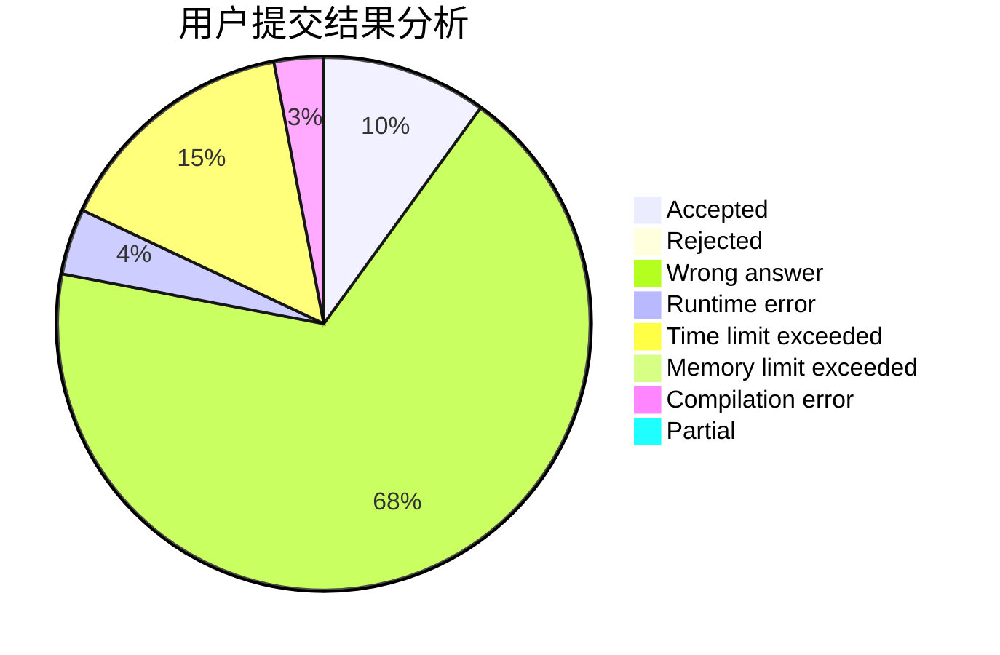
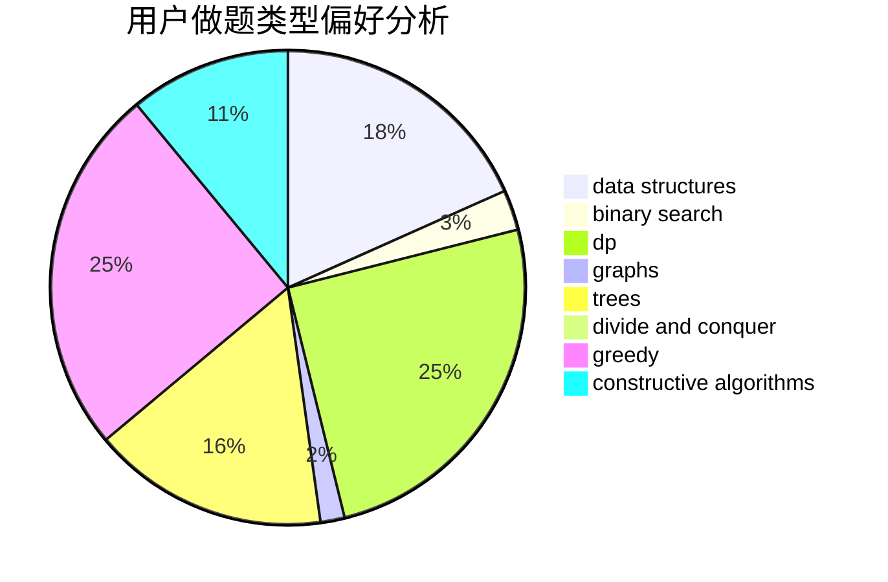
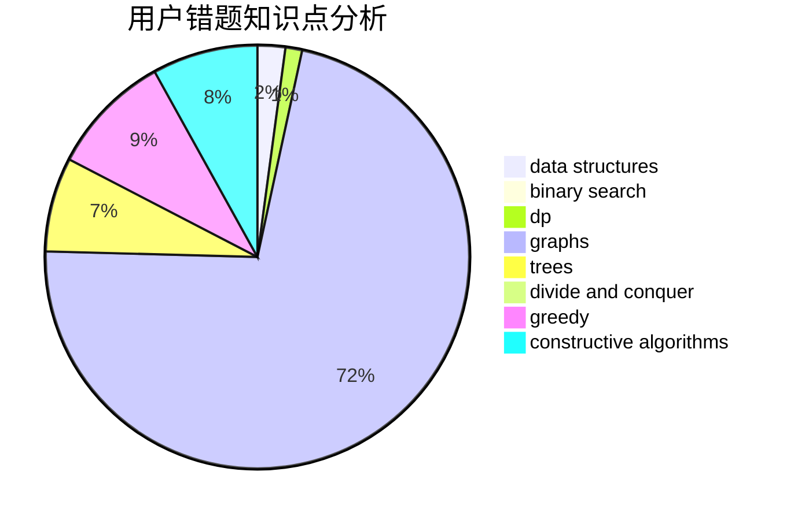

# xqly

<!-- tabs:start -->

#### **用户提交结果分析**

#### **用户做题类型偏好分析**

#### **用户错题知识点分析**

<!-- tabs:end -->
# 推荐题目
[788B](https://codeforces.com/contest/788/problem/B)		combinatorics,
                        constructive algorithms,
                        dfs and similar,
                        dsu,
                        graphs		  
[11292](https://codeforces.com/contest/1129/problem/2)		dsu,graphs,sortings,trees		  
[193D](https://codeforces.com/contest/193/problem/D)		data structures		  
[756A](https://codeforces.com/contest/756/problem/A)		constructive algorithms,
                        dfs and similar		  
[29E](https://codeforces.com/contest/29/problem/E)		graphs,
                        shortest paths		  
[1260F](https://codeforces.com/contest/1260/problem/F)		data structures,
                        trees		  
[999C](https://codeforces.com/contest/999/problem/C)		implementation		  
[994C](https://codeforces.com/contest/994/problem/C)		dsu,graphs,sortings,trees		  
[1005C](https://codeforces.com/contest/1005/problem/C)		brute force,
                        greedy,
                        implementation		  
[264B](https://codeforces.com/contest/264/problem/B)		dp,
                        number theory		  
