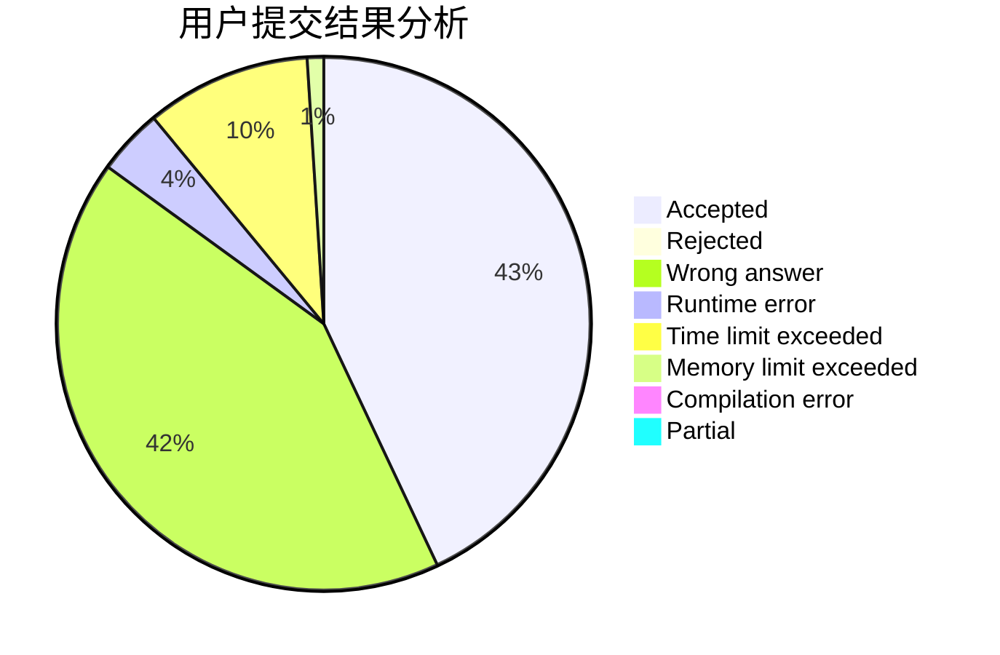
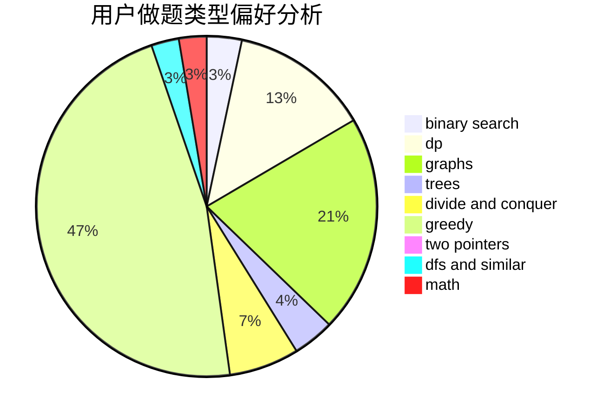

# xryjr233

<!-- tabs:start -->

#### **用户提交结果分析**

#### **用户做题类型偏好分析**

<!-- tabs:end -->
# 推荐题目
[859E](https://codeforces.com/contest/859/problem/E)
[1252L](https://codeforces.com/contest/1252/problem/L)
[883I](https://codeforces.com/contest/883/problem/I)
[1082C](https://codeforces.com/contest/1082/problem/C)
[656F](https://codeforces.com/contest/656/problem/F)
[1037B](https://codeforces.com/contest/1037/problem/B)
[594D](https://codeforces.com/contest/594/problem/D)
[405D](https://codeforces.com/contest/405/problem/D)
[15A](https://codeforces.com/contest/15/problem/A)
[1310B](https://codeforces.com/contest/1310/problem/B)
