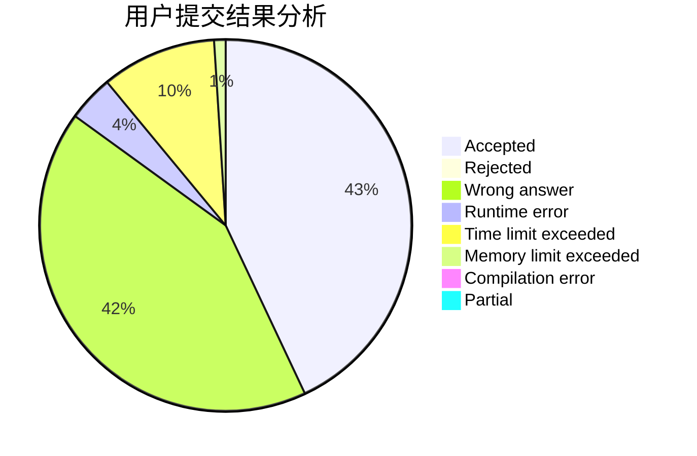
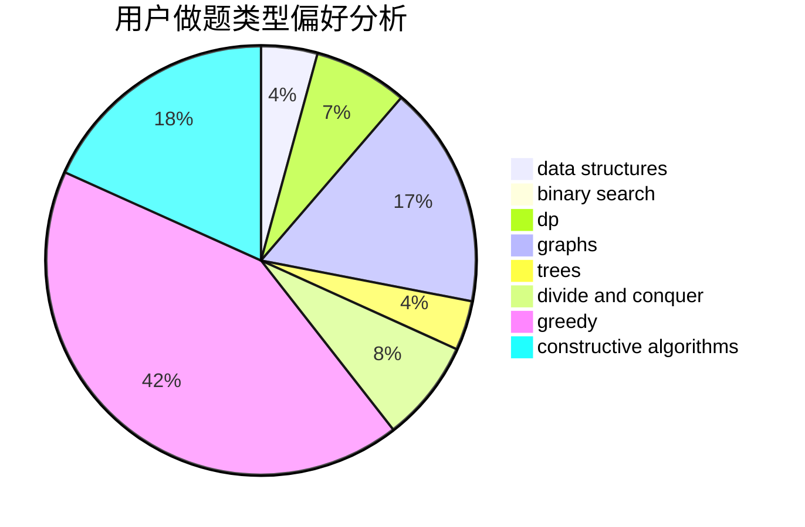
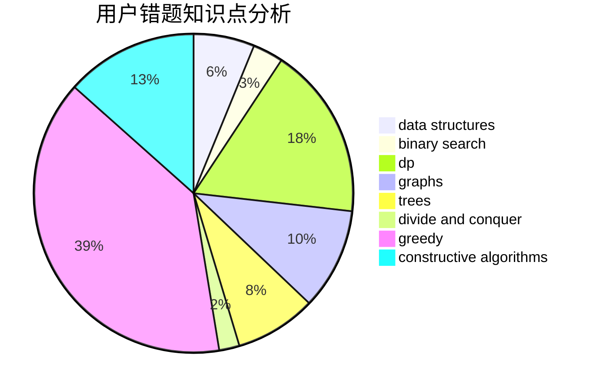

# xryjr233

<!-- tabs:start -->

#### **用户提交结果分析**

#### **用户做题类型偏好分析**

#### **用户错题知识点分析**

<!-- tabs:end -->
# 推荐题目
[859E](https://codeforces.com/contest/859/problem/E)		combinatorics,
                        dfs and similar,
                        dsu,
                        graphs,
                        trees		  
[1252L](https://codeforces.com/contest/1252/problem/L)		flows,
                        graphs		  
[883I](https://codeforces.com/contest/883/problem/I)		binary search,
                        dp		  
[1082C](https://codeforces.com/contest/1082/problem/C)		greedy,
                        sortings		  
[656F](https://codeforces.com/contest/656/problem/F)		*special problem		  
[1037B](https://codeforces.com/contest/1037/problem/B)		greedy		  
[594D](https://codeforces.com/contest/594/problem/D)		data structures,
                        number theory		  
[405D](https://codeforces.com/contest/405/problem/D)		greedy,
                        implementation,
                        math		  
[15A](https://codeforces.com/contest/15/problem/A)		implementation,
                        sortings		  
[1310B](https://codeforces.com/contest/1310/problem/B)		dp,
                        implementation		  
