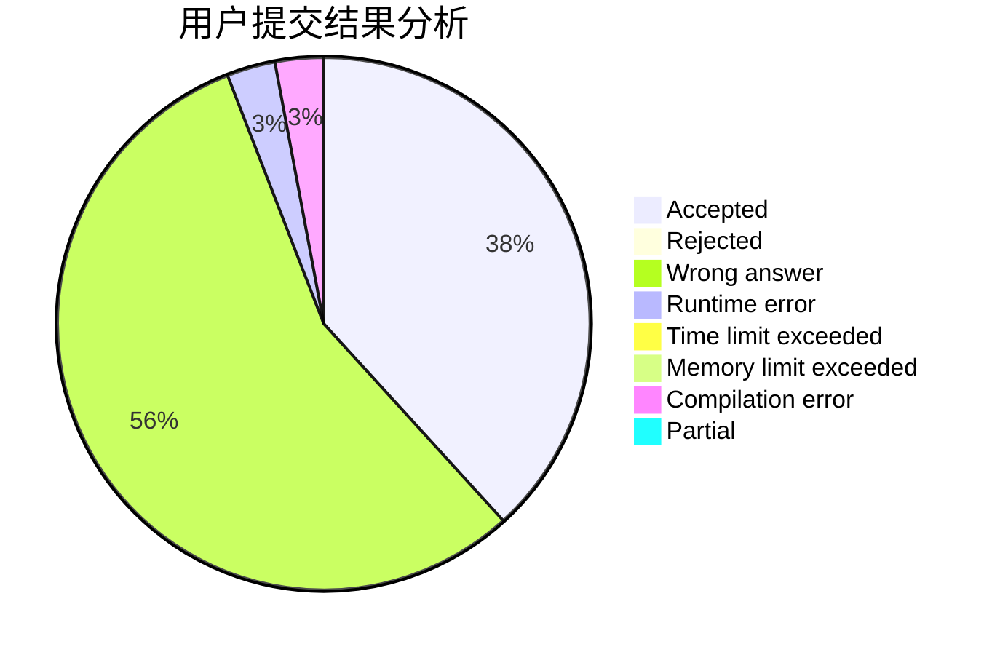
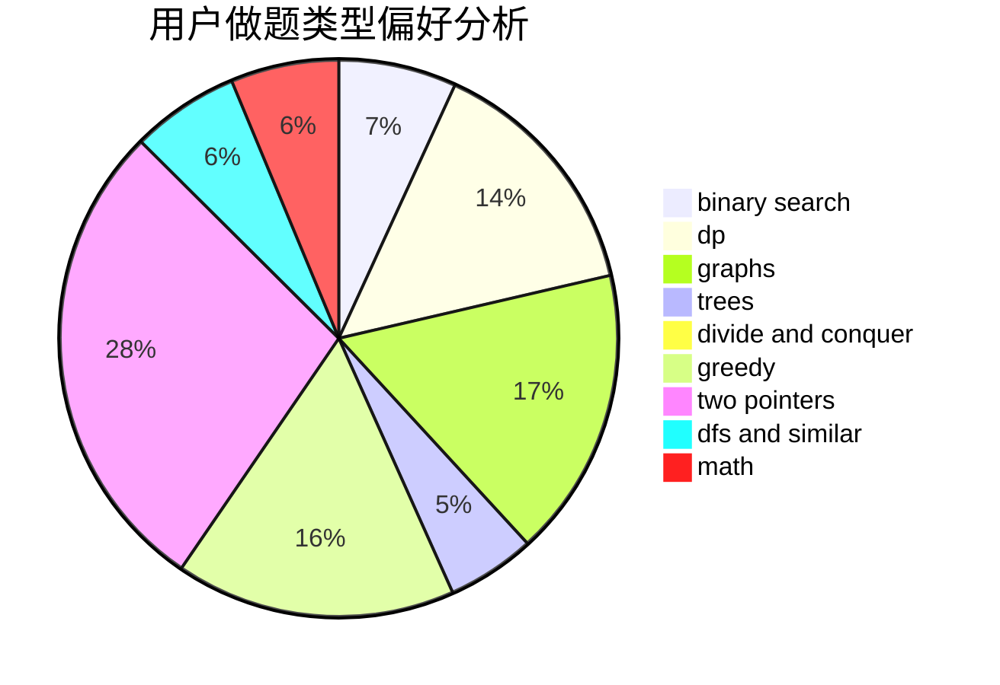

# xsap

<!-- tabs:start -->

#### **用户提交结果分析**

#### **用户做题类型偏好分析**

<!-- tabs:end -->
# 推荐题目
[497D](https://codeforces.com/contest/497/problem/D)
[1157G](https://codeforces.com/contest/1157/problem/G)
[825F](https://codeforces.com/contest/825/problem/F)
[576C](https://codeforces.com/contest/576/problem/C)
[1070L](https://codeforces.com/contest/1070/problem/L)
[906B](https://codeforces.com/contest/906/problem/B)
[743D](https://codeforces.com/contest/743/problem/D)
[11952](https://codeforces.com/contest/1195/problem/2)
[199B](https://codeforces.com/contest/199/problem/B)
[369B](https://codeforces.com/contest/369/problem/B)
