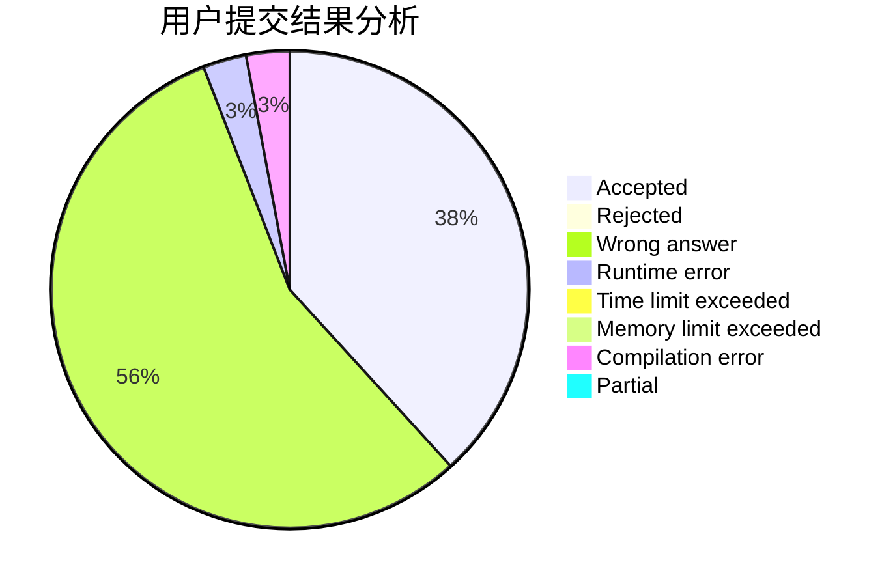
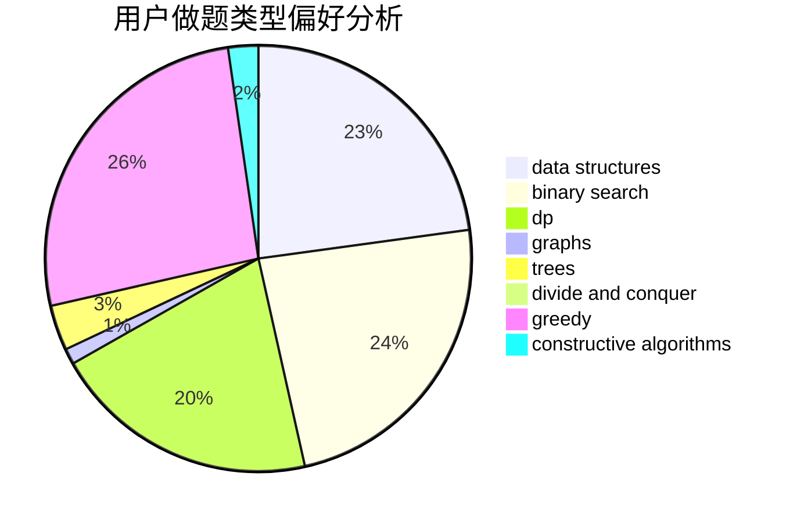
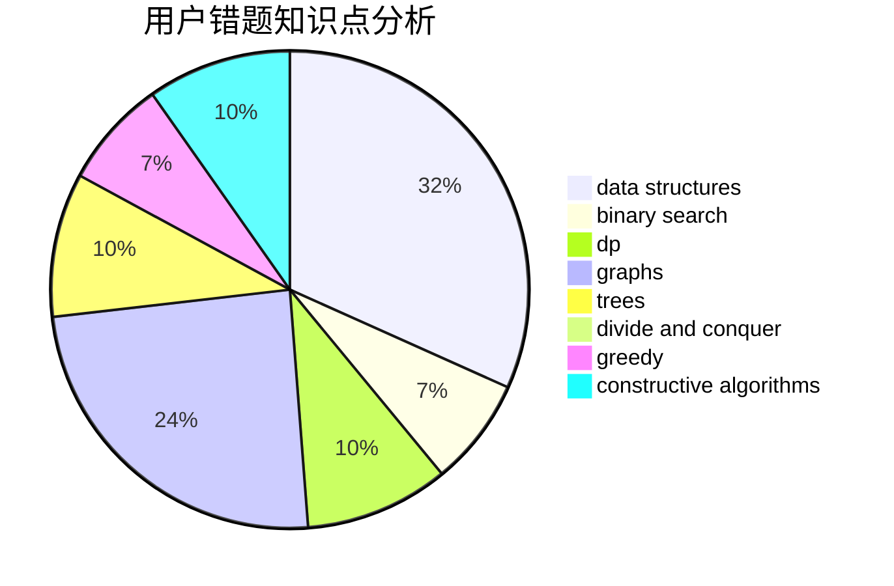

# xsap

<!-- tabs:start -->

#### **用户提交结果分析**

#### **用户做题类型偏好分析**

#### **用户错题知识点分析**

<!-- tabs:end -->
# 推荐题目
[477D](https://codeforces.com/contest/477/problem/D)		dp,
                        strings		  
[1156B](https://codeforces.com/contest/1156/problem/B)		dfs and similar,
                        greedy,
                        implementation,
                        sortings,
                        strings		  
[808G](https://codeforces.com/contest/808/problem/G)		dp,
                        strings		  
[551B](https://codeforces.com/contest/551/problem/B)		brute force,
                        constructive algorithms,
                        implementation,
                        strings		  
[1070I](https://codeforces.com/contest/1070/problem/I)		flows,
                        graph matchings,
                        graphs		  
[887A](https://codeforces.com/contest/887/problem/A)		implementation		  
[725D](https://codeforces.com/contest/725/problem/D)		data structures,
                        greedy		  
[1189E](https://codeforces.com/contest/1189/problem/E)		dsu,graphs,sortings,trees		  
[171E](https://codeforces.com/contest/171/problem/E)		*special problem		  
[341E](https://codeforces.com/contest/341/problem/E)		constructive algorithms,
                        greedy		  
