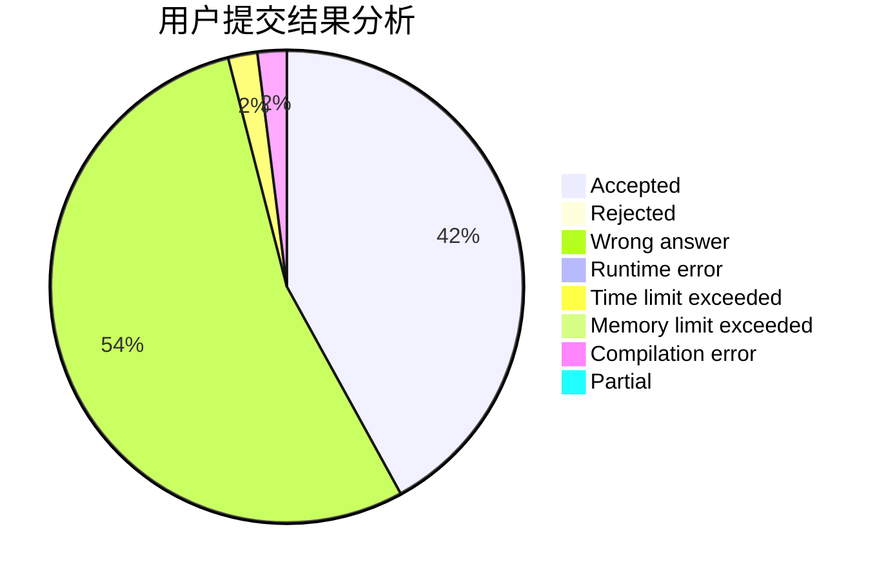
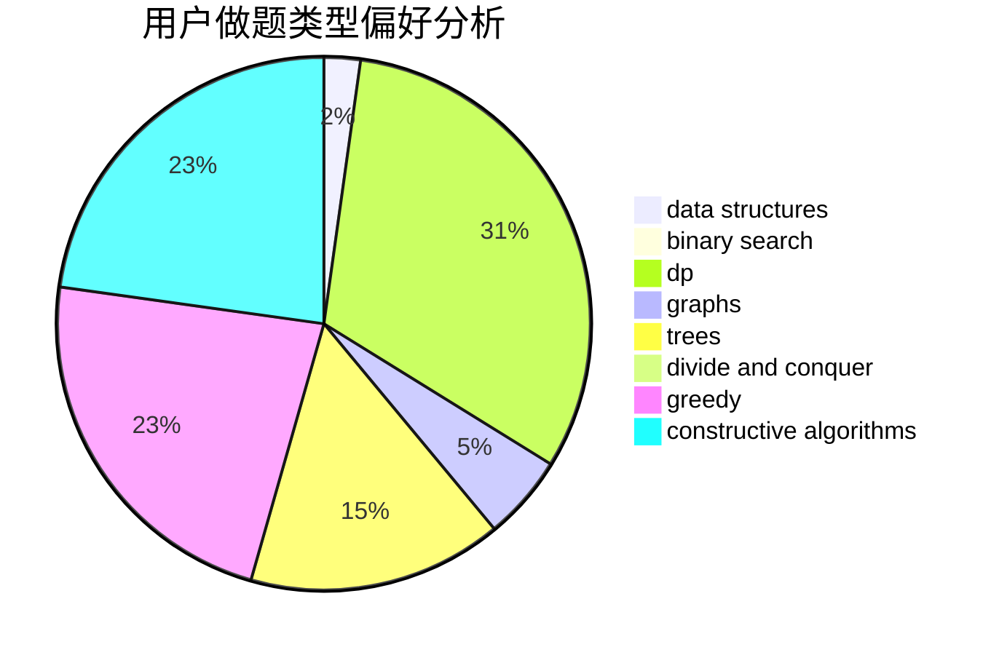
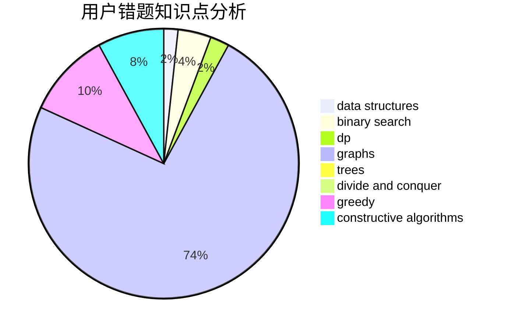

# xsl.

<!-- tabs:start -->

#### **用户提交结果分析**

#### **用户做题类型偏好分析**

#### **用户错题知识点分析**

<!-- tabs:end -->
# 推荐题目
[1459F](https://codeforces.com/contest/1459/problem/F)		dsu,graphs,sortings,trees		  
[513A](https://codeforces.com/contest/513/problem/A)		constructive algorithms,
                        math		  
[1165B](https://codeforces.com/contest/1165/problem/B)		data structures,
                        greedy,
                        sortings		  
[34A](https://codeforces.com/contest/34/problem/A)		implementation		  
[1217F](https://codeforces.com/contest/1217/problem/F)		data structures,
                        divide and conquer,
                        dsu,
                        graphs,
                        trees		  
[729D](https://codeforces.com/contest/729/problem/D)		constructive algorithms,
                        greedy,
                        math		  
[605A](https://codeforces.com/contest/605/problem/A)		constructive algorithms,
                        greedy		  
[1137A](https://codeforces.com/contest/1137/problem/A)		implementation,
                        sortings		  
[1195A](https://codeforces.com/contest/1195/problem/A)		greedy,
                        math		  
[1341C](https://codeforces.com/contest/1341/problem/C)		dsu,graphs,sortings,trees		  
