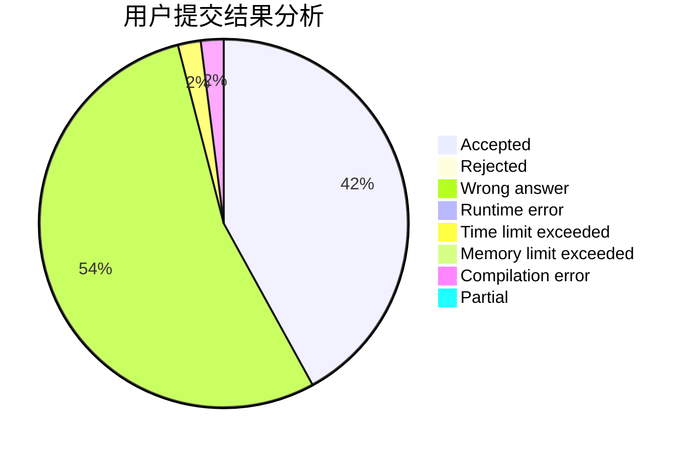
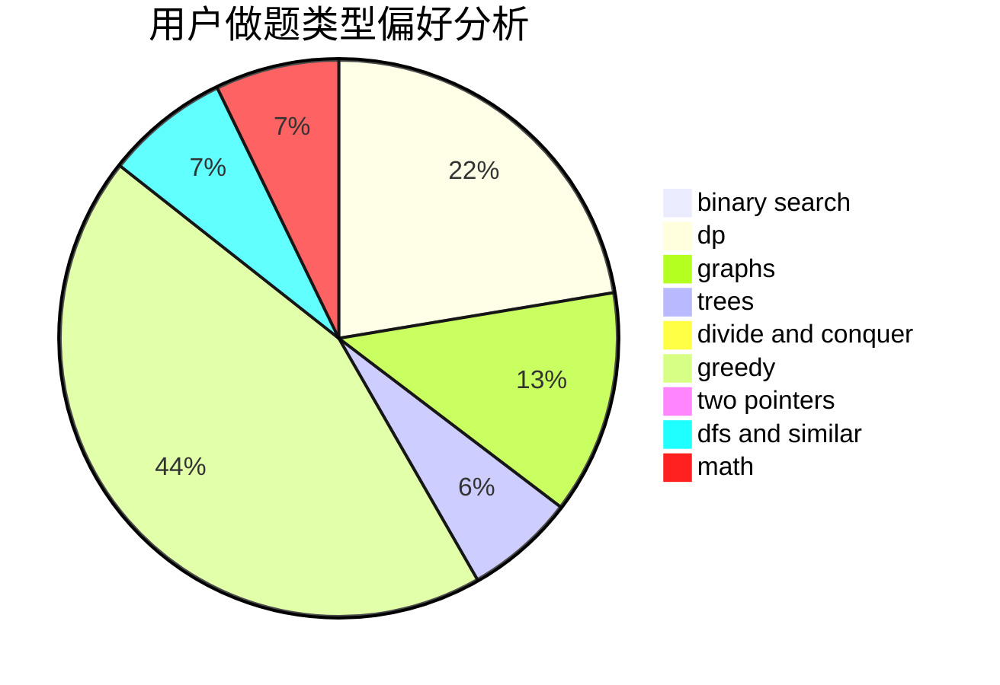

# xsl.

<!-- tabs:start -->

#### **用户提交结果分析**

#### **用户做题类型偏好分析**

<!-- tabs:end -->
# 推荐题目
[1459F](https://codeforces.com/contest/1459/problem/F)
[513A](https://codeforces.com/contest/513/problem/A)
[1165B](https://codeforces.com/contest/1165/problem/B)
[34A](https://codeforces.com/contest/34/problem/A)
[1217F](https://codeforces.com/contest/1217/problem/F)
[729D](https://codeforces.com/contest/729/problem/D)
[605A](https://codeforces.com/contest/605/problem/A)
[1137A](https://codeforces.com/contest/1137/problem/A)
[1195A](https://codeforces.com/contest/1195/problem/A)
[1341C](https://codeforces.com/contest/1341/problem/C)
