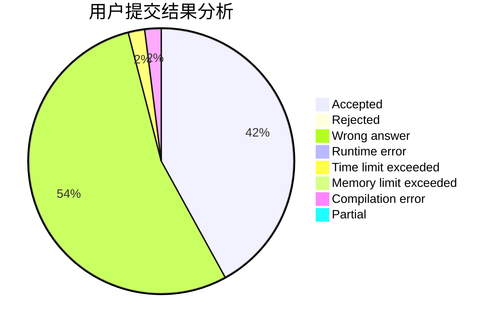
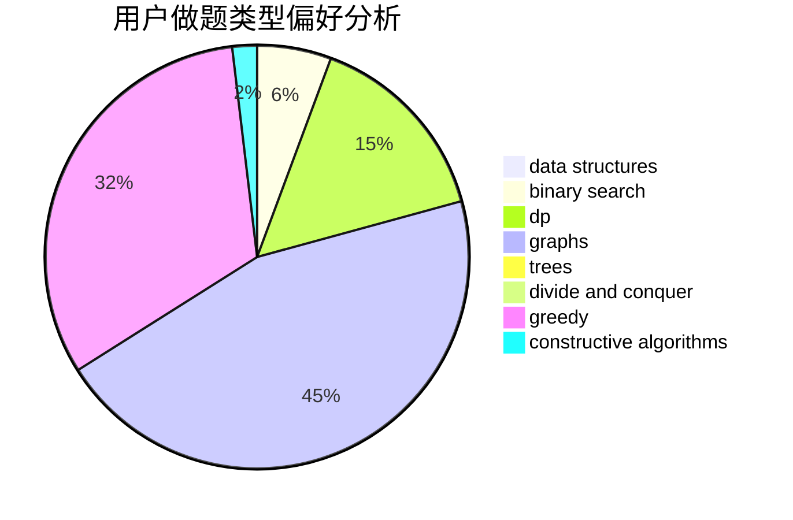
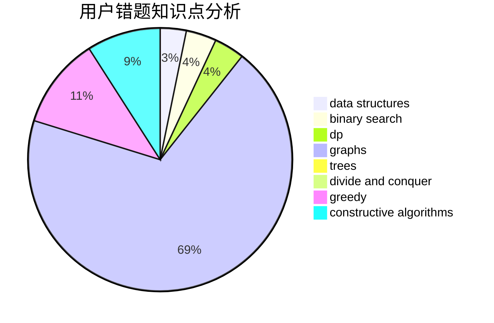

# xsl.

<!-- tabs:start -->

#### **用户提交结果分析**

#### **用户做题类型偏好分析**

#### **用户错题知识点分析**

<!-- tabs:end -->
# 推荐题目
[1450H2](https://codeforces.com/contest/1450H/problem/2)		combinatorics,
                        implementation,
                        math		  
[493D](https://codeforces.com/contest/493/problem/D)		constructive algorithms,
                        games,
                        math		  
[1163F](https://codeforces.com/contest/1163/problem/F)		data structures,
                        graphs,
                        shortest paths		  
[319B](https://codeforces.com/contest/319/problem/B)		data structures,
                        implementation		  
[1213D1](https://codeforces.com/contest/1213D/problem/1)		brute force,
                        implementation		  
[709C](https://codeforces.com/contest/709/problem/C)		dsu,graphs,sortings,trees		  
[584D](https://codeforces.com/contest/584/problem/D)		brute force,
                        math,
                        number theory		  
[1132G](https://codeforces.com/contest/1132/problem/G)		data structures,
                        dp,
                        trees		  
[118A](https://codeforces.com/contest/118/problem/A)		implementation,
                        strings		  
[1334D](https://codeforces.com/contest/1334/problem/D)		constructive algorithms,
                        graphs,
                        greedy,
                        implementation		  
