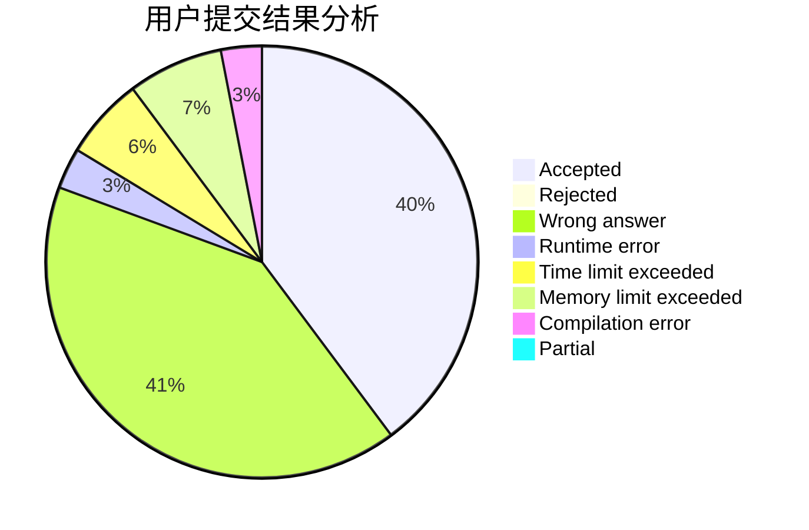
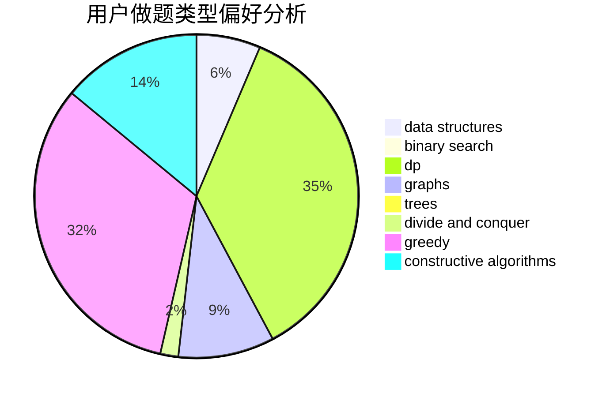
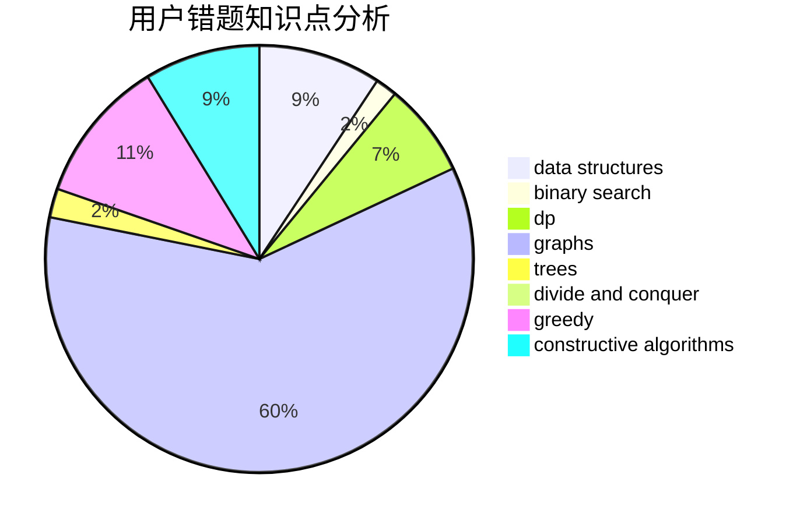

# xt2357

<!-- tabs:start -->

#### **用户提交结果分析**

#### **用户做题类型偏好分析**

#### **用户错题知识点分析**

<!-- tabs:end -->
# 推荐题目
[1478C](https://codeforces.com/contest/1478/problem/C)		implementation,
                        math,
                        sortings		  
[1392E](https://codeforces.com/contest/1392/problem/E)		bitmasks,
                        constructive algorithms,
                        interactive,
                        math		  
[1397B](https://codeforces.com/contest/1397/problem/B)		brute force,
                        math,
                        number theory,
                        sortings		  
[813A](https://codeforces.com/contest/813/problem/A)		implementation		  
[957A](https://codeforces.com/contest/957/problem/A)		implementation		  
[348C](https://codeforces.com/contest/348/problem/C)		brute force,
                        data structures		  
[789D](https://codeforces.com/contest/789/problem/D)		dsu,graphs,sortings,trees		  
[935F](https://codeforces.com/contest/935/problem/F)		data structures,
                        greedy		  
[1512A](https://codeforces.com/contest/1512/problem/A)		brute force,
                        implementation		  
[1362D](https://codeforces.com/contest/1362/problem/D)		dsu,graphs,sortings,trees		  
