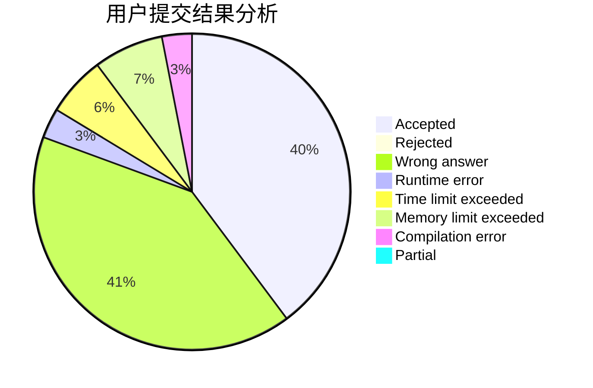
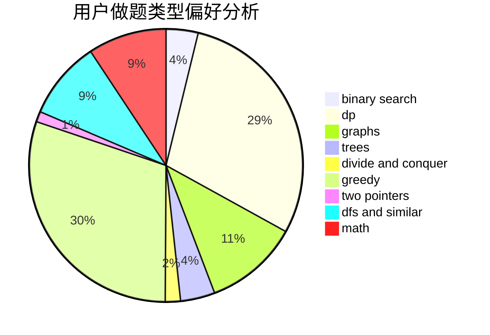

# xt2357

<!-- tabs:start -->

#### **用户提交结果分析**

#### **用户做题类型偏好分析**

<!-- tabs:end -->
# 推荐题目
[1487A](https://codeforces.com/contest/1487/problem/A)
[1400B](https://codeforces.com/contest/1400/problem/B)
[1406A](https://codeforces.com/contest/1406/problem/A)
[831C](https://codeforces.com/contest/831/problem/C)
[978D](https://codeforces.com/contest/978/problem/D)
[375C](https://codeforces.com/contest/375/problem/C)
[804F](https://codeforces.com/contest/804/problem/F)
[957E](https://codeforces.com/contest/957/problem/E)
[171A](https://codeforces.com/contest/171/problem/A)
[136C](https://codeforces.com/contest/136/problem/C)
