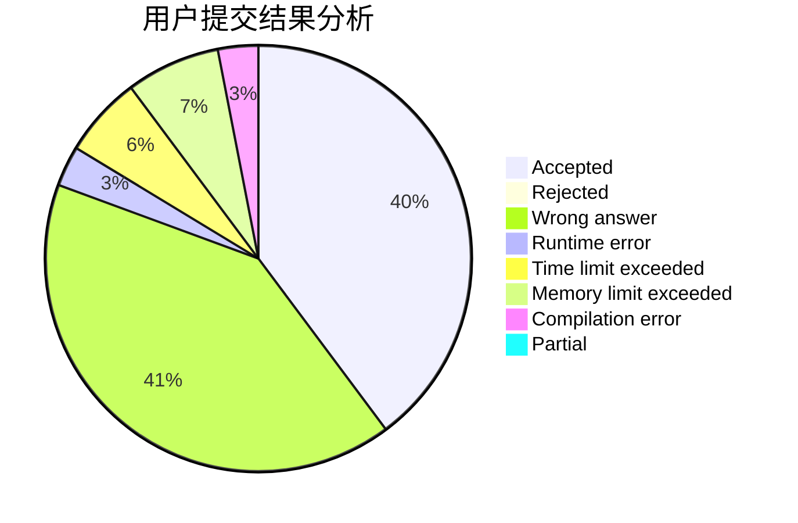
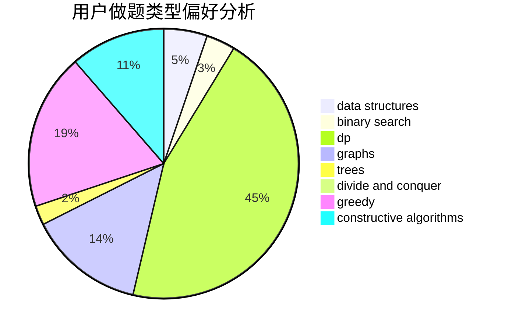
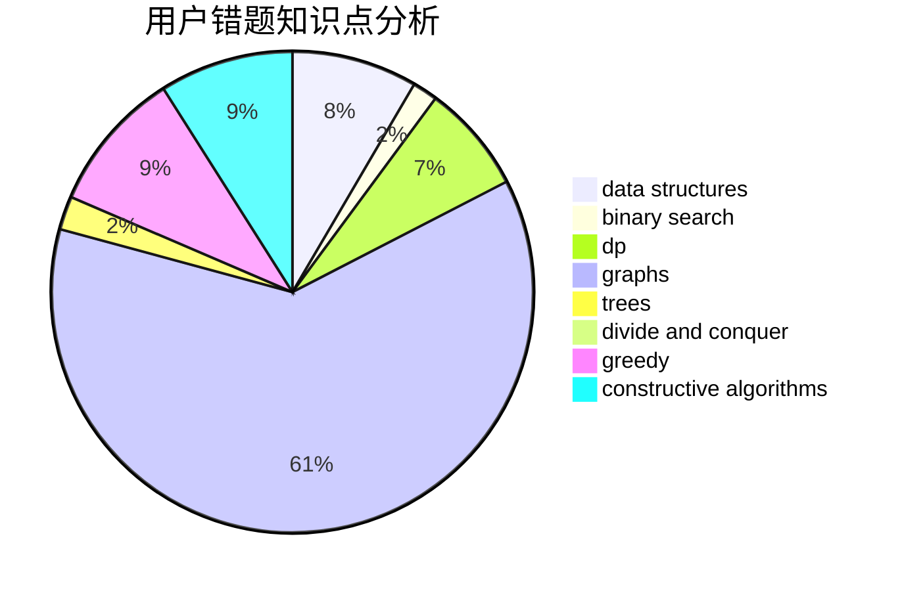

# xt2357

<!-- tabs:start -->

#### **用户提交结果分析**

#### **用户做题类型偏好分析**

#### **用户错题知识点分析**

<!-- tabs:end -->
# 推荐题目
[1487A](https://codeforces.com/contest/1487/problem/A)		implementation,
                        sortings		  
[1400B](https://codeforces.com/contest/1400/problem/B)		brute force,
                        greedy,
                        math		  
[1406A](https://codeforces.com/contest/1406/problem/A)		greedy,
                        implementation,
                        math		  
[831C](https://codeforces.com/contest/831/problem/C)		brute force,
                        constructive algorithms		  
[978D](https://codeforces.com/contest/978/problem/D)		brute force,
                        implementation,
                        math		  
[375C](https://codeforces.com/contest/375/problem/C)		bitmasks,
                        shortest paths		  
[804F](https://codeforces.com/contest/804/problem/F)		combinatorics,
                        dfs and similar,
                        dp,
                        graphs,
                        number theory		  
[957E](https://codeforces.com/contest/957/problem/E)		dsu,graphs,sortings,trees		  
[171A](https://codeforces.com/contest/171/problem/A)		*special problem,
                        constructive algorithms		  
[136C](https://codeforces.com/contest/136/problem/C)		dsu,graphs,sortings,trees		  
