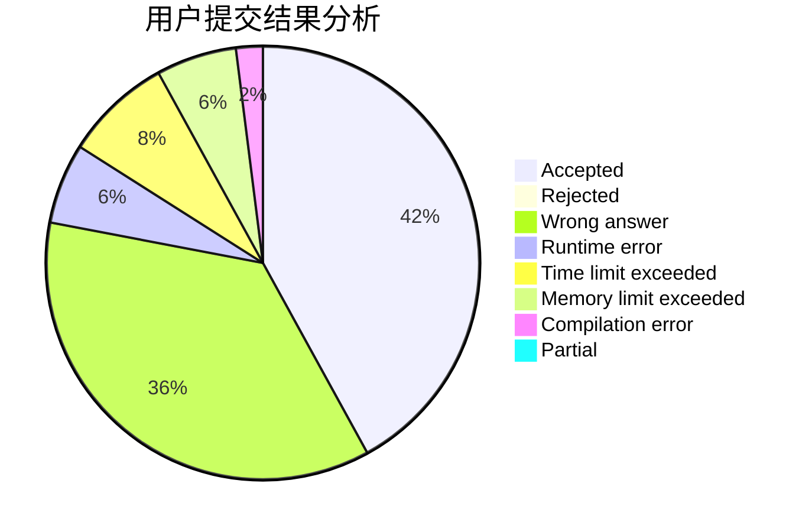
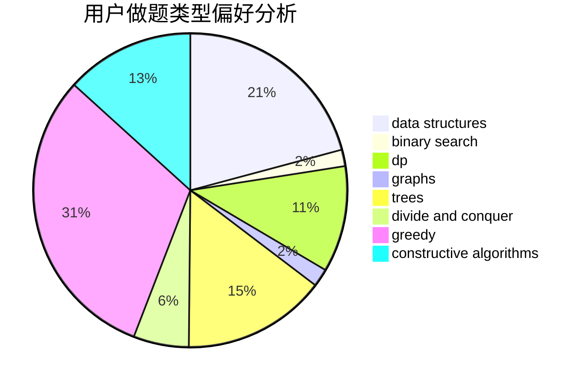
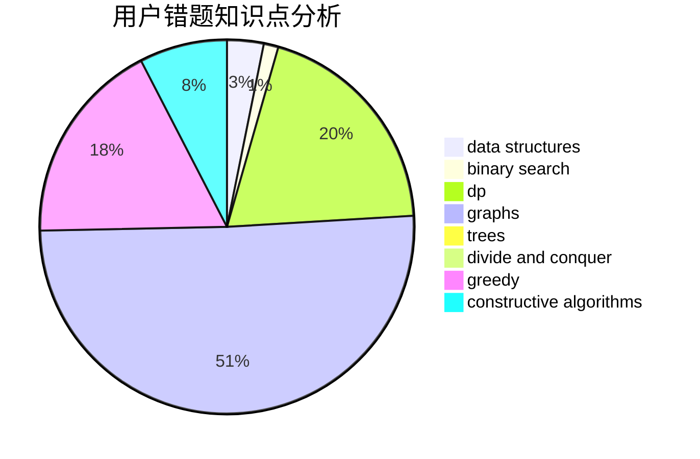

# xtwno

<!-- tabs:start -->

#### **用户提交结果分析**

#### **用户做题类型偏好分析**

#### **用户错题知识点分析**

<!-- tabs:end -->
# 推荐题目
[1405A](https://codeforces.com/contest/1405/problem/A)		constructive algorithms		  
[1386B](https://codeforces.com/contest/1386/problem/B)		*special problem,
                        data structures,
                        geometry,
                        math,
                        sortings		  
[831B](https://codeforces.com/contest/831/problem/B)		implementation,
                        strings		  
[900E](https://codeforces.com/contest/900/problem/E)		data structures,
                        dp,
                        strings		  
[305D](https://codeforces.com/contest/305/problem/D)		combinatorics,
                        math		  
[1175C](https://codeforces.com/contest/1175/problem/C)		binary search,
                        brute force,
                        greedy		  
[710F](https://codeforces.com/contest/710/problem/F)		brute force,
                        data structures,
                        hashing,
                        interactive,
                        string suffix structures,
                        strings		  
[512C](https://codeforces.com/contest/512/problem/C)		dsu,graphs,sortings,trees		  
[712E](https://codeforces.com/contest/712/problem/E)		data structures,
                        math,
                        probabilities		  
[1194D](https://codeforces.com/contest/1194/problem/D)		games,
                        math		  
