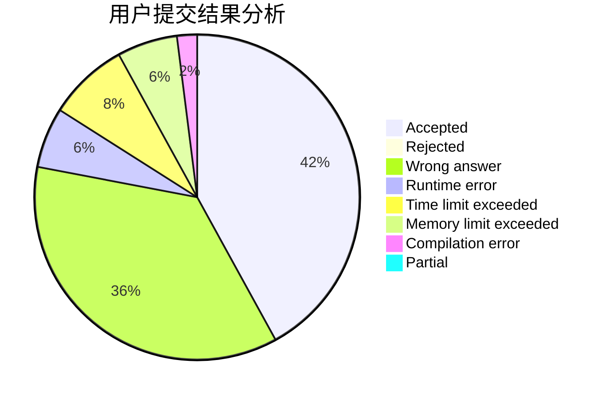
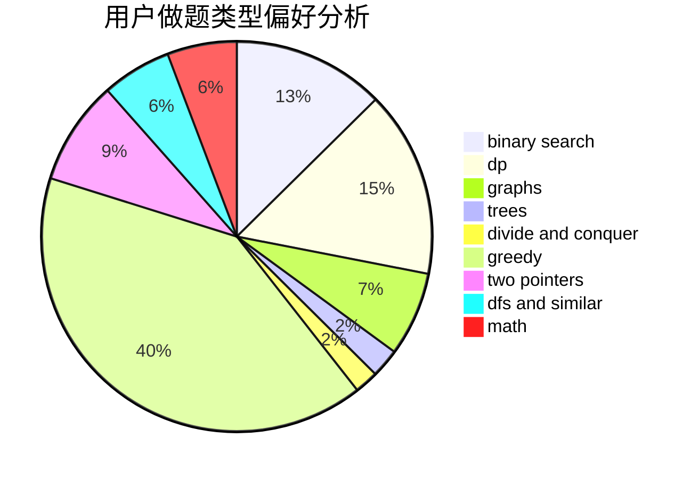

# xtwno

<!-- tabs:start -->

#### **用户提交结果分析**

#### **用户做题类型偏好分析**

<!-- tabs:end -->
# 推荐题目
[1416B](https://codeforces.com/contest/1416/problem/B)
[1396C](https://codeforces.com/contest/1396/problem/C)
[849B](https://codeforces.com/contest/849/problem/B)
[917C](https://codeforces.com/contest/917/problem/C)
[327A](https://codeforces.com/contest/327/problem/A)
[1178C](https://codeforces.com/contest/1178/problem/C)
[730J](https://codeforces.com/contest/730/problem/J)
[535C](https://codeforces.com/contest/535/problem/C)
[732A](https://codeforces.com/contest/732/problem/A)
[1198F](https://codeforces.com/contest/1198/problem/F)
