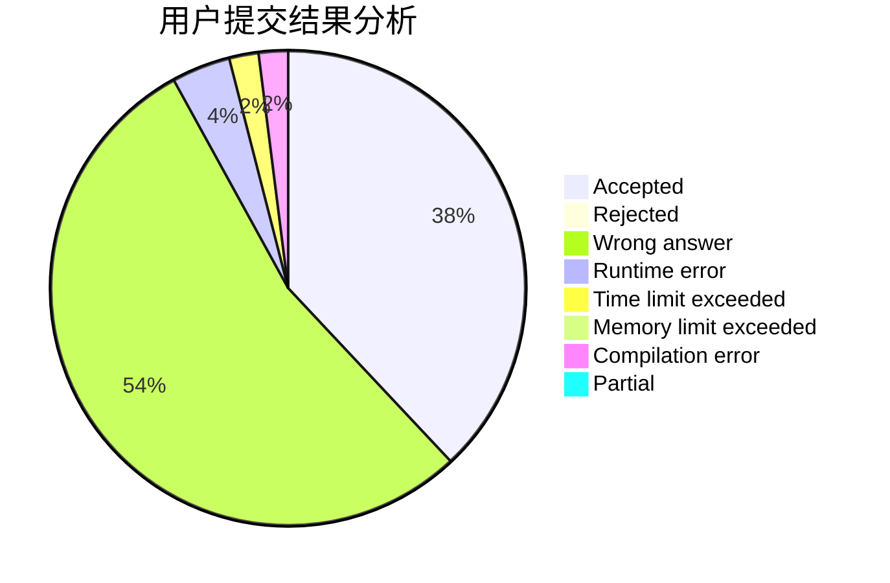
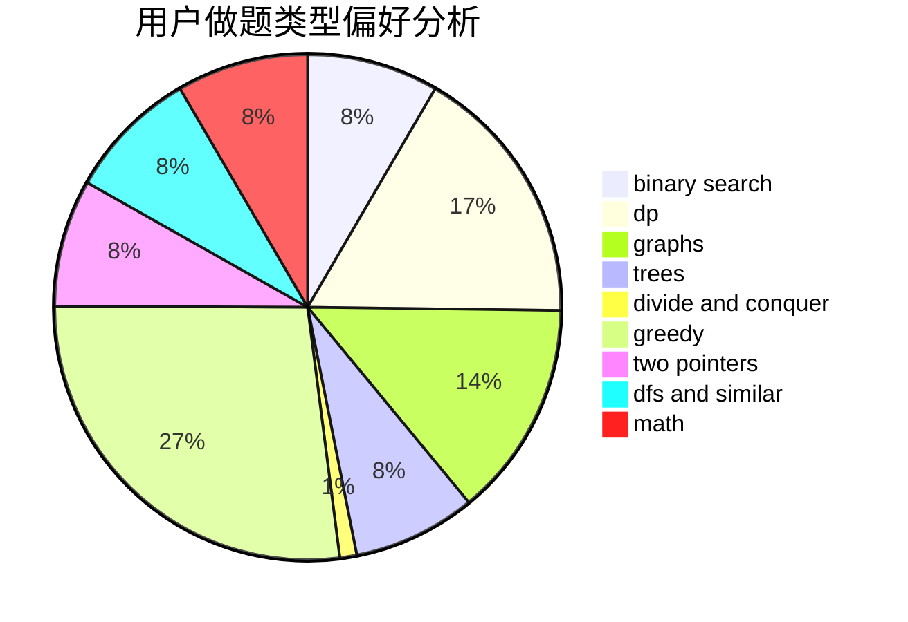

# xuanso

<!-- tabs:start -->

#### **用户提交结果分析**

#### **用户做题类型偏好分析**

<!-- tabs:end -->
# 推荐题目
[878C](https://codeforces.com/contest/878/problem/C)
[1423C](https://codeforces.com/contest/1423/problem/C)
[205D](https://codeforces.com/contest/205/problem/D)
[144B](https://codeforces.com/contest/144/problem/B)
[887D](https://codeforces.com/contest/887/problem/D)
[81C](https://codeforces.com/contest/81/problem/C)
[509D](https://codeforces.com/contest/509/problem/D)
[191C](https://codeforces.com/contest/191/problem/C)
[566A](https://codeforces.com/contest/566/problem/A)
[1023D](https://codeforces.com/contest/1023/problem/D)
