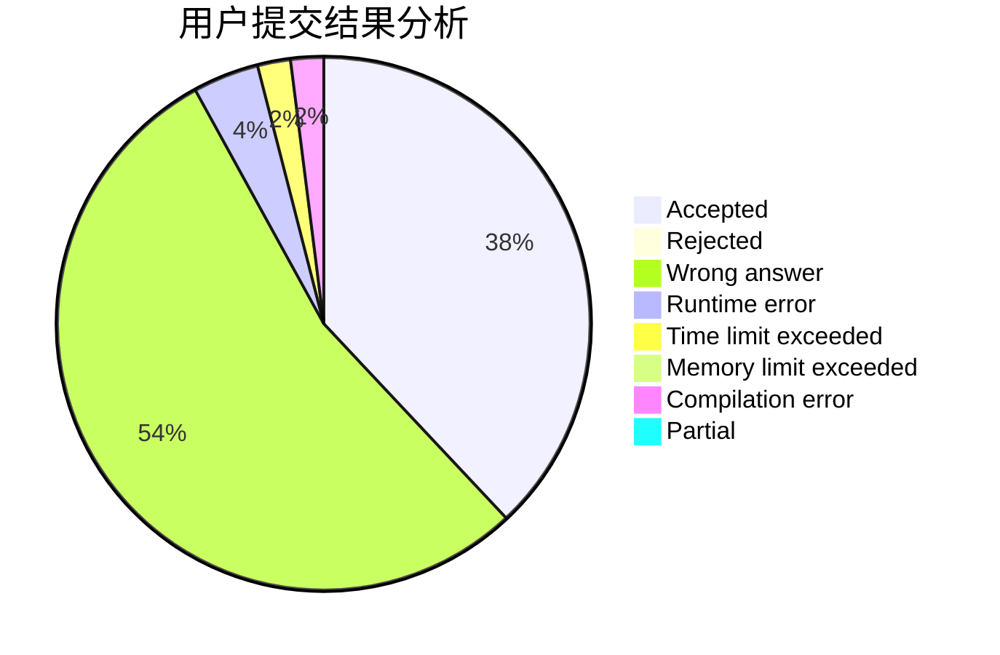
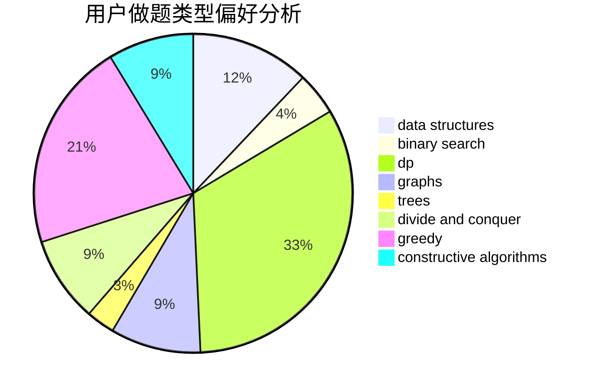
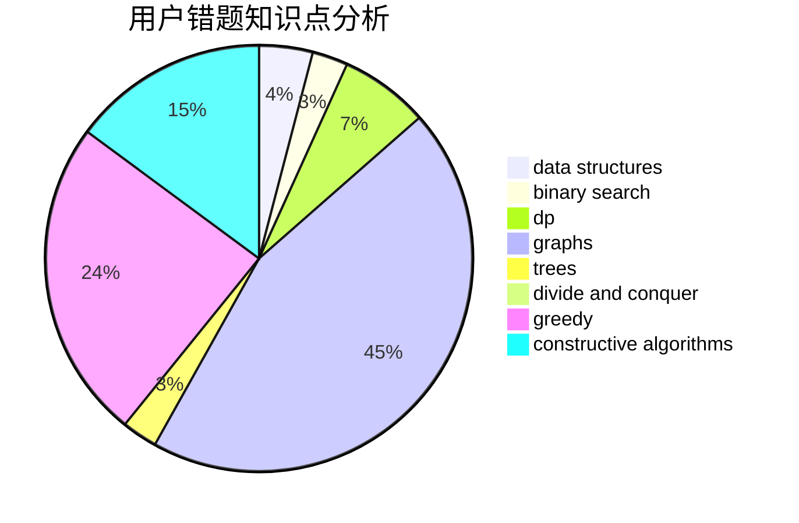

# xuanso

<!-- tabs:start -->

#### **用户提交结果分析**

#### **用户做题类型偏好分析**

#### **用户错题知识点分析**

<!-- tabs:end -->
# 推荐题目
[860C](https://codeforces.com/contest/860/problem/C)		dsu,graphs,sortings,trees		  
[1413F](https://codeforces.com/contest/1413/problem/F)		data structures,
                        trees		  
[180C](https://codeforces.com/contest/180/problem/C)		dp		  
[1438B](https://codeforces.com/contest/1438/problem/B)		constructive algorithms,
                        data structures,
                        greedy,
                        sortings		  
[868B](https://codeforces.com/contest/868/problem/B)		implementation		  
[803G](https://codeforces.com/contest/803/problem/G)		data structures		  
[489C](https://codeforces.com/contest/489/problem/C)		dp,
                        greedy,
                        implementation		  
[166A](https://codeforces.com/contest/166/problem/A)		binary search,
                        implementation,
                        sortings		  
[540A](https://codeforces.com/contest/540/problem/A)		implementation		  
[1023A](https://codeforces.com/contest/1023/problem/A)		brute force,
                        implementation,
                        strings		  
