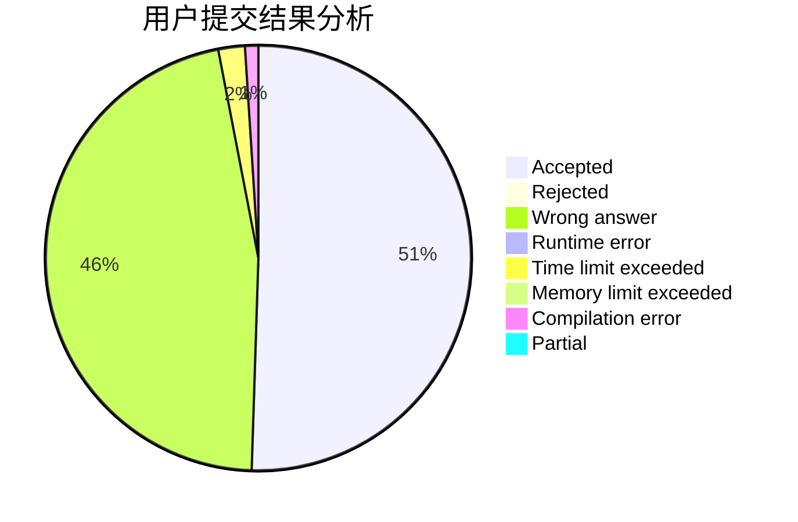
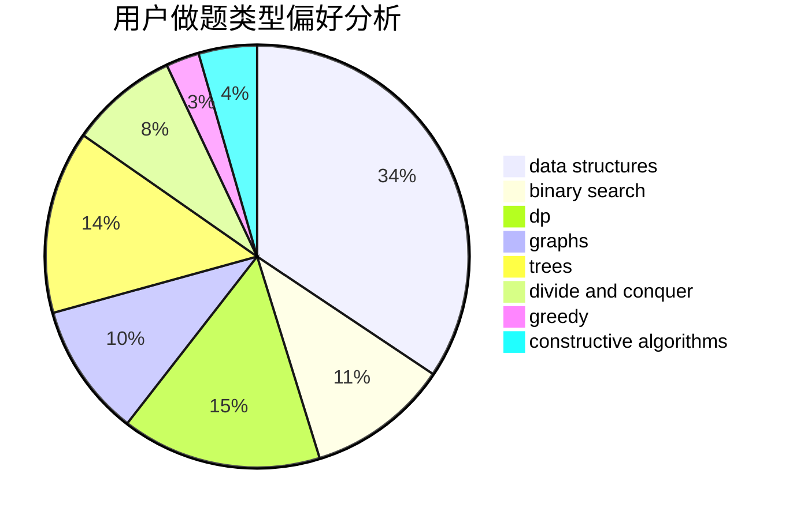
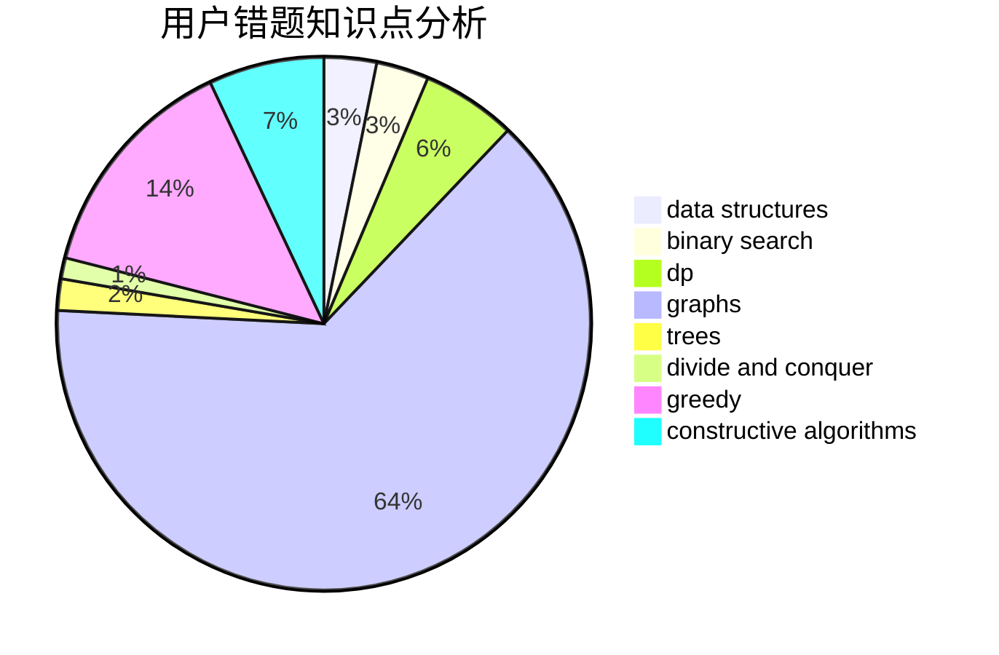

# xuanyi

<!-- tabs:start -->

#### **用户提交结果分析**

#### **用户做题类型偏好分析**

#### **用户错题知识点分析**

<!-- tabs:end -->
# 推荐题目
[916D](https://codeforces.com/contest/916/problem/D)		data structures,
                        interactive,
                        trees		  
[279B](https://codeforces.com/contest/279/problem/B)		binary search,
                        brute force,
                        implementation,
                        two pointers		  
[218D](https://codeforces.com/contest/218/problem/D)		dsu,graphs,sortings,trees		  
[514D](https://codeforces.com/contest/514/problem/D)		binary search,
                        data structures,
                        two pointers		  
[508C](https://codeforces.com/contest/508/problem/C)		constructive algorithms,
                        greedy		  
[237A](https://codeforces.com/contest/237/problem/A)		implementation		  
[994C](https://codeforces.com/contest/994/problem/C)		dsu,graphs,sortings,trees		  
[938E](https://codeforces.com/contest/938/problem/E)		combinatorics,
                        math		  
[438A](https://codeforces.com/contest/438/problem/A)		dsu,graphs,sortings,trees		  
[821A](https://codeforces.com/contest/821/problem/A)		implementation		  
