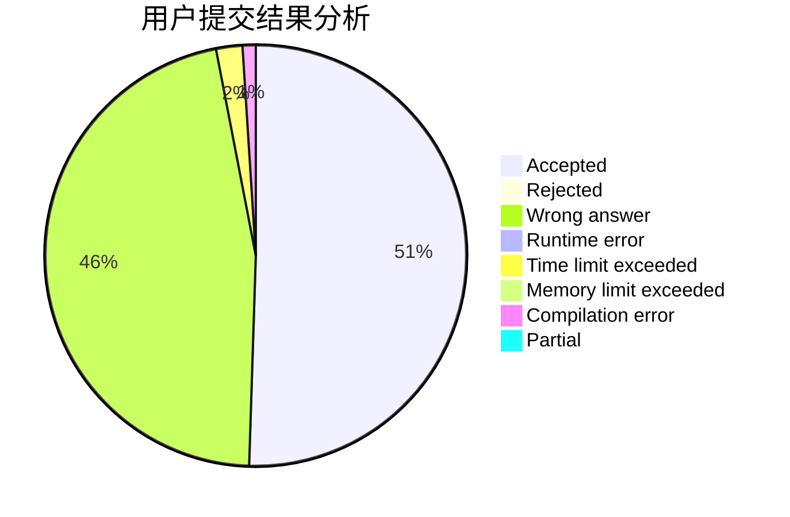
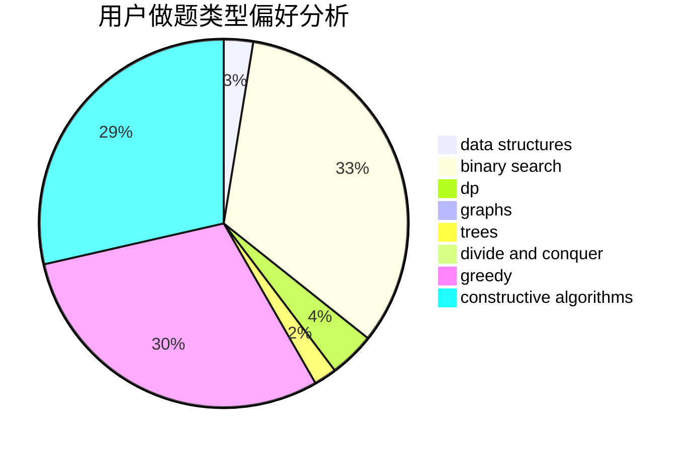
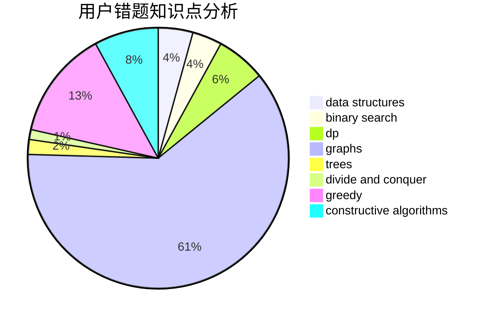

# xuanyi

<!-- tabs:start -->

#### **用户提交结果分析**

#### **用户做题类型偏好分析**

#### **用户错题知识点分析**

<!-- tabs:end -->
# 推荐题目
[900A](https://codeforces.com/contest/900/problem/A)		geometry,
                        implementation		  
[260D](https://codeforces.com/contest/260/problem/D)		constructive algorithms,
                        dsu,
                        graphs,
                        greedy,
                        trees		  
[196E](https://codeforces.com/contest/196/problem/E)		dsu,
                        graphs,
                        shortest paths		  
[494C](https://codeforces.com/contest/494/problem/C)		dp,
                        probabilities		  
[487C](https://codeforces.com/contest/487/problem/C)		constructive algorithms,
                        math,
                        number theory		  
[218B](https://codeforces.com/contest/218/problem/B)		implementation		  
[97C](https://codeforces.com/contest/97/problem/C)		binary search,
                        graphs,
                        math,
                        shortest paths		  
[918B](https://codeforces.com/contest/918/problem/B)		implementation,
                        strings		  
[411A](https://codeforces.com/contest/411/problem/A)		*special problem,
                        implementation		  
[804F](https://codeforces.com/contest/804/problem/F)		combinatorics,
                        dfs and similar,
                        dp,
                        graphs,
                        number theory		  
