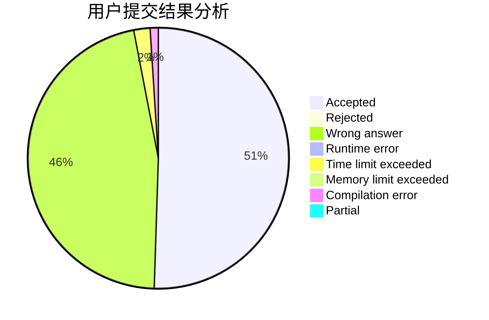
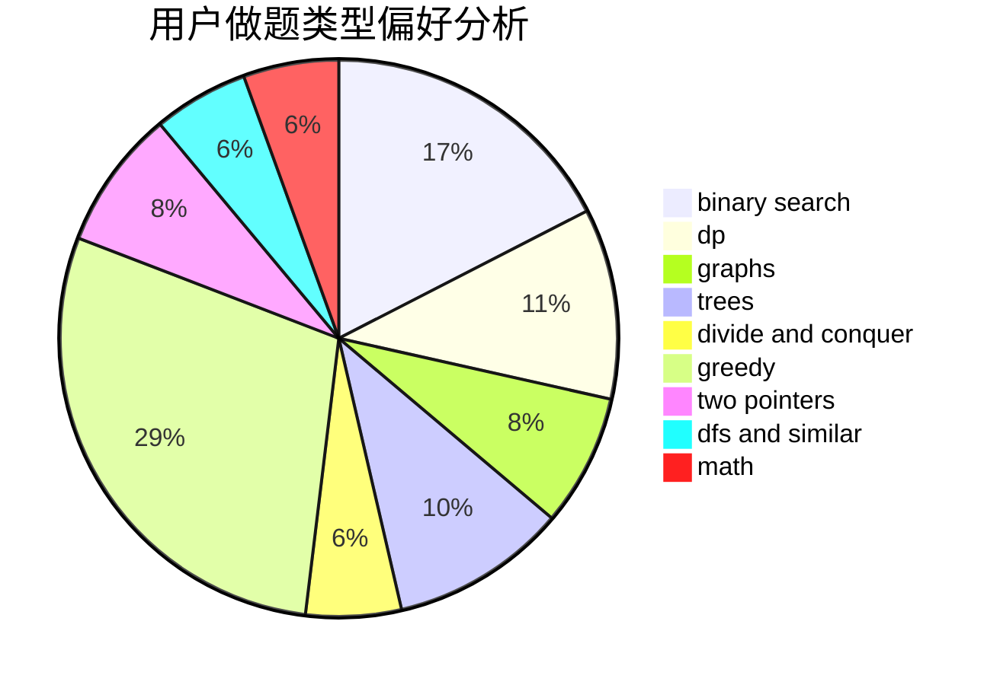

# xuanyi

<!-- tabs:start -->

#### **用户提交结果分析**

#### **用户做题类型偏好分析**

<!-- tabs:end -->
# 推荐题目
[916D](https://codeforces.com/contest/916/problem/D)
[279B](https://codeforces.com/contest/279/problem/B)
[218D](https://codeforces.com/contest/218/problem/D)
[514D](https://codeforces.com/contest/514/problem/D)
[508C](https://codeforces.com/contest/508/problem/C)
[237A](https://codeforces.com/contest/237/problem/A)
[994C](https://codeforces.com/contest/994/problem/C)
[938E](https://codeforces.com/contest/938/problem/E)
[438A](https://codeforces.com/contest/438/problem/A)
[821A](https://codeforces.com/contest/821/problem/A)
