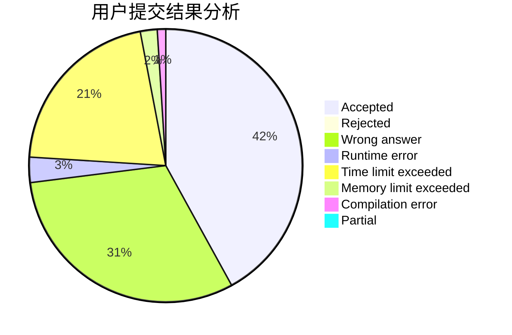
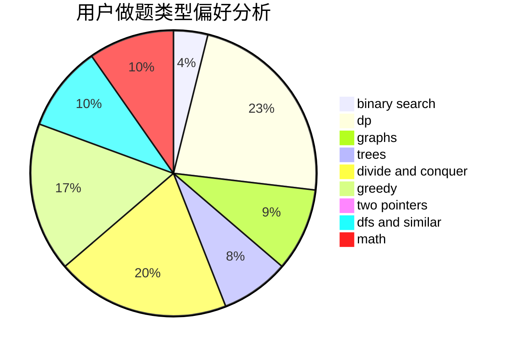

# xuanzo

<!-- tabs:start -->

#### **用户提交结果分析**

#### **用户做题类型偏好分析**

<!-- tabs:end -->
# 推荐题目
[967E](https://codeforces.com/contest/967/problem/E)
[1411G](https://codeforces.com/contest/1411/problem/G)
[807C](https://codeforces.com/contest/807/problem/C)
[442D](https://codeforces.com/contest/442/problem/D)
[1321A](https://codeforces.com/contest/1321/problem/A)
[1017F](https://codeforces.com/contest/1017/problem/F)
[1164H](https://codeforces.com/contest/1164/problem/H)
[628F](https://codeforces.com/contest/628/problem/F)
[843D](https://codeforces.com/contest/843/problem/D)
[294E](https://codeforces.com/contest/294/problem/E)
