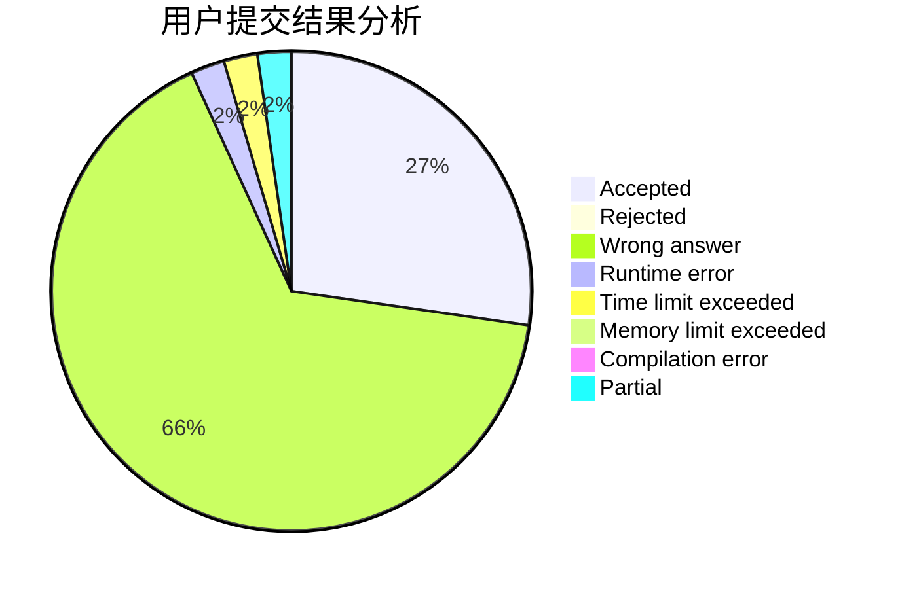
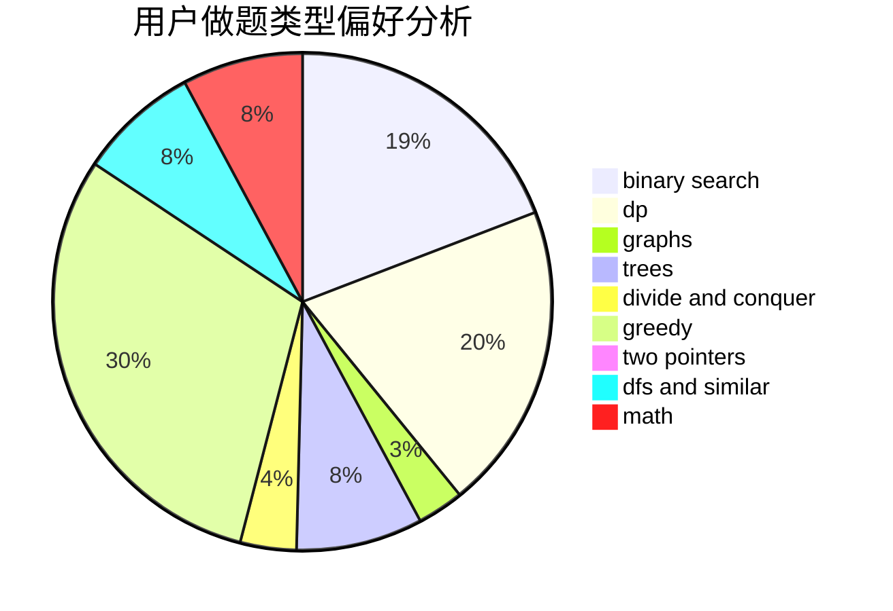

# xuezhe

<!-- tabs:start -->

#### **用户提交结果分析**

#### **用户做题类型偏好分析**

<!-- tabs:end -->
# 推荐题目
[13822](https://codeforces.com/contest/1382/problem/2)
[18C](https://codeforces.com/contest/18/problem/C)
[998B](https://codeforces.com/contest/998/problem/B)
[922B](https://codeforces.com/contest/922/problem/B)
[36C](https://codeforces.com/contest/36/problem/C)
[1162E](https://codeforces.com/contest/1162/problem/E)
[550B](https://codeforces.com/contest/550/problem/B)
[295B](https://codeforces.com/contest/295/problem/B)
[702C](https://codeforces.com/contest/702/problem/C)
[925F](https://codeforces.com/contest/925/problem/F)
