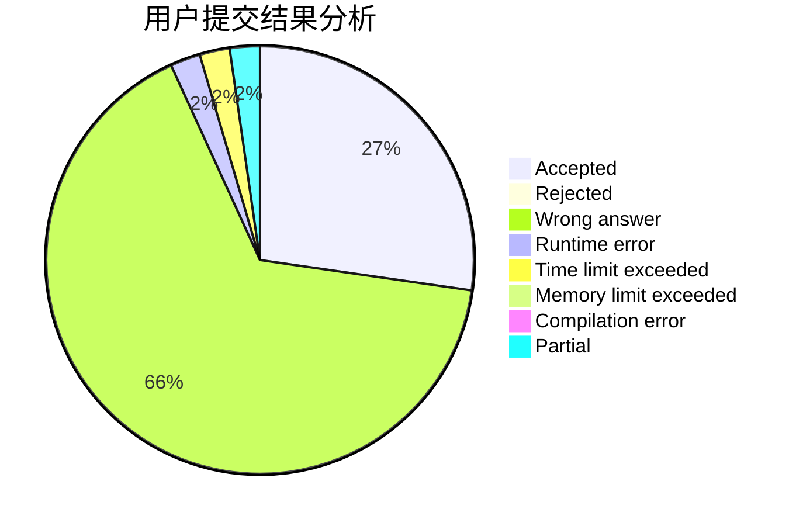
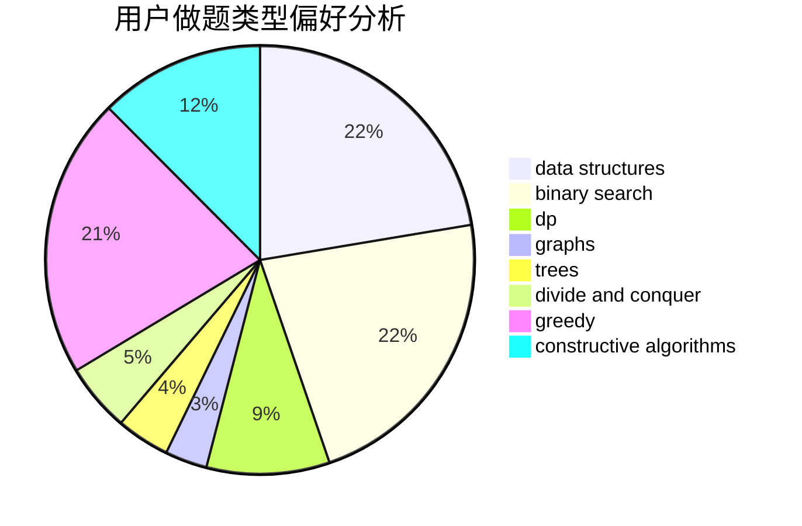

# xuezhe

<!-- tabs:start -->

#### **用户提交结果分析**

#### **用户做题类型偏好分析**

#### **用户错题知识点分析**

<!-- tabs:end -->
# 推荐题目
[13822](https://codeforces.com/contest/1382/problem/2)		dsu,graphs,sortings,trees		  
[18C](https://codeforces.com/contest/18/problem/C)		data structures,
                        implementation		  
[998B](https://codeforces.com/contest/998/problem/B)		dp,
                        greedy,
                        sortings		  
[922B](https://codeforces.com/contest/922/problem/B)		brute force		  
[36C](https://codeforces.com/contest/36/problem/C)		geometry,
                        implementation		  
[1162E](https://codeforces.com/contest/1162/problem/E)		dsu,graphs,sortings,trees		  
[550B](https://codeforces.com/contest/550/problem/B)		bitmasks,
                        brute force		  
[295B](https://codeforces.com/contest/295/problem/B)		dp,
                        graphs,
                        shortest paths		  
[702C](https://codeforces.com/contest/702/problem/C)		binary search,
                        implementation,
                        two pointers		  
[925F](https://codeforces.com/contest/925/problem/F)		binary search,
                        flows		  
