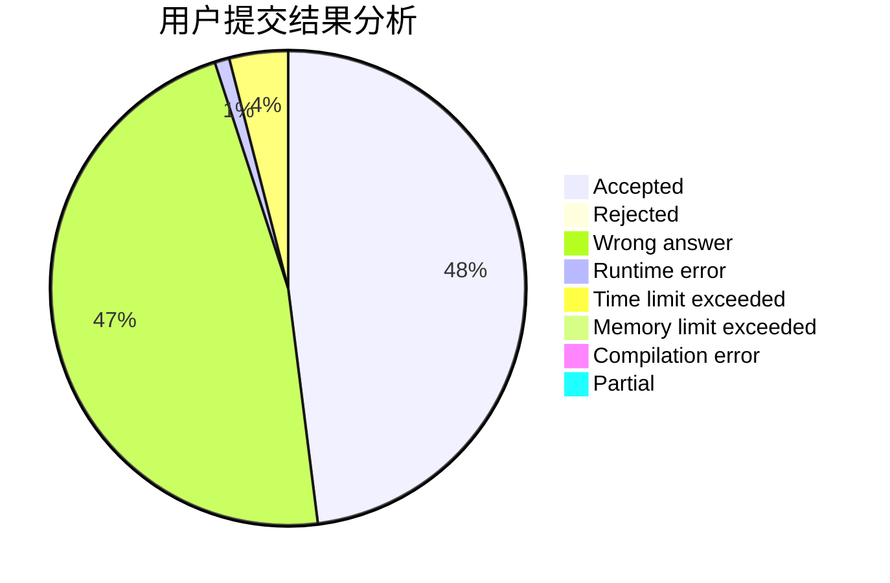
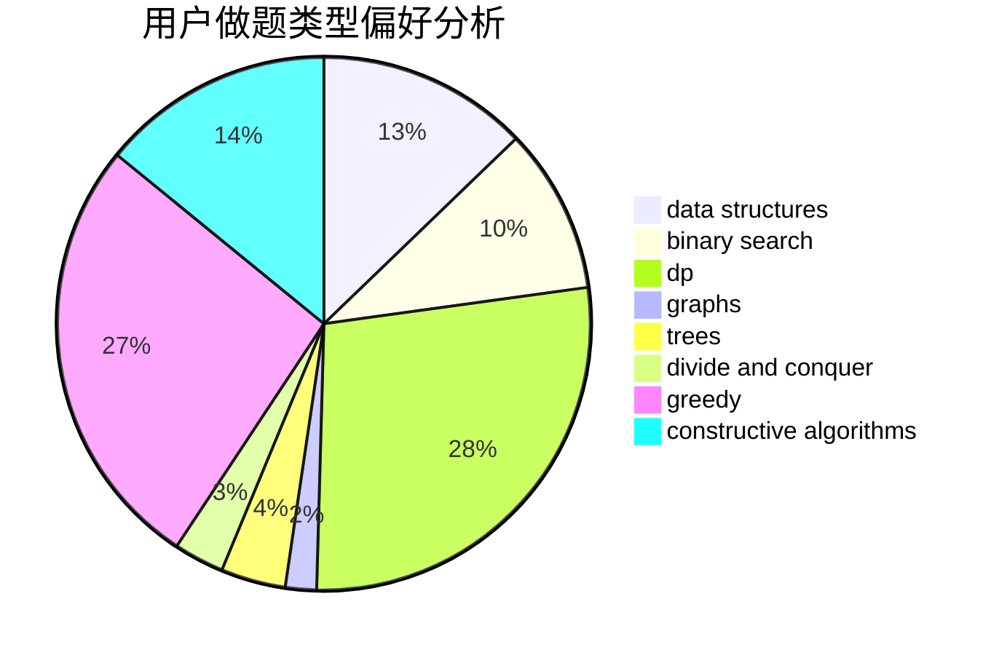

# Carls

<!-- tabs:start -->

#### **用户提交结果分析**

#### **用户做题类型偏好分析**

#### **用户错题知识点分析**

<!-- tabs:end -->
# 推荐题目
[149E](https://codeforces.com/contest/149/problem/E)		string suffix structures,
                        strings		  
[380E](https://codeforces.com/contest/380/problem/E)		data structures		  
[653C](https://codeforces.com/contest/653/problem/C)		brute force,
                        implementation		  
[652E](https://codeforces.com/contest/652/problem/E)		dfs and similar,
                        dsu,
                        graphs,
                        trees		  
[114D](https://codeforces.com/contest/114/problem/D)		dsu,graphs,sortings,trees		  
[525B](https://codeforces.com/contest/525/problem/B)		constructive algorithms,
                        greedy,
                        math,
                        strings		  
[1270G](https://codeforces.com/contest/1270/problem/G)		constructive algorithms,
                        dfs and similar,
                        graphs,
                        math		  
[436B](https://codeforces.com/contest/436/problem/B)		implementation,
                        math		  
[653F](https://codeforces.com/contest/653/problem/F)		data structures,
                        string suffix structures,
                        strings		  
[380C](https://codeforces.com/contest/380/problem/C)		data structures,
                        schedules		  
