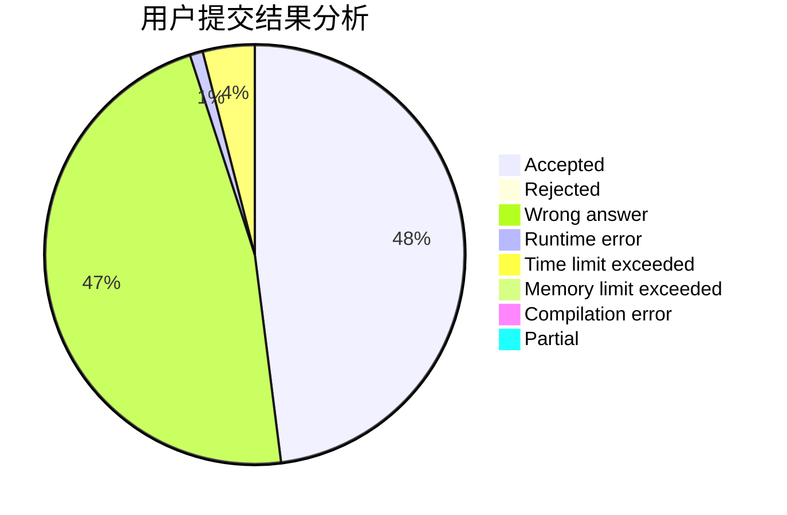
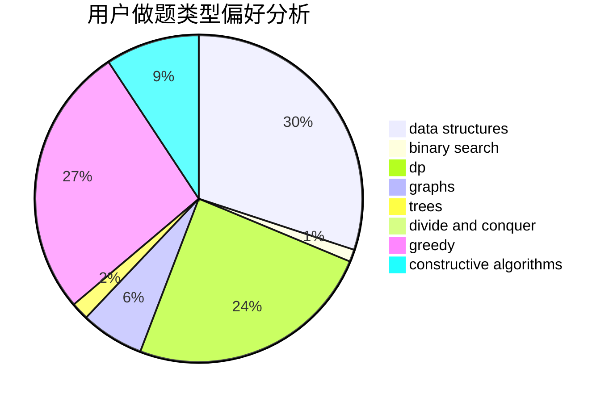
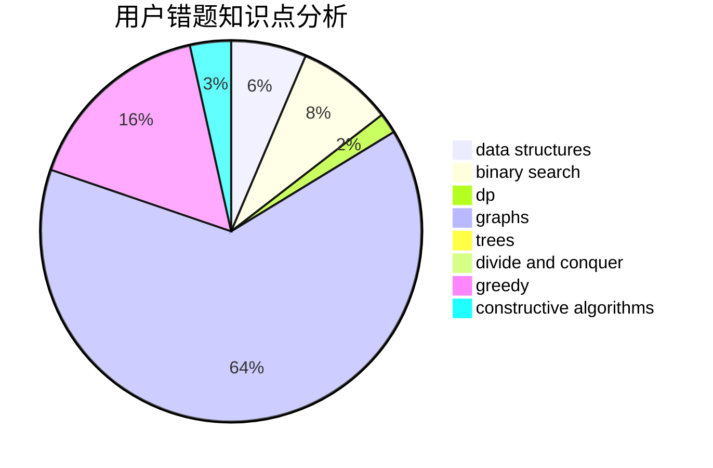

# Carls

<!-- tabs:start -->

#### **用户提交结果分析**

#### **用户做题类型偏好分析**

#### **用户错题知识点分析**

<!-- tabs:end -->
# 推荐题目
[1510A](https://codeforces.com/contest/1510/problem/A)		nan		  
[412D](https://codeforces.com/contest/412/problem/D)		dfs and similar		  
[677C](https://codeforces.com/contest/677/problem/C)		bitmasks,
                        combinatorics,
                        implementation,
                        strings		  
[676D](https://codeforces.com/contest/676/problem/D)		graphs,
                        implementation,
                        shortest paths		  
[11521](https://codeforces.com/contest/1152/problem/1)		dsu,graphs,sortings,trees		  
[549E](https://codeforces.com/contest/549/problem/E)		geometry,
                        math		  
[127A](https://codeforces.com/contest/127/problem/A)		geometry		  
[456B](https://codeforces.com/contest/456/problem/B)		math,
                        number theory		  
[678B](https://codeforces.com/contest/678/problem/B)		implementation		  
[411A](https://codeforces.com/contest/411/problem/A)		*special problem,
                        implementation		  
