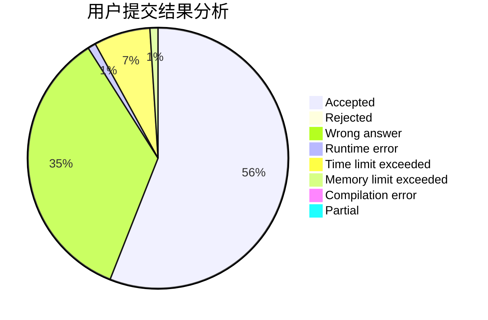
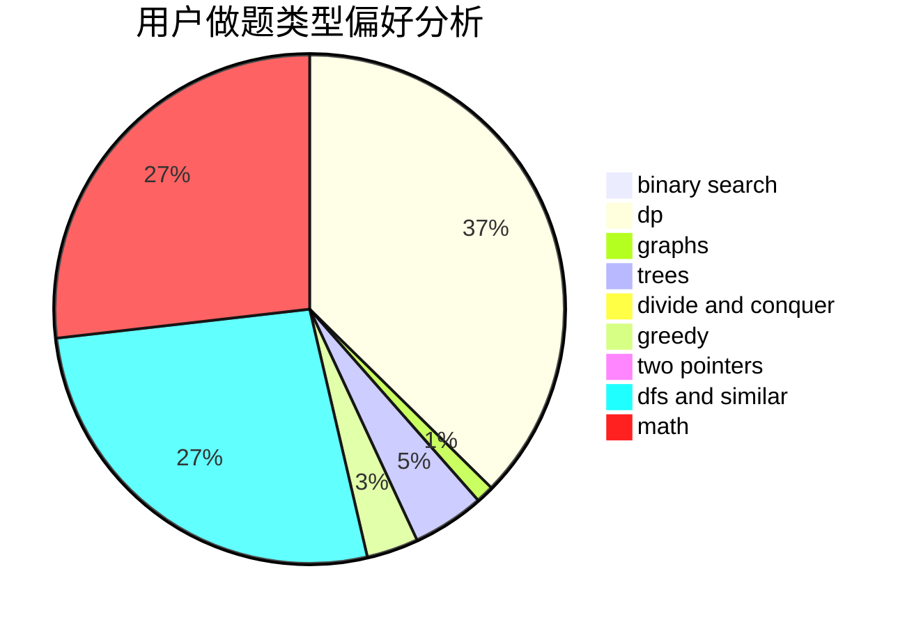

# xumingyang

<!-- tabs:start -->

#### **用户提交结果分析**

#### **用户做题类型偏好分析**

<!-- tabs:end -->
# 推荐题目
[1476D](https://codeforces.com/contest/1476/problem/D)
[329B](https://codeforces.com/contest/329/problem/B)
[678B](https://codeforces.com/contest/678/problem/B)
[367D](https://codeforces.com/contest/367/problem/D)
[1191A](https://codeforces.com/contest/1191/problem/A)
[1427C](https://codeforces.com/contest/1427/problem/C)
[205B](https://codeforces.com/contest/205/problem/B)
[277B](https://codeforces.com/contest/277/problem/B)
[1042A](https://codeforces.com/contest/1042/problem/A)
[802J](https://codeforces.com/contest/802/problem/J)
