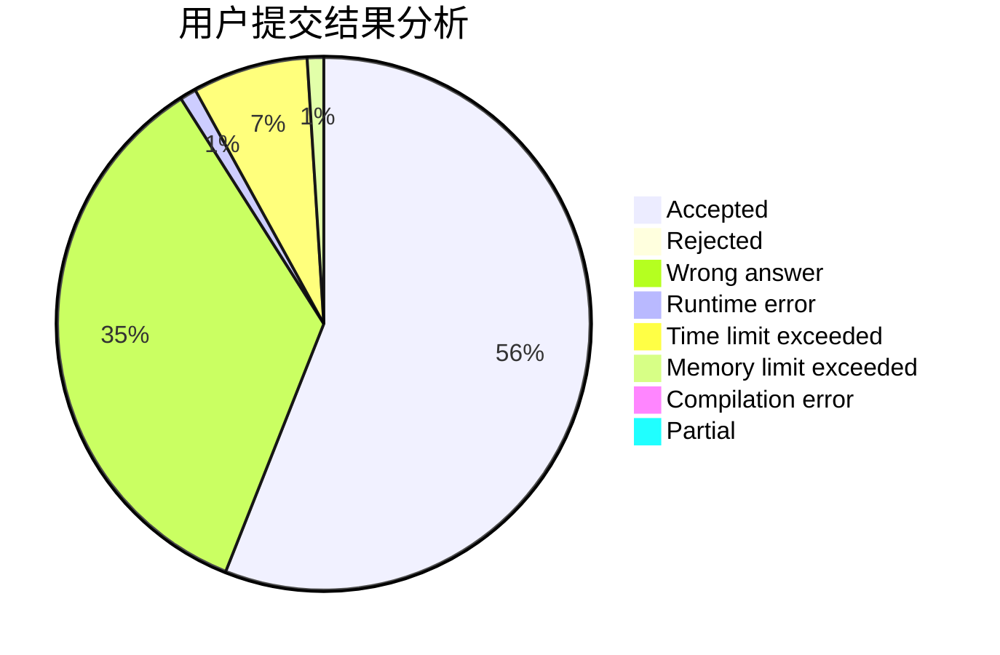
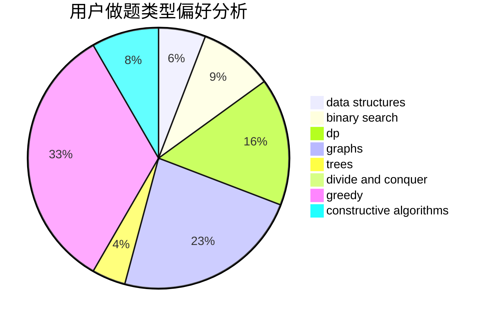
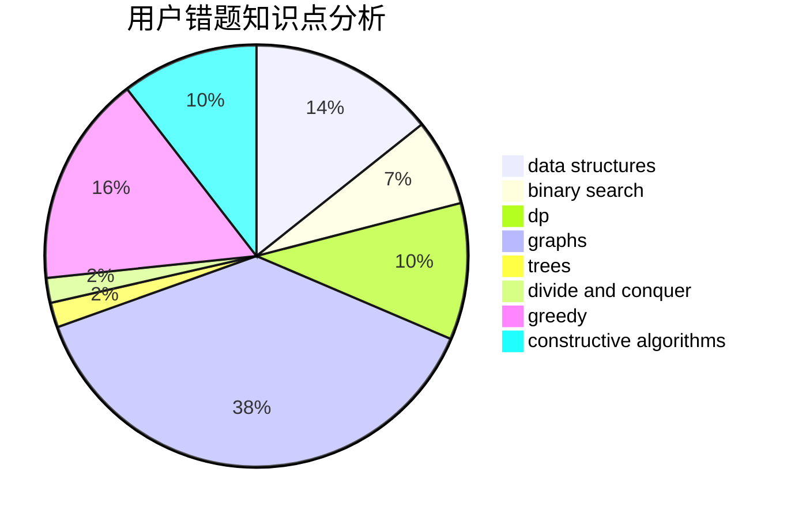

# xumingyang

<!-- tabs:start -->

#### **用户提交结果分析**

#### **用户做题类型偏好分析**

#### **用户错题知识点分析**

<!-- tabs:end -->
# 推荐题目
[1468J](https://codeforces.com/contest/1468/problem/J)		dsu,
                        graphs,
                        greedy		  
[306D](https://codeforces.com/contest/306/problem/D)		constructive algorithms,
                        geometry		  
[653F](https://codeforces.com/contest/653/problem/F)		data structures,
                        string suffix structures,
                        strings		  
[33D](https://codeforces.com/contest/33/problem/D)		geometry,
                        graphs,
                        shortest paths,
                        sortings		  
[1187D](https://codeforces.com/contest/1187/problem/D)		data structures,
                        sortings		  
[1419D2](https://codeforces.com/contest/1419D/problem/2)		binary search,
                        brute force,
                        constructive algorithms,
                        greedy,
                        sortings,
                        two pointers		  
[17C](https://codeforces.com/contest/17/problem/C)		dp		  
[25B](https://codeforces.com/contest/25/problem/B)		implementation		  
[1041D](https://codeforces.com/contest/1041/problem/D)		binary search,
                        data structures,
                        two pointers		  
[785E](https://codeforces.com/contest/785/problem/E)		brute force,
                        data structures		  
