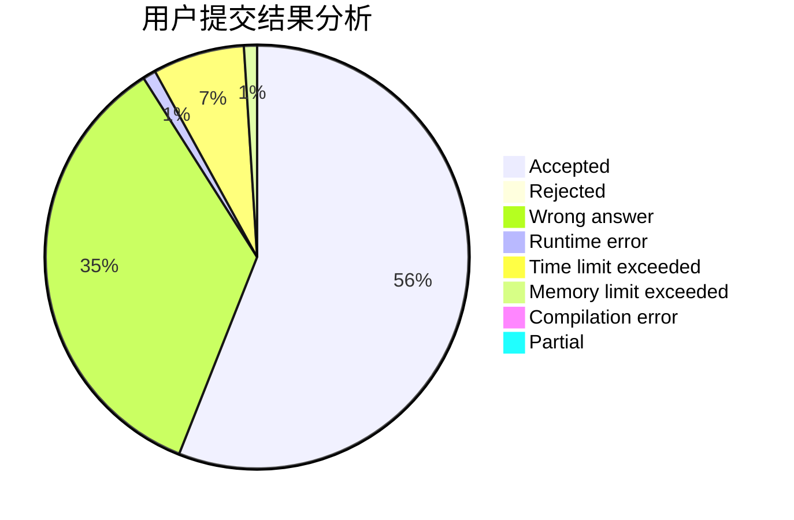
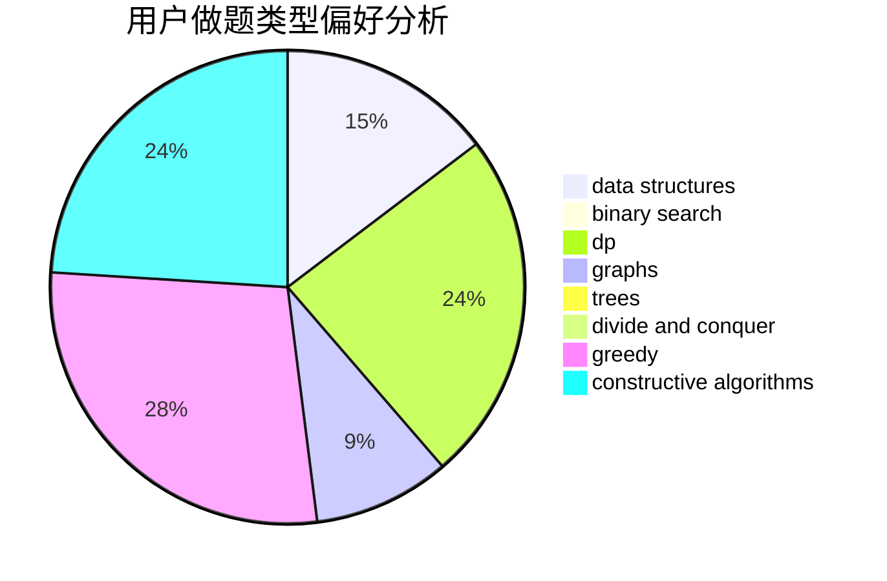
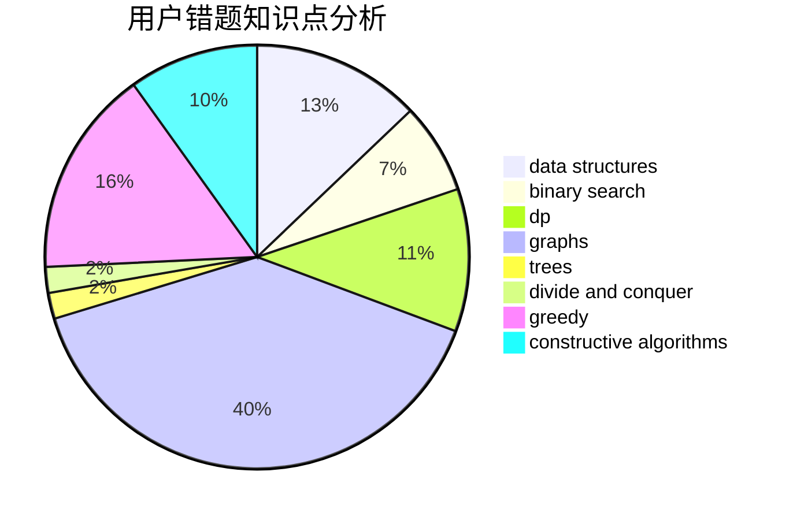

# xumingyang

<!-- tabs:start -->

#### **用户提交结果分析**

#### **用户做题类型偏好分析**

#### **用户错题知识点分析**

<!-- tabs:end -->
# 推荐题目
[1476D](https://codeforces.com/contest/1476/problem/D)		dfs and similar,
                        dp,
                        dsu,
                        implementation		  
[329B](https://codeforces.com/contest/329/problem/B)		dfs and similar,
                        shortest paths		  
[678B](https://codeforces.com/contest/678/problem/B)		implementation		  
[367D](https://codeforces.com/contest/367/problem/D)		bitmasks,
                        dfs and similar		  
[1191A](https://codeforces.com/contest/1191/problem/A)		brute force		  
[1427C](https://codeforces.com/contest/1427/problem/C)		dp		  
[205B](https://codeforces.com/contest/205/problem/B)		brute force,
                        greedy		  
[277B](https://codeforces.com/contest/277/problem/B)		constructive algorithms,
                        geometry		  
[1042A](https://codeforces.com/contest/1042/problem/A)		binary search,
                        implementation		  
[802J](https://codeforces.com/contest/802/problem/J)		dfs and similar,
                        graphs,
                        trees		  
