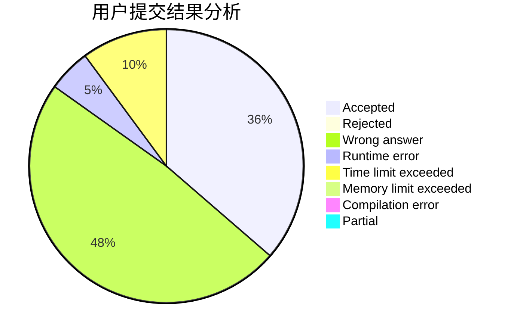
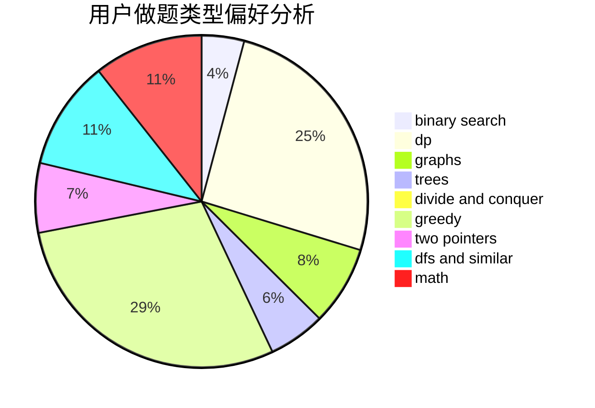

# xumouyi

<!-- tabs:start -->

#### **用户提交结果分析**

#### **用户做题类型偏好分析**

<!-- tabs:end -->
# 推荐题目
[1431B](https://codeforces.com/contest/1431/problem/B)
[1432F](https://codeforces.com/contest/1432/problem/F)
[1210E](https://codeforces.com/contest/1210/problem/E)
[1385G](https://codeforces.com/contest/1385/problem/G)
[418D](https://codeforces.com/contest/418/problem/D)
[844A](https://codeforces.com/contest/844/problem/A)
[488B](https://codeforces.com/contest/488/problem/B)
[764C](https://codeforces.com/contest/764/problem/C)
[736D](https://codeforces.com/contest/736/problem/D)
[1285F](https://codeforces.com/contest/1285/problem/F)
