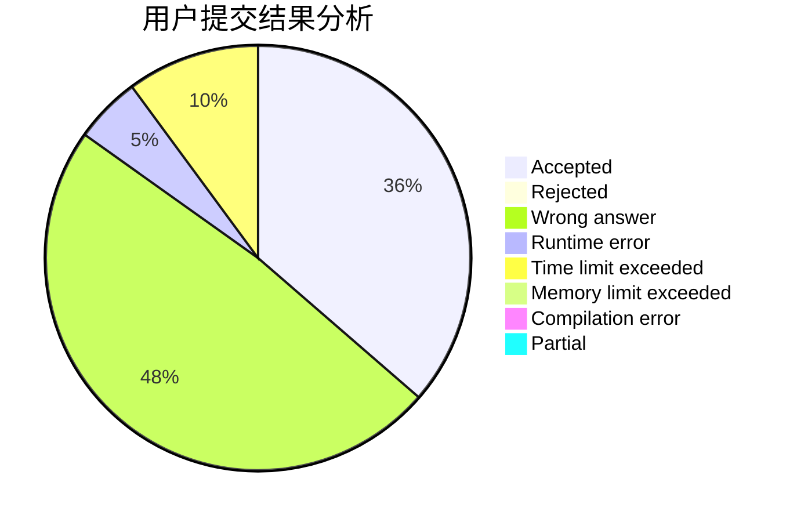
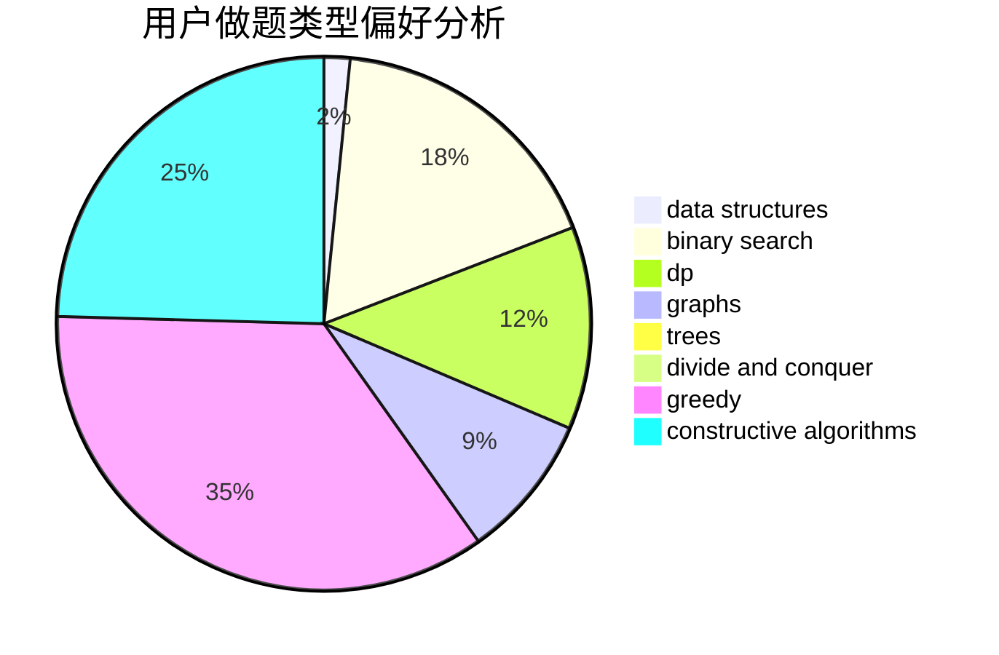
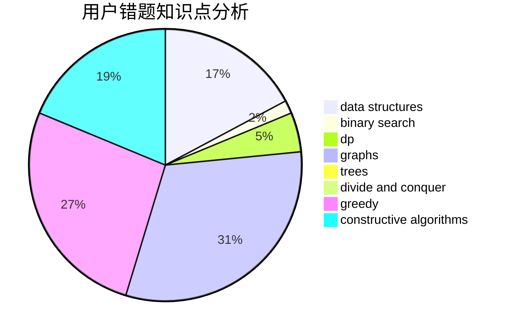

# xumouyi

<!-- tabs:start -->

#### **用户提交结果分析**

#### **用户做题类型偏好分析**

#### **用户错题知识点分析**

<!-- tabs:end -->
# 推荐题目
[1423G](https://codeforces.com/contest/1423/problem/G)		data structures		  
[1424G](https://codeforces.com/contest/1424/problem/G)		data structures,
                        sortings		  
[1206D](https://codeforces.com/contest/1206/problem/D)		dsu,graphs,sortings,trees		  
[1376B3](https://codeforces.com/contest/1376B/problem/3)		dsu,graphs,sortings,trees		  
[389B](https://codeforces.com/contest/389/problem/B)		greedy,
                        implementation		  
[825D](https://codeforces.com/contest/825/problem/D)		binary search,
                        greedy,
                        implementation		  
[468D](https://codeforces.com/contest/468/problem/D)		graph matchings		  
[744B](https://codeforces.com/contest/744/problem/B)		bitmasks,
                        divide and conquer,
                        interactive		  
[719C](https://codeforces.com/contest/719/problem/C)		dsu,graphs,sortings,trees		  
[1279E](https://codeforces.com/contest/1279/problem/E)		combinatorics,
                        dp		  
