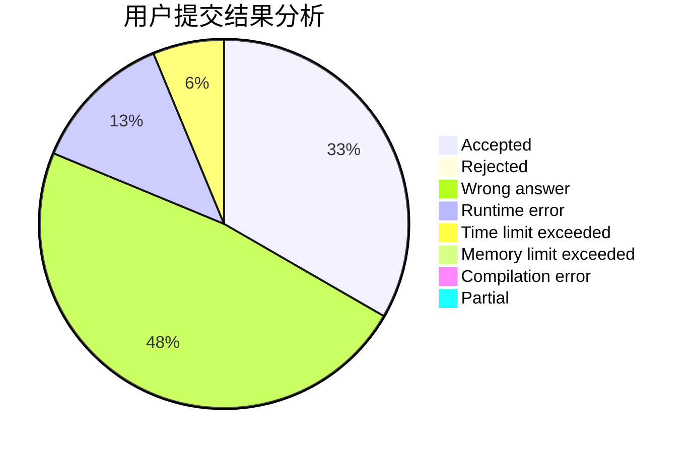
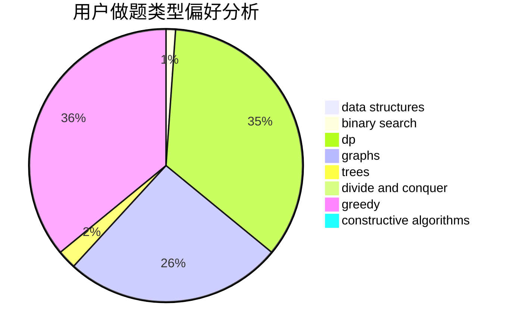
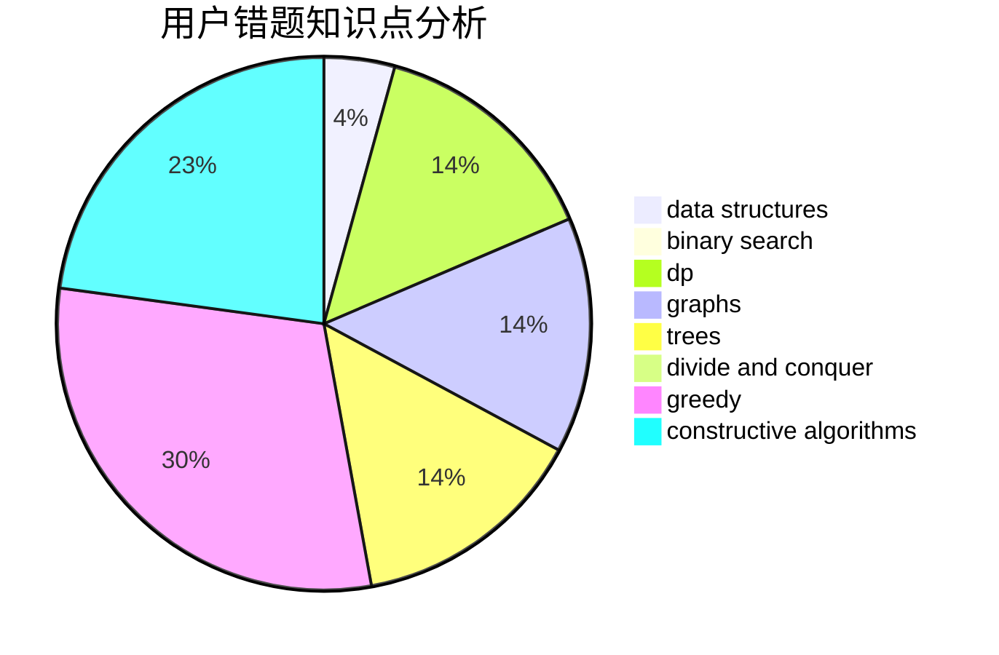

# xuqin

<!-- tabs:start -->

#### **用户提交结果分析**

#### **用户做题类型偏好分析**

#### **用户错题知识点分析**

<!-- tabs:end -->
# 推荐题目
[1218C](https://codeforces.com/contest/1218/problem/C)		dp		  
[269B](https://codeforces.com/contest/269/problem/B)		dp		  
[577E](https://codeforces.com/contest/577/problem/E)		dsu,graphs,sortings,trees		  
[854C](https://codeforces.com/contest/854/problem/C)		dsu,graphs,sortings,trees		  
[894B](https://codeforces.com/contest/894/problem/B)		combinatorics,
                        constructive algorithms,
                        math,
                        number theory		  
[1248C](https://codeforces.com/contest/1248/problem/C)		dsu,graphs,sortings,trees		  
[1191B](https://codeforces.com/contest/1191/problem/B)		brute force,
                        implementation		  
[1510G](https://codeforces.com/contest/1510/problem/G)		nan		  
[1315C](https://codeforces.com/contest/1315/problem/C)		greedy		  
[696F](https://codeforces.com/contest/696/problem/F)		binary search,
                        geometry,
                        two pointers		  
