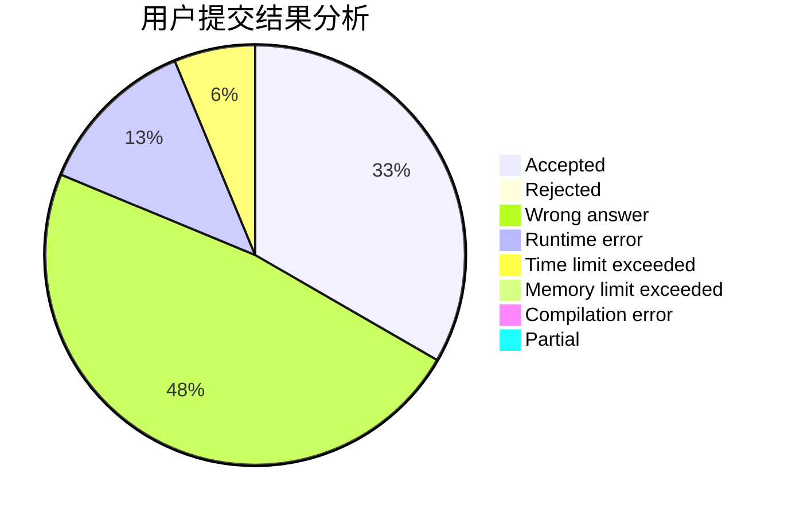
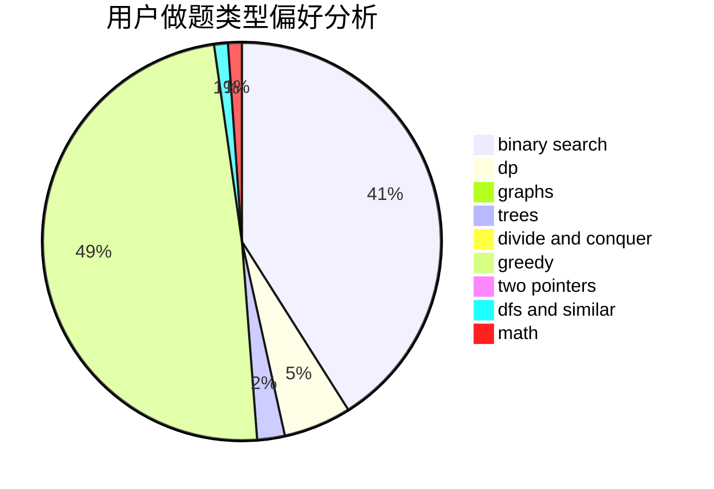

# xuqin

<!-- tabs:start -->

#### **用户提交结果分析**

#### **用户做题类型偏好分析**

<!-- tabs:end -->
# 推荐题目
[1225E](https://codeforces.com/contest/1225/problem/E)
[284E](https://codeforces.com/contest/284/problem/E)
[599B](https://codeforces.com/contest/599/problem/B)
[873A](https://codeforces.com/contest/873/problem/A)
[912A](https://codeforces.com/contest/912/problem/A)
[1252D](https://codeforces.com/contest/1252/problem/D)
[1197A](https://codeforces.com/contest/1197/problem/A)
[165D](https://codeforces.com/contest/165/problem/D)
[1325B](https://codeforces.com/contest/1325/problem/B)
[713D](https://codeforces.com/contest/713/problem/D)
