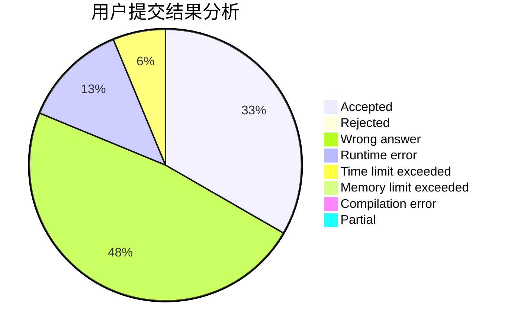
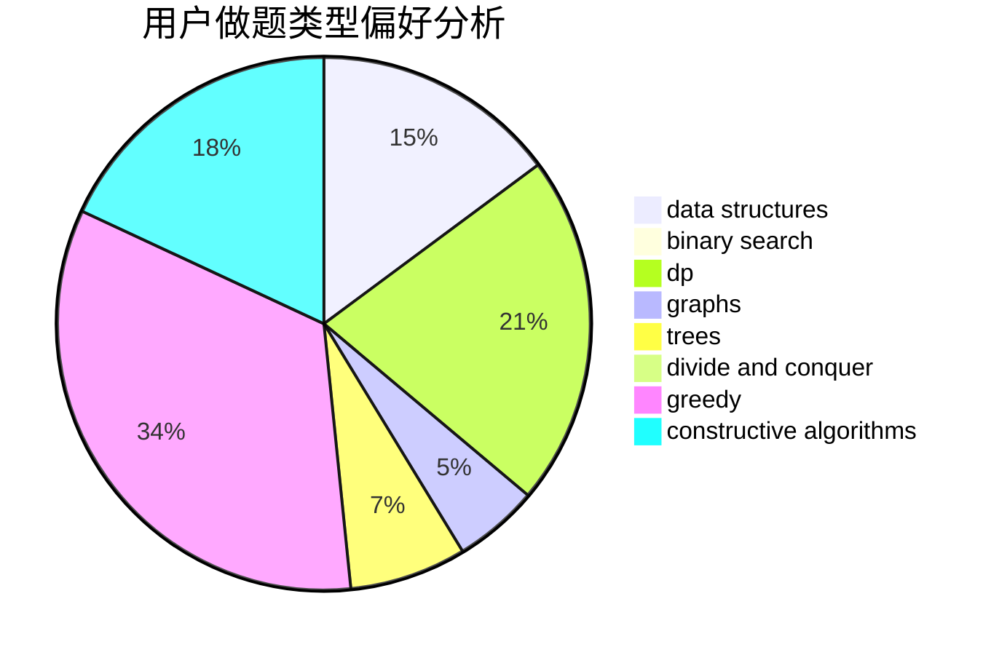
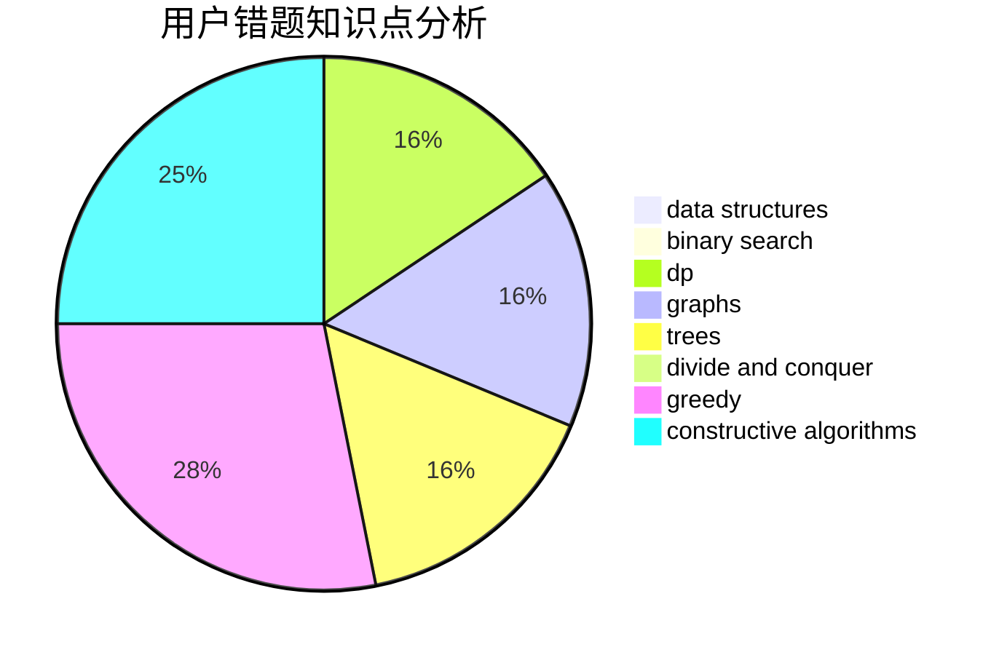

# xuqin

<!-- tabs:start -->

#### **用户提交结果分析**

#### **用户做题类型偏好分析**

#### **用户错题知识点分析**

<!-- tabs:end -->
# 推荐题目
[1225E](https://codeforces.com/contest/1225/problem/E)		binary search,
                        dp		  
[284E](https://codeforces.com/contest/284/problem/E)		dsu,graphs,sortings,trees		  
[599B](https://codeforces.com/contest/599/problem/B)		implementation		  
[873A](https://codeforces.com/contest/873/problem/A)		implementation		  
[912A](https://codeforces.com/contest/912/problem/A)		implementation		  
[1252D](https://codeforces.com/contest/1252/problem/D)		data structures,
                        dp,
                        strings,
                        trees		  
[1197A](https://codeforces.com/contest/1197/problem/A)		greedy,
                        math,
                        sortings		  
[165D](https://codeforces.com/contest/165/problem/D)		data structures,
                        dsu,
                        trees		  
[1325B](https://codeforces.com/contest/1325/problem/B)		greedy,
                        implementation		  
[713D](https://codeforces.com/contest/713/problem/D)		binary search,
                        data structures		  
