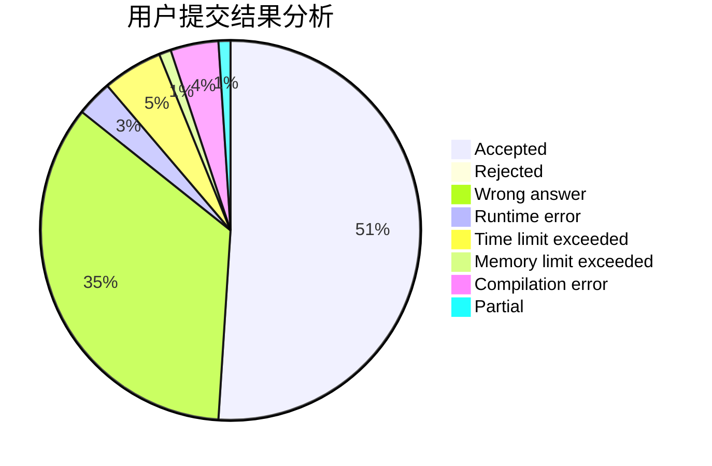
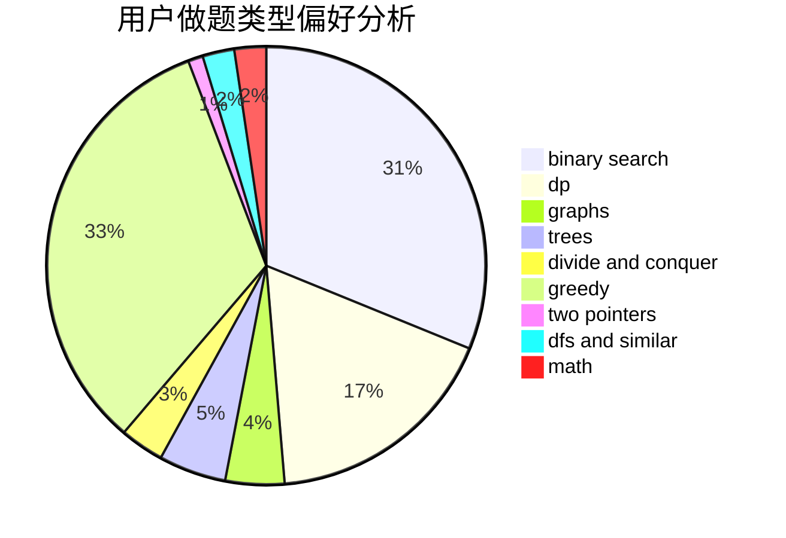

# xuyifeng

<!-- tabs:start -->

#### **用户提交结果分析**

#### **用户做题类型偏好分析**

<!-- tabs:end -->
# 推荐题目
[1485C](https://codeforces.com/contest/1485/problem/C)
[acmsguru7](https://codeforces.com/contest/acmsguru/problem/7)
[766E](https://codeforces.com/contest/766/problem/E)
[807E](https://codeforces.com/contest/807/problem/E)
[1341A](https://codeforces.com/contest/1341/problem/A)
[833C](https://codeforces.com/contest/833/problem/C)
[497D](https://codeforces.com/contest/497/problem/D)
[198C](https://codeforces.com/contest/198/problem/C)
[98E](https://codeforces.com/contest/98/problem/E)
[1102E](https://codeforces.com/contest/1102/problem/E)
