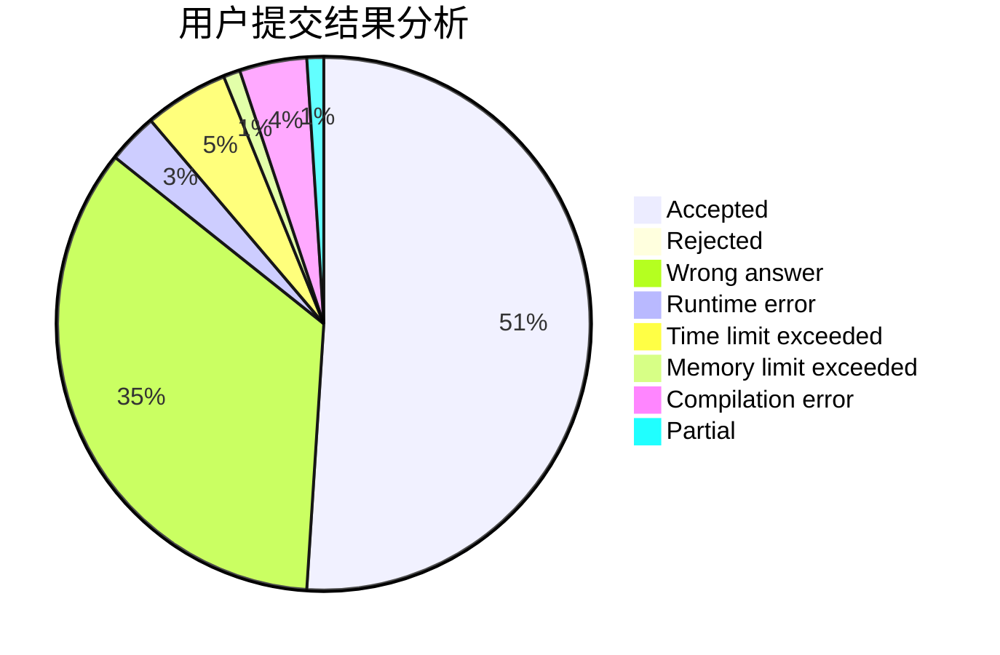
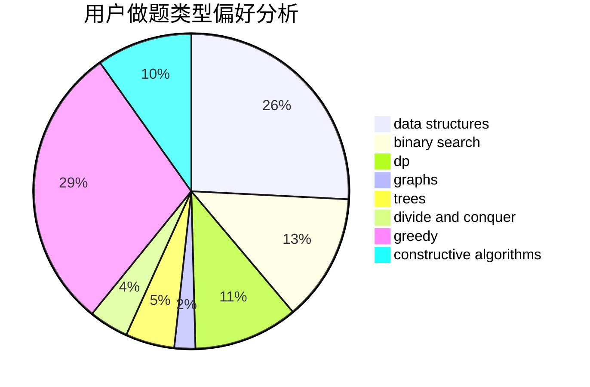
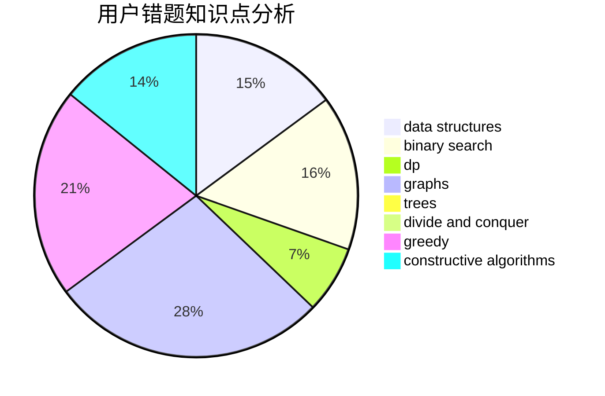

# xuyifeng

<!-- tabs:start -->

#### **用户提交结果分析**

#### **用户做题类型偏好分析**

#### **用户错题知识点分析**

<!-- tabs:end -->
# 推荐题目
[1485C](https://codeforces.com/contest/1485/problem/C)		binary search,
                        brute force,
                        math,
                        number theory		  
[acmsguru7](https://codeforces.com/contest/acmsguru/problem/7)		dsu,graphs,sortings,trees		  
[766E](https://codeforces.com/contest/766/problem/E)		bitmasks,
                        constructive algorithms,
                        data structures,
                        dfs and similar,
                        dp,
                        math,
                        trees		  
[807E](https://codeforces.com/contest/807/problem/E)		dsu,graphs,sortings,trees		  
[1341A](https://codeforces.com/contest/1341/problem/A)		math		  
[833C](https://codeforces.com/contest/833/problem/C)		brute force,
                        combinatorics,
                        greedy,
                        math		  
[497D](https://codeforces.com/contest/497/problem/D)		brute force,
                        geometry,
                        math		  
[198C](https://codeforces.com/contest/198/problem/C)		binary search,
                        geometry		  
[98E](https://codeforces.com/contest/98/problem/E)		dp,
                        games,
                        math,
                        probabilities		  
[1102E](https://codeforces.com/contest/1102/problem/E)		combinatorics,
                        sortings		  
