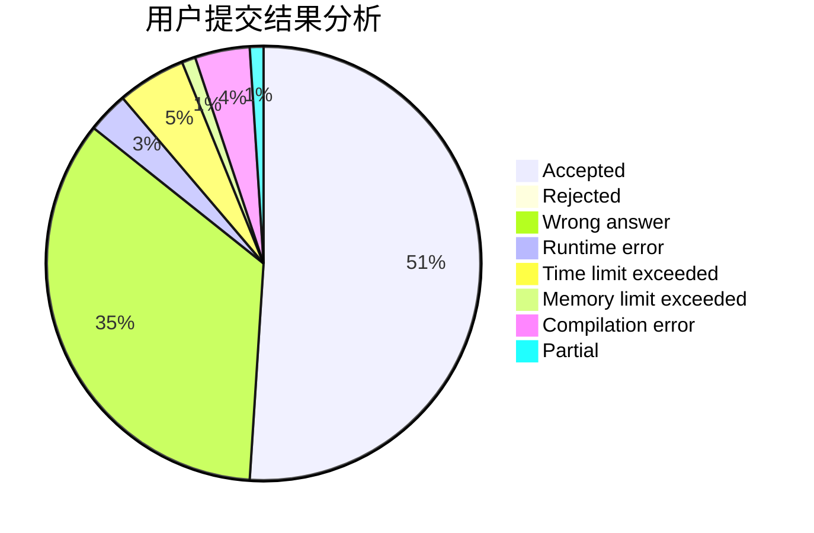
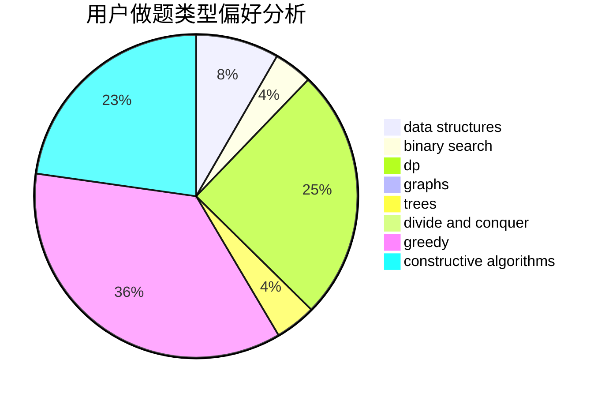
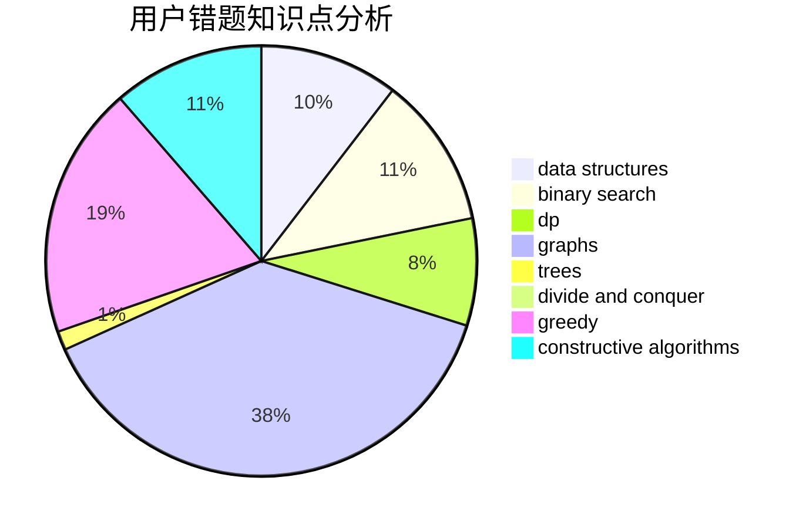

# xuyifeng
<!-- tabs:start -->
#### **用户提交结果分析**

#### **用户做题类型偏好分析**

#### **用户错题知识点分析**

<!-- tabs:end -->
# 推荐题目
[Mammoth's Genome Decoding](http://codeforces.com/problemset/problem/747/B)		implementation,
                        strings		  
[Make It Ascending](http://codeforces.com/problemset/problem/1342/F)		bitmasks,
                        brute force,
                        dp		  
[Minimum Binary Number](http://codeforces.com/problemset/problem/976/A)		implementation		  
[Xor-Set](http://codeforces.com/problemset/problem/1261/F)		bitmasks,
                        divide and conquer,
                        math		  
[Shooting Gallery](http://codeforces.com/problemset/problem/30/C)		dp,
                        probabilities		  
[Skyscrapers](https://codeforces.com/contest/1138/problem/C)		implementation,
                        sortings		  
[Boxes Packing](https://codeforces.com/contest/1489/problem/F)		binary search,
                        implementation		  
[A Piece of Cake](http://codeforces.com/problemset/problem/171/C)		*special problem,
                        implementation		  
[Dreamoon and Binary](http://codeforces.com/problemset/problem/477/D)		dp,
                        strings		  
[Two Friends](http://codeforces.com/problemset/problem/8/D)		binary search,
                        geometry		  
<!-- tabs:start -->
#### **data structures**
[Mammoth's Genome Decoding](http://codeforces.com/problemset/problem/1017/D)		bitmasks,
                        brute force,
                        data structures		  
[Make It Ascending](http://codeforces.com/problemset/problem/1185/C2)		brute force,
                        data structures,
                        greedy,
                        math		  
[Minimum Binary Number](http://codeforces.com/problemset/problem/986/E)		brute force,
                        data structures,
                        math,
                        number theory,
                        trees		  
[Xor-Set](http://codeforces.com/problemset/problem/165/D)		data structures,
                        dsu,
                        trees		  
[Shooting Gallery](http://codeforces.com/problemset/problem/713/D)		binary search,
                        data structures		  
[Skyscrapers](http://codeforces.com/problemset/problem/877/F)		data structures,
                        flows,
                        hashing		  
[Boxes Packing](http://codeforces.com/problemset/problem/486/E)		data structures,
                        dp,
                        greedy,
                        hashing,
                        math		  
[A Piece of Cake](https://codeforces.com/contest/831/problem/F)		brute force,
                        data structures,
                        implementation,
                        math,
                        number theory,
                        sortings,
                        two pointers		  
[Dreamoon and Binary](http://codeforces.com/problemset/problem/788/E)		data structures		  
[Two Friends](http://codeforces.com/problemset/problem/1476/E)		bitmasks,
                        data structures,
                        dfs and similar,
                        graphs,
                        hashing,
                        sortings,
                        strings		  
#### **binary search**
[Mammoth's Genome Decoding](https://codeforces.com/contest/1489/problem/F)		binary search,
                        implementation		  
[Make It Ascending](http://codeforces.com/problemset/problem/8/D)		binary search,
                        geometry		  
[Minimum Binary Number](http://codeforces.com/problemset/problem/713/D)		binary search,
                        data structures		  
[Xor-Set](http://codeforces.com/problemset/problem/696/F)		binary search,
                        geometry,
                        two pointers		  
[Shooting Gallery](http://codeforces.com/problemset/problem/817/C)		binary search,
                        brute force,
                        dp,
                        math		  
[Skyscrapers](http://codeforces.com/problemset/problem/125/E)		binary search,
                        graphs		  
[Boxes Packing](https://codeforces.com/contest/1424/problem/J)		binary search,
                        math,
                        number theory,
                        two pointers		  
[A Piece of Cake](http://codeforces.com/problemset/problem/1492/C)		binary search,
                        data structures,
                        dp,
                        greedy,
                        two pointers		  
[Dreamoon and Binary](http://codeforces.com/problemset/problem/1463/D)		binary search,
                        constructive algorithms,
                        greedy,
                        two pointers		  
[Two Friends](http://codeforces.com/problemset/problem/1490/G)		binary search,
                        data structures,
                        math		  
#### **dp**
[Mammoth's Genome Decoding](http://codeforces.com/problemset/problem/1342/F)		bitmasks,
                        brute force,
                        dp		  
[Make It Ascending](http://codeforces.com/problemset/problem/30/C)		dp,
                        probabilities		  
[Minimum Binary Number](http://codeforces.com/problemset/problem/477/D)		dp,
                        strings		  
[Xor-Set](http://codeforces.com/problemset/problem/814/E)		combinatorics,
                        dp,
                        graphs,
                        shortest paths		  
[Shooting Gallery](http://codeforces.com/problemset/problem/486/E)		data structures,
                        dp,
                        greedy,
                        hashing,
                        math		  
[Skyscrapers](https://codeforces.com/contest/1337/problem/E)		dp,
                        strings		  
[Boxes Packing](http://codeforces.com/problemset/problem/453/B)		bitmasks,
                        brute force,
                        dp		  
[A Piece of Cake](https://codeforces.com/contest/1424/problem/I)		bitmasks,
                        constructive algorithms,
                        dp,
                        math		  
[Dreamoon and Binary](http://codeforces.com/problemset/problem/855/E)		bitmasks,
                        dp		  
[Two Friends](http://codeforces.com/problemset/problem/1425/D)		combinatorics,
                        dp,
                        math		  
#### **graph**
[Mammoth's Genome Decoding](http://codeforces.com/problemset/problem/1255/B)		graphs,
                        implementation		  
[Make It Ascending](http://codeforces.com/problemset/problem/814/E)		combinatorics,
                        dp,
                        graphs,
                        shortest paths		  
[Minimum Binary Number](http://codeforces.com/problemset/problem/240/E)		dfs and similar,
                        graphs,
                        greedy		  
[Xor-Set](http://codeforces.com/problemset/problem/1019/C)		constructive algorithms,
                        graphs		  
[Shooting Gallery](http://codeforces.com/problemset/problem/893/C)		dfs and similar,
                        graphs,
                        greedy		  
[Skyscrapers](http://codeforces.com/problemset/problem/1349/C)		dfs and similar,
                        graphs,
                        implementation,
                        shortest paths		  
[Boxes Packing](http://codeforces.com/problemset/problem/1476/E)		bitmasks,
                        data structures,
                        dfs and similar,
                        graphs,
                        hashing,
                        sortings,
                        strings		  
[A Piece of Cake](http://codeforces.com/problemset/problem/125/E)		binary search,
                        graphs		  
[Dreamoon and Binary](http://codeforces.com/problemset/problem/1327/B)		brute force,
                        graphs,
                        greedy		  
[Two Friends](http://codeforces.com/problemset/problem/1487/C)		brute force,
                        constructive algorithms,
                        dfs and similar,
                        graphs,
                        greedy,
                        implementation,
                        math		  
#### **trees**
[Mammoth's Genome Decoding](http://codeforces.com/problemset/problem/986/E)		brute force,
                        data structures,
                        math,
                        number theory,
                        trees		  
[Make It Ascending](http://codeforces.com/problemset/problem/165/D)		data structures,
                        dsu,
                        trees		  
[Minimum Binary Number](https://codeforces.com/contest/1230/problem/E)		math,
                        number theory,
                        trees		  
[Xor-Set](http://codeforces.com/problemset/problem/827/B)		constructive algorithms,
                        greedy,
                        implementation,
                        trees		  
[Shooting Gallery](http://codeforces.com/problemset/problem/581/F)		dp,
                        trees,
                        two pointers		  
[Skyscrapers](http://codeforces.com/problemset/problem/461/B)		dfs and similar,
                        dp,
                        trees		  
[Boxes Packing](http://codeforces.com/problemset/problem/1479/D)		binary search,
                        bitmasks,
                        brute force,
                        data structures,
                        probabilities,
                        trees		  
[A Piece of Cake](http://codeforces.com/problemset/problem/1511/C)		brute force,
                        data structures,
                        implementation,
                        trees		  
[Dreamoon and Binary](http://codeforces.com/problemset/problem/1499/F)		combinatorics,
                        dfs and similar,
                        dp,
                        trees		  
[Two Friends](http://codeforces.com/problemset/problem/1491/E)		brute force,
                        dfs and similar,
                        divide and conquer,
                        number theory,
                        trees		  
#### **divide and conquer**
[Mammoth's Genome Decoding](http://codeforces.com/problemset/problem/1261/F)		bitmasks,
                        divide and conquer,
                        math		  
[Make It Ascending](http://codeforces.com/problemset/problem/1466/G)		combinatorics,
                        divide and conquer,
                        hashing,
                        math,
                        string suffix structures,
                        strings		  
[Minimum Binary Number](http://codeforces.com/problemset/problem/1470/F)		divide and conquer		  
[Xor-Set](http://codeforces.com/problemset/problem/1461/D)		binary search,
                        brute force,
                        data structures,
                        divide and conquer,
                        implementation,
                        sortings		  
[Shooting Gallery](http://codeforces.com/problemset/problem/1466/G)		combinatorics,
                        divide and conquer,
                        hashing,
                        math,
                        string suffix structures,
                        strings		  
[Skyscrapers](http://codeforces.com/problemset/problem/1490/D)		dfs and similar,
                        divide and conquer,
                        implementation		  
[Boxes Packing](https://codeforces.com/contest/1483/problem/C)		data structures,
                        divide and conquer,
                        dp		  
[A Piece of Cake](http://codeforces.com/problemset/problem/1491/E)		brute force,
                        dfs and similar,
                        divide and conquer,
                        number theory,
                        trees		  
[Dreamoon and Binary](http://codeforces.com/problemset/problem/1303/G)		data structures,
                        divide and conquer,
                        geometry,
                        trees		  
[Two Friends](http://codeforces.com/problemset/problem/1494/D)		constructive algorithms,
                        data structures,
                        dfs and similar,
                        divide and conquer,
                        dsu,
                        greedy,
                        sortings,
                        trees		  
#### **greedy**
[Mammoth's Genome Decoding](http://codeforces.com/problemset/problem/1185/C2)		brute force,
                        data structures,
                        greedy,
                        math		  
[Make It Ascending](http://codeforces.com/problemset/problem/716/B)		greedy,
                        two pointers		  
[Minimum Binary Number](http://codeforces.com/problemset/problem/462/B)		greedy		  
[Xor-Set](http://codeforces.com/problemset/problem/1360/B)		greedy,
                        sortings		  
[Shooting Gallery](http://codeforces.com/problemset/problem/1102/B)		greedy,
                        sortings		  
[Skyscrapers](http://codeforces.com/problemset/problem/827/B)		constructive algorithms,
                        greedy,
                        implementation,
                        trees		  
[Boxes Packing](http://codeforces.com/problemset/problem/819/A)		games,
                        greedy		  
[A Piece of Cake](http://codeforces.com/problemset/problem/1254/B1)		constructive algorithms,
                        greedy,
                        math,
                        number theory,
                        ternary search,
                        two pointers		  
[Dreamoon and Binary](http://codeforces.com/problemset/problem/486/E)		data structures,
                        dp,
                        greedy,
                        hashing,
                        math		  
[Two Friends](http://codeforces.com/problemset/problem/1362/C)		bitmasks,
                        greedy,
                        math		  
#### **constructive algorithms**
[Mammoth's Genome Decoding](http://codeforces.com/problemset/problem/827/B)		constructive algorithms,
                        greedy,
                        implementation,
                        trees		  
[Make It Ascending](http://codeforces.com/problemset/problem/1254/B1)		constructive algorithms,
                        greedy,
                        math,
                        number theory,
                        ternary search,
                        two pointers		  
[Minimum Binary Number](http://codeforces.com/problemset/problem/1019/C)		constructive algorithms,
                        graphs		  
[Xor-Set](http://codeforces.com/problemset/problem/1292/E)		constructive algorithms,
                        greedy,
                        interactive,
                        math		  
[Shooting Gallery](http://codeforces.com/problemset/problem/1196/A)		brute force,
                        constructive algorithms,
                        math		  
[Skyscrapers](https://codeforces.com/contest/1424/problem/I)		bitmasks,
                        constructive algorithms,
                        dp,
                        math		  
[Boxes Packing](http://codeforces.com/problemset/problem/672/B)		constructive algorithms,
                        implementation,
                        strings		  
[A Piece of Cake](http://codeforces.com/problemset/problem/27/C)		constructive algorithms,
                        greedy		  
[Dreamoon and Binary](http://codeforces.com/problemset/problem/1088/A)		brute force,
                        constructive algorithms		  
[Two Friends](http://codeforces.com/problemset/problem/1365/F)		constructive algorithms,
                        implementation,
                        sortings		  
#### **sortings**
[Mammoth's Genome Decoding](https://codeforces.com/contest/1138/problem/C)		implementation,
                        sortings		  
[Make It Ascending](http://codeforces.com/problemset/problem/792/A)		implementation,
                        sortings		  
[Minimum Binary Number](http://codeforces.com/problemset/problem/1360/B)		greedy,
                        sortings		  
[Xor-Set](http://codeforces.com/problemset/problem/1102/B)		greedy,
                        sortings		  
[Shooting Gallery](http://codeforces.com/problemset/problem/599/C)		sortings		  
[Skyscrapers](https://codeforces.com/contest/831/problem/F)		brute force,
                        data structures,
                        implementation,
                        math,
                        number theory,
                        sortings,
                        two pointers		  
[Boxes Packing](http://codeforces.com/problemset/problem/714/B)		implementation,
                        sortings		  
[A Piece of Cake](http://codeforces.com/problemset/problem/1476/E)		bitmasks,
                        data structures,
                        dfs and similar,
                        graphs,
                        hashing,
                        sortings,
                        strings		  
[Dreamoon and Binary](http://codeforces.com/problemset/problem/1334/B)		greedy,
                        sortings		  
[Two Friends](http://codeforces.com/problemset/problem/1365/F)		constructive algorithms,
                        implementation,
                        sortings		  
<!-- tabs:end -->
