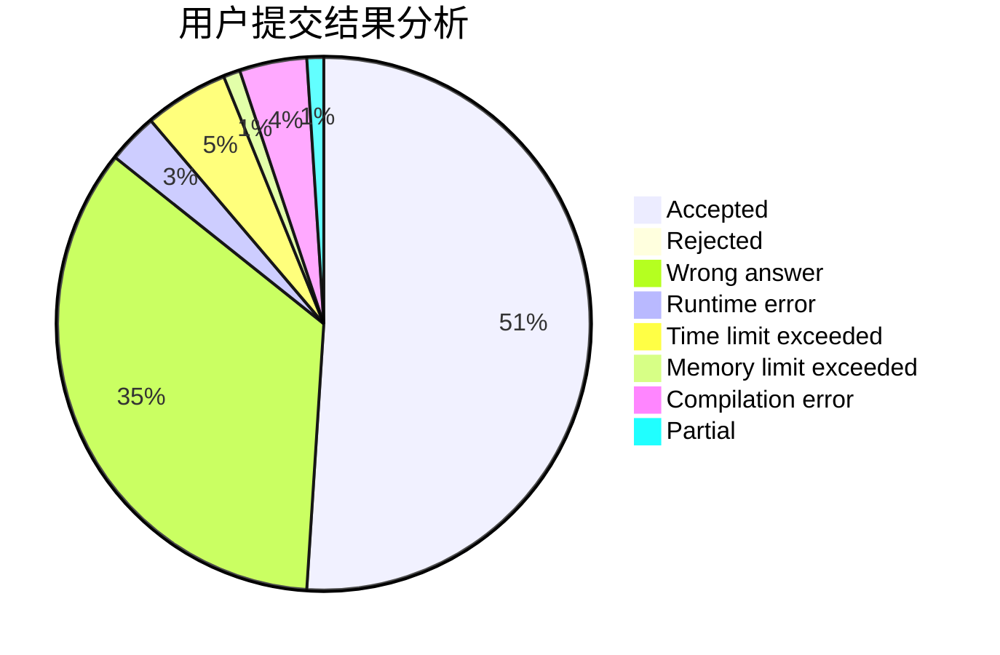
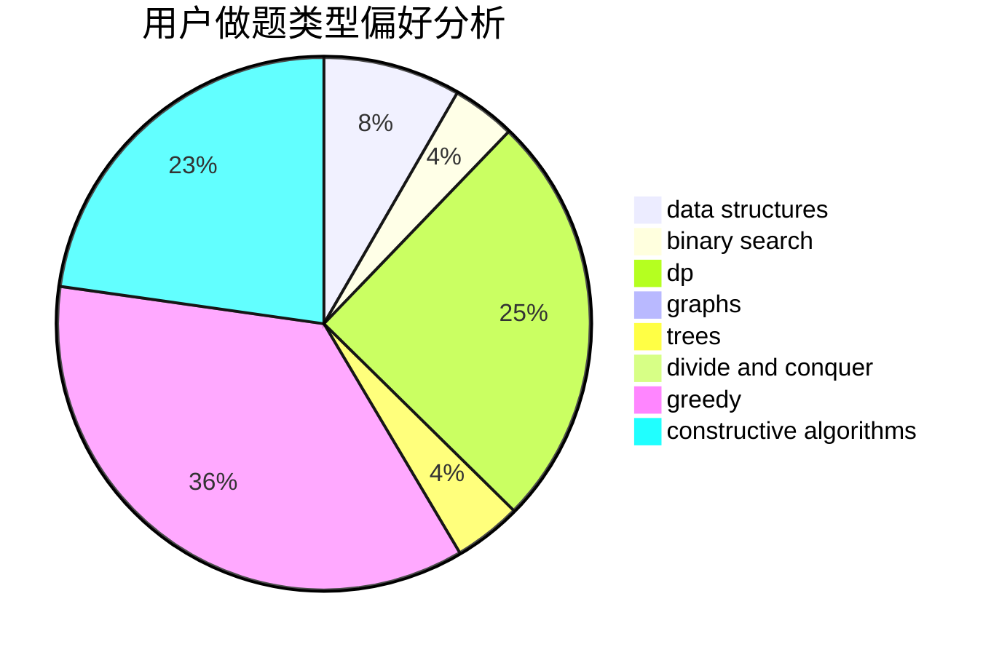
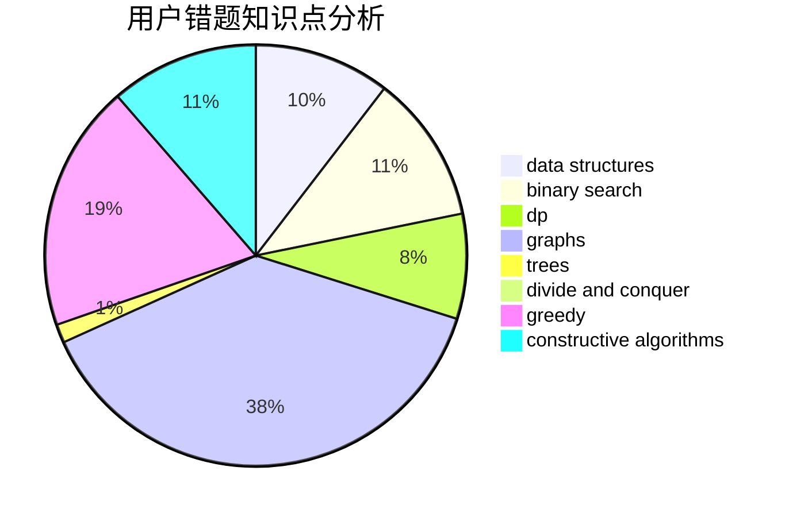

# xuyifeng

<!-- tabs:start -->

#### **用户提交结果分析**

#### **用户做题类型偏好分析**

#### **用户错题知识点分析**

<!-- tabs:end -->
# 推荐题目
[1476E](https://codeforces.com/contest/1476/problem/E)		bitmasks,
                        data structures,
                        dfs and similar,
                        graphs,
                        hashing,
                        sortings,
                        strings		  
[986E](https://codeforces.com/contest/986/problem/E)		brute force,
                        data structures,
                        math,
                        number theory,
                        trees		  
[747B](https://codeforces.com/contest/747/problem/B)		implementation,
                        strings		  
[792A](https://codeforces.com/contest/792/problem/A)		implementation,
                        sortings		  
[1334B](https://codeforces.com/contest/1334/problem/B)		greedy,
                        sortings		  
[814E](https://codeforces.com/contest/814/problem/E)		combinatorics,
                        dp,
                        graphs,
                        shortest paths		  
[477D](https://codeforces.com/contest/477/problem/D)		dp,
                        strings		  
[171C](https://codeforces.com/contest/171/problem/C)		*special problem,
                        implementation		  
[976A](https://codeforces.com/contest/976/problem/A)		implementation		  
[1102B](https://codeforces.com/contest/1102/problem/B)		greedy,
                        sortings		  
