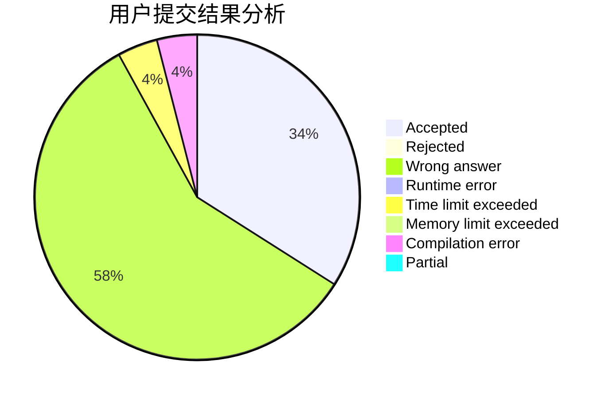
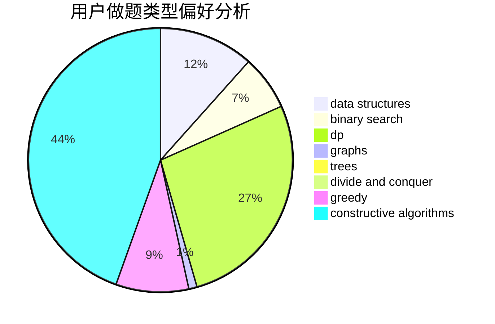

# xuyuchen

<!-- tabs:start -->

#### **用户提交结果分析**

#### **用户做题类型偏好分析**

#### **用户错题知识点分析**

<!-- tabs:end -->
# 推荐题目
[1326B](https://codeforces.com/contest/1326/problem/B)		implementation,
                        math		  
[1373D](https://codeforces.com/contest/1373/problem/D)		divide and conquer,
                        dp,
                        greedy,
                        implementation		  
[903D](https://codeforces.com/contest/903/problem/D)		data structures,
                        math		  
[319D](https://codeforces.com/contest/319/problem/D)		greedy,
                        hashing,
                        string suffix structures,
                        strings		  
[1108E2](https://codeforces.com/contest/1108E/problem/2)		data structures,
                        implementation		  
[196E](https://codeforces.com/contest/196/problem/E)		dsu,
                        graphs,
                        shortest paths		  
[1286C2](https://codeforces.com/contest/1286C/problem/2)		brute force,
                        constructive algorithms,
                        hashing,
                        interactive,
                        math		  
[43E](https://codeforces.com/contest/43/problem/E)		brute force,
                        implementation,
                        two pointers		  
[1004C](https://codeforces.com/contest/1004/problem/C)		constructive algorithms,
                        implementation		  
[305A](https://codeforces.com/contest/305/problem/A)		brute force,
                        constructive algorithms,
                        implementation		  
