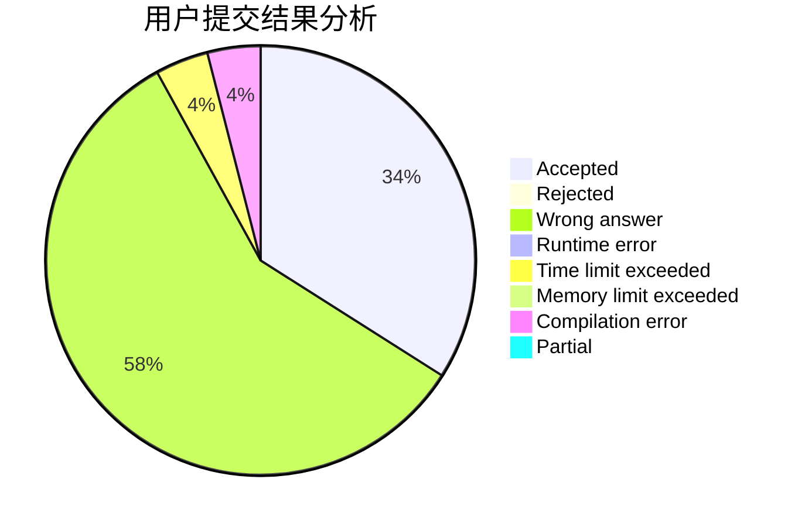
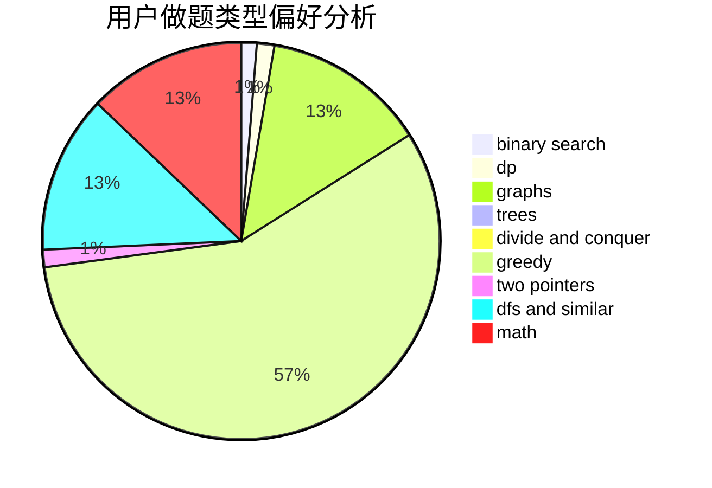

# xuyuchen

<!-- tabs:start -->

#### **用户提交结果分析**

#### **用户做题类型偏好分析**

<!-- tabs:end -->
# 推荐题目
[1332D](https://codeforces.com/contest/1332/problem/D)
[13822](https://codeforces.com/contest/1382/problem/2)
[919D](https://codeforces.com/contest/919/problem/D)
[34D](https://codeforces.com/contest/34/problem/D)
[1109B](https://codeforces.com/contest/1109/problem/B)
[218D](https://codeforces.com/contest/218/problem/D)
[1293E](https://codeforces.com/contest/1293/problem/E)
[461E](https://codeforces.com/contest/461/problem/E)
[1004F](https://codeforces.com/contest/1004/problem/F)
[325C](https://codeforces.com/contest/325/problem/C)
