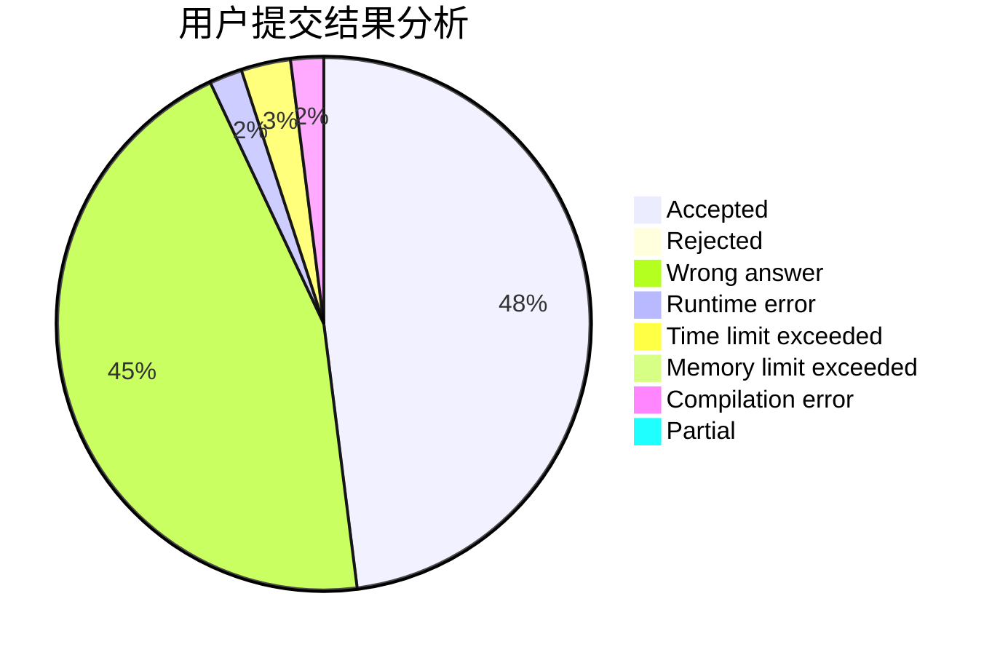
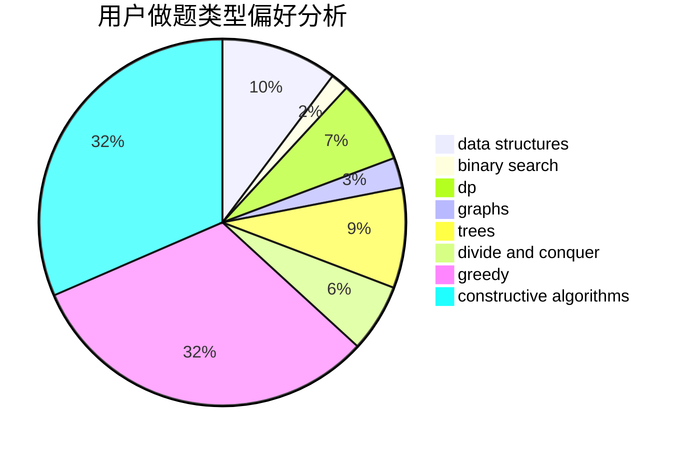

# xuzhi1234

<!-- tabs:start -->

#### **用户提交结果分析**

#### **用户做题类型偏好分析**

#### **用户错题知识点分析**

<!-- tabs:end -->
# 推荐题目
[1467A](https://codeforces.com/contest/1467/problem/A)		constructive algorithms,
                        greedy,
                        math		  
[1382A](https://codeforces.com/contest/1382/problem/A)		brute force		  
[1404B](https://codeforces.com/contest/1404/problem/B)		dfs and similar,
                        dp,
                        games,
                        trees		  
[891E](https://codeforces.com/contest/891/problem/E)		combinatorics,
                        math,
                        matrices		  
[1267B](https://codeforces.com/contest/1267/problem/B)		nan		  
[12512](https://codeforces.com/contest/1251/problem/2)		dsu,graphs,sortings,trees		  
[1268E](https://codeforces.com/contest/1268/problem/E)		dp		  
[850C](https://codeforces.com/contest/850/problem/C)		bitmasks,
                        dp,
                        games		  
[13563](https://codeforces.com/contest/1356/problem/3)		dsu,graphs,sortings,trees		  
[1020A](https://codeforces.com/contest/1020/problem/A)		math		  
