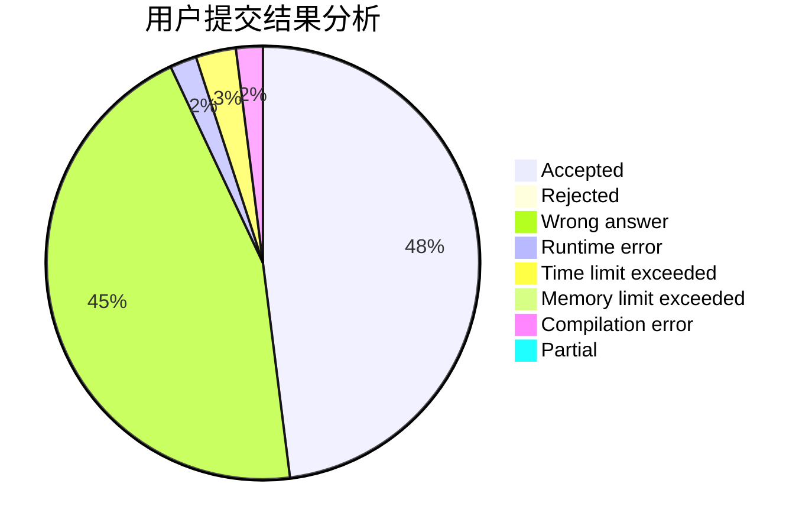
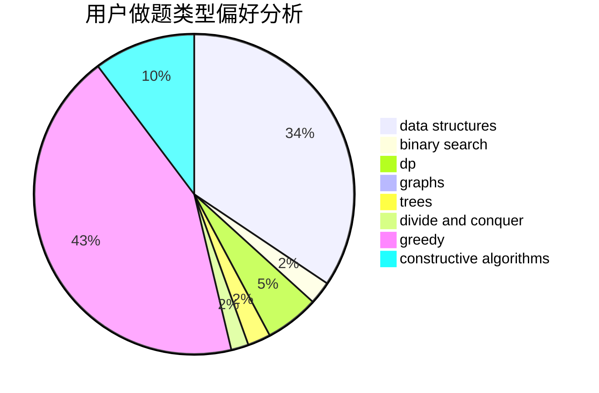

# xuzhi1234

<!-- tabs:start -->

#### **用户提交结果分析**

#### **用户做题类型偏好分析**

#### **用户错题知识点分析**

<!-- tabs:end -->
# 推荐题目
[1458B](https://codeforces.com/contest/1458/problem/B)		dp		  
[1373E](https://codeforces.com/contest/1373/problem/E)		brute force,
                        constructive algorithms,
                        dp,
                        greedy		  
[1395D](https://codeforces.com/contest/1395/problem/D)		dsu,graphs,sortings,trees		  
[871A](https://codeforces.com/contest/871/problem/A)		dsu,graphs,sortings,trees		  
[1261C](https://codeforces.com/contest/1261/problem/C)		dsu,graphs,sortings,trees		  
[1247B1](https://codeforces.com/contest/1247B/problem/1)		dsu,graphs,sortings,trees		  
[1263B](https://codeforces.com/contest/1263/problem/B)		greedy,
                        implementation		  
[832A](https://codeforces.com/contest/832/problem/A)		games,
                        math		  
[1349E](https://codeforces.com/contest/1349/problem/E)		constructive algorithms,
                        dp,
                        greedy		  
[1019E](https://codeforces.com/contest/1019/problem/E)		data structures,
                        divide and conquer,
                        trees		  
