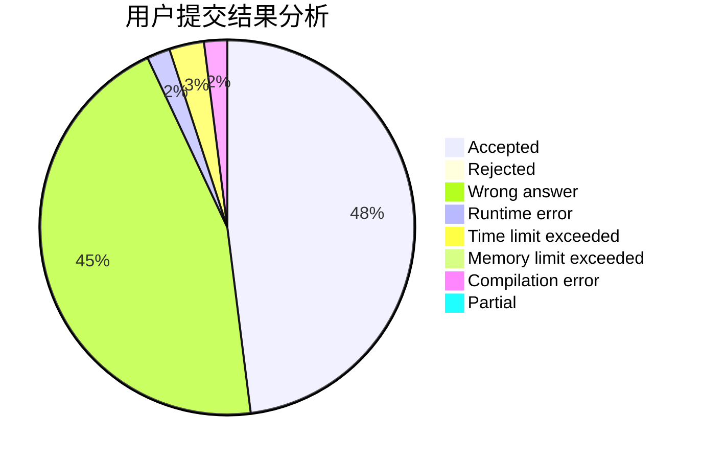
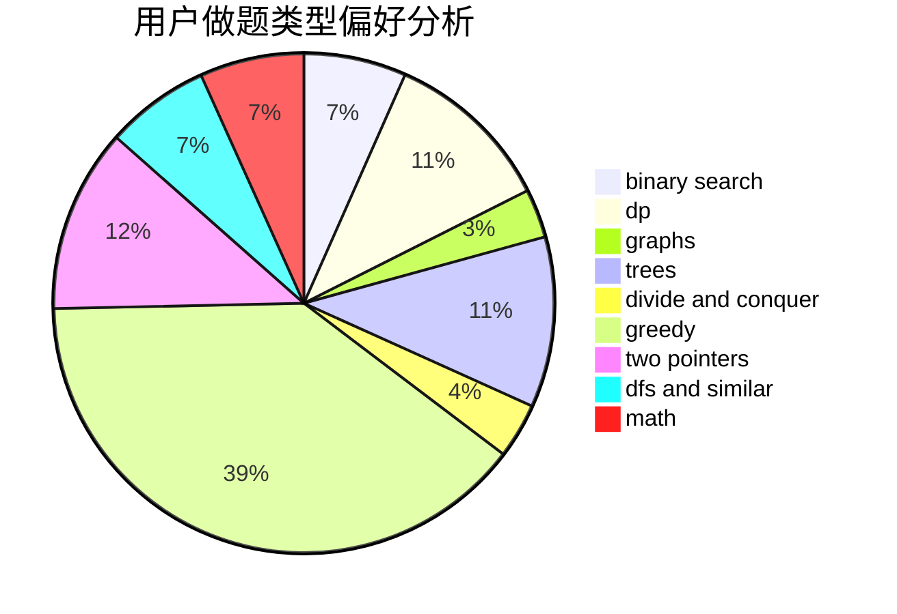

# xuzhi1234

<!-- tabs:start -->

#### **用户提交结果分析**

#### **用户做题类型偏好分析**

<!-- tabs:end -->
# 推荐题目
[1467A](https://codeforces.com/contest/1467/problem/A)
[1382A](https://codeforces.com/contest/1382/problem/A)
[1404B](https://codeforces.com/contest/1404/problem/B)
[891E](https://codeforces.com/contest/891/problem/E)
[1267B](https://codeforces.com/contest/1267/problem/B)
[12512](https://codeforces.com/contest/1251/problem/2)
[1268E](https://codeforces.com/contest/1268/problem/E)
[850C](https://codeforces.com/contest/850/problem/C)
[13563](https://codeforces.com/contest/1356/problem/3)
[1020A](https://codeforces.com/contest/1020/problem/A)
