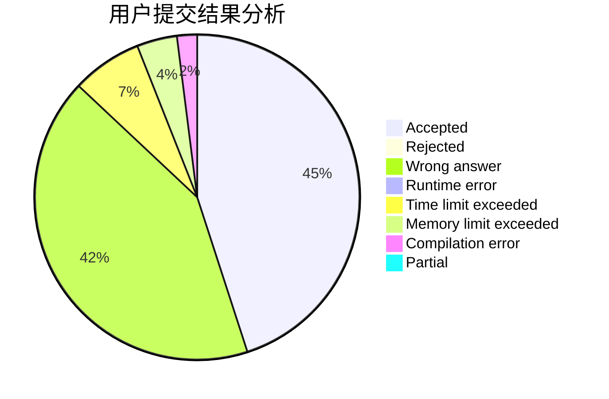
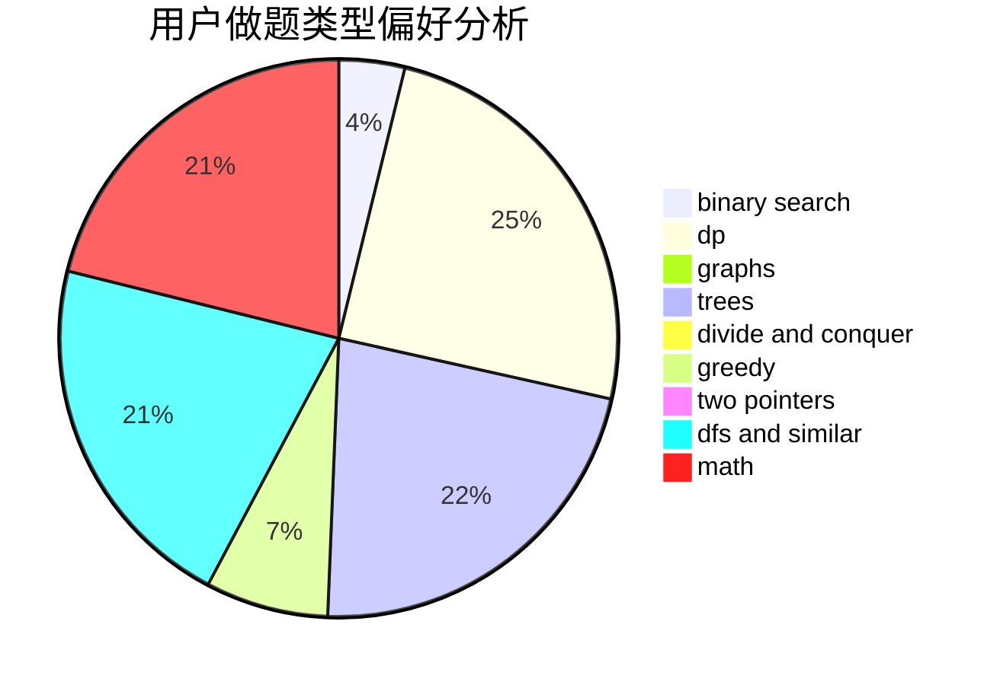

# xuzihao

<!-- tabs:start -->

#### **用户提交结果分析**

#### **用户做题类型偏好分析**

<!-- tabs:end -->
# 推荐题目
[1114A](https://codeforces.com/contest/1114/problem/A)
[376A](https://codeforces.com/contest/376/problem/A)
[294B](https://codeforces.com/contest/294/problem/B)
[703D](https://codeforces.com/contest/703/problem/D)
[702B](https://codeforces.com/contest/702/problem/B)
[13671](https://codeforces.com/contest/1367/problem/1)
[803B](https://codeforces.com/contest/803/problem/B)
[175B](https://codeforces.com/contest/175/problem/B)
[691A](https://codeforces.com/contest/691/problem/A)
[380C](https://codeforces.com/contest/380/problem/C)
