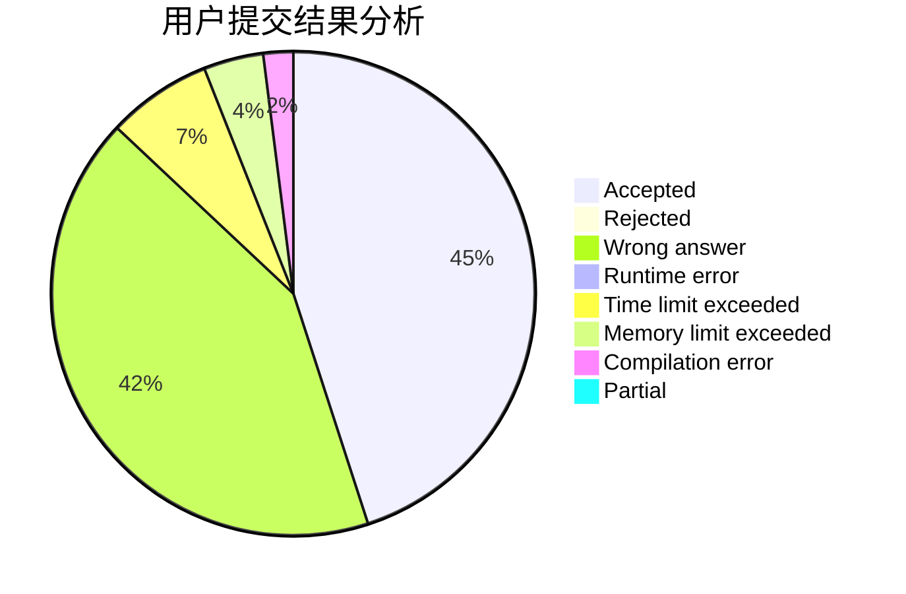
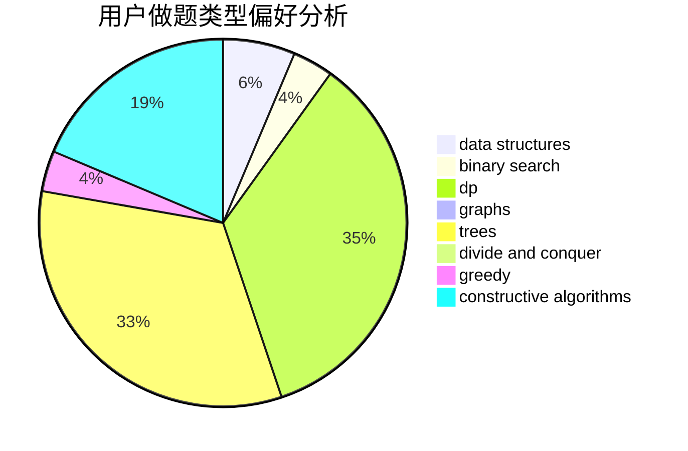
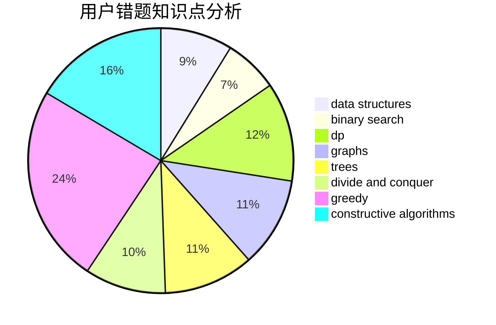

# xuzihao

<!-- tabs:start -->

#### **用户提交结果分析**

#### **用户做题类型偏好分析**

#### **用户错题知识点分析**

<!-- tabs:end -->
# 推荐题目
[1114A](https://codeforces.com/contest/1114/problem/A)		brute force,
                        greedy,
                        implementation		  
[376A](https://codeforces.com/contest/376/problem/A)		implementation,
                        math		  
[294B](https://codeforces.com/contest/294/problem/B)		dp,
                        greedy		  
[703D](https://codeforces.com/contest/703/problem/D)		data structures		  
[702B](https://codeforces.com/contest/702/problem/B)		brute force,
                        data structures,
                        implementation,
                        math		  
[13671](https://codeforces.com/contest/1367/problem/1)		dsu,graphs,sortings,trees		  
[803B](https://codeforces.com/contest/803/problem/B)		constructive algorithms		  
[175B](https://codeforces.com/contest/175/problem/B)		implementation		  
[691A](https://codeforces.com/contest/691/problem/A)		implementation		  
[380C](https://codeforces.com/contest/380/problem/C)		data structures,
                        schedules		  
