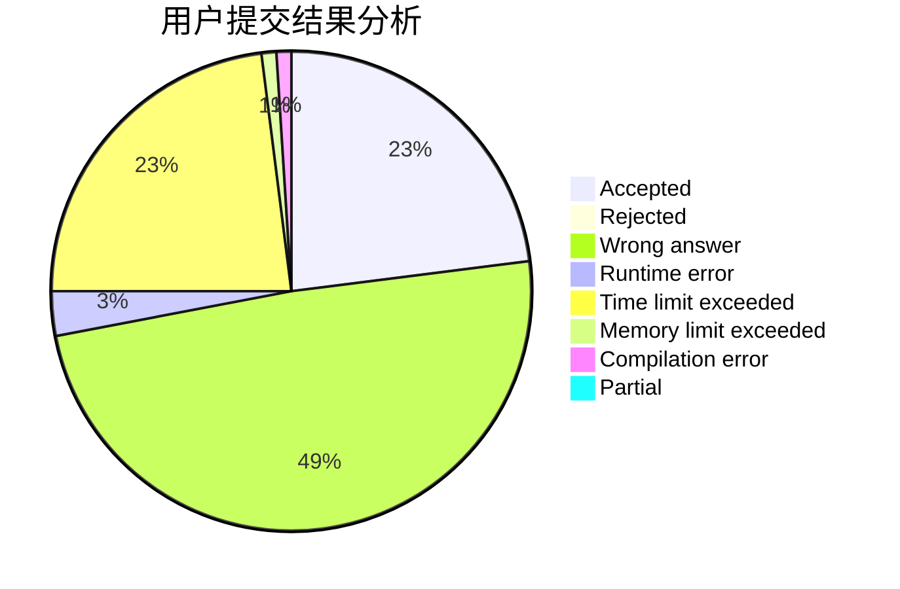
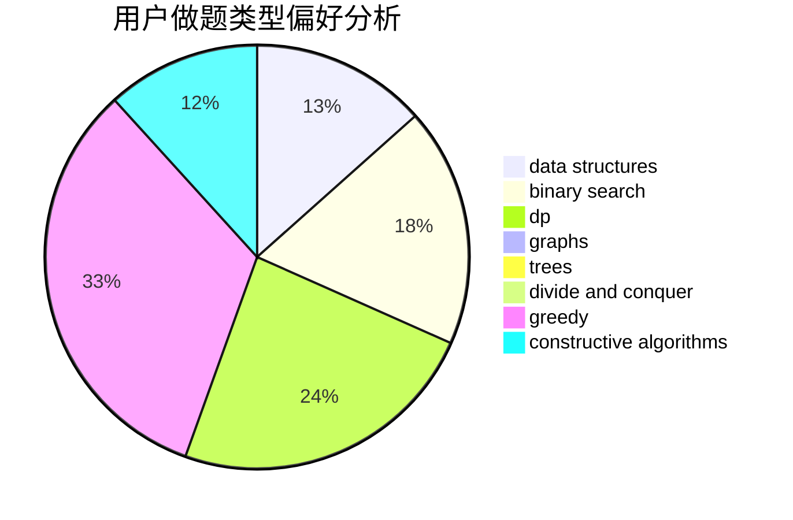
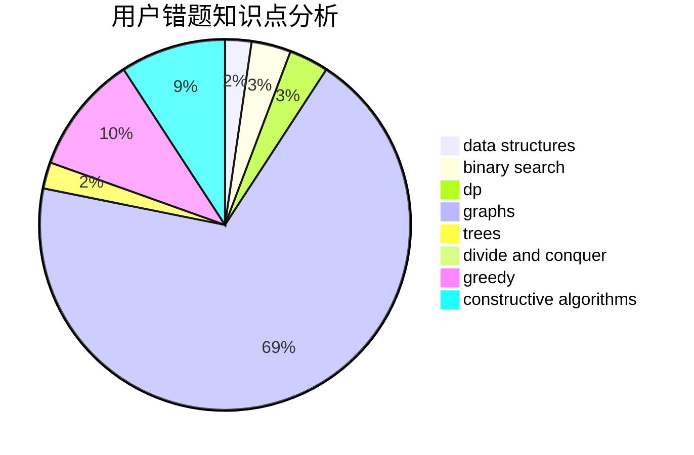

# xuziye0327

<!-- tabs:start -->

#### **用户提交结果分析**

#### **用户做题类型偏好分析**

#### **用户错题知识点分析**

<!-- tabs:end -->
# 推荐题目
[1335A](https://codeforces.com/contest/1335/problem/A)		math		  
[495B](https://codeforces.com/contest/495/problem/B)		math,
                        number theory		  
[592C](https://codeforces.com/contest/592/problem/C)		math		  
[1092E](https://codeforces.com/contest/1092/problem/E)		constructive algorithms,
                        dfs and similar,
                        greedy,
                        trees		  
[711C](https://codeforces.com/contest/711/problem/C)		dp		  
[845C](https://codeforces.com/contest/845/problem/C)		data structures,
                        greedy,
                        sortings		  
[318C](https://codeforces.com/contest/318/problem/C)		dsu,graphs,sortings,trees		  
[462B](https://codeforces.com/contest/462/problem/B)		greedy		  
[681B](https://codeforces.com/contest/681/problem/B)		brute force		  
[1367C](https://codeforces.com/contest/1367/problem/C)		constructive algorithms,
                        greedy,
                        math		  
