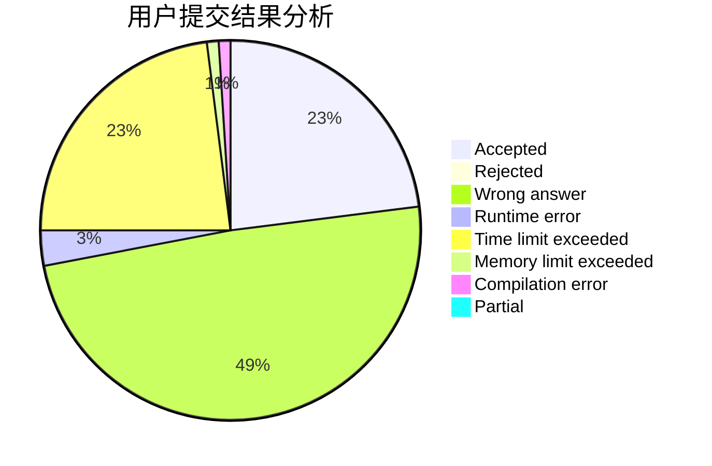
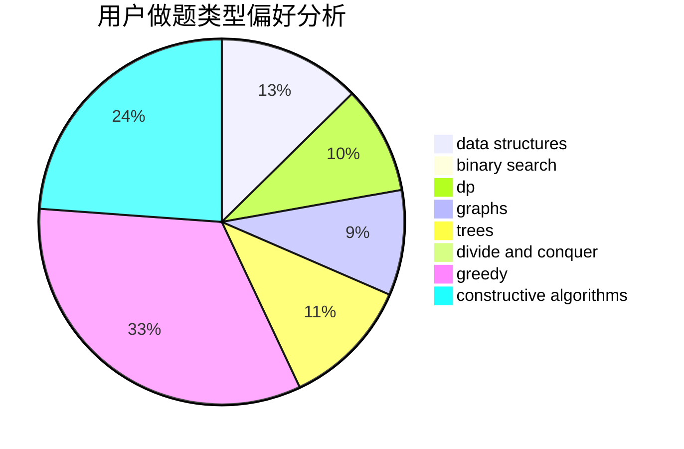
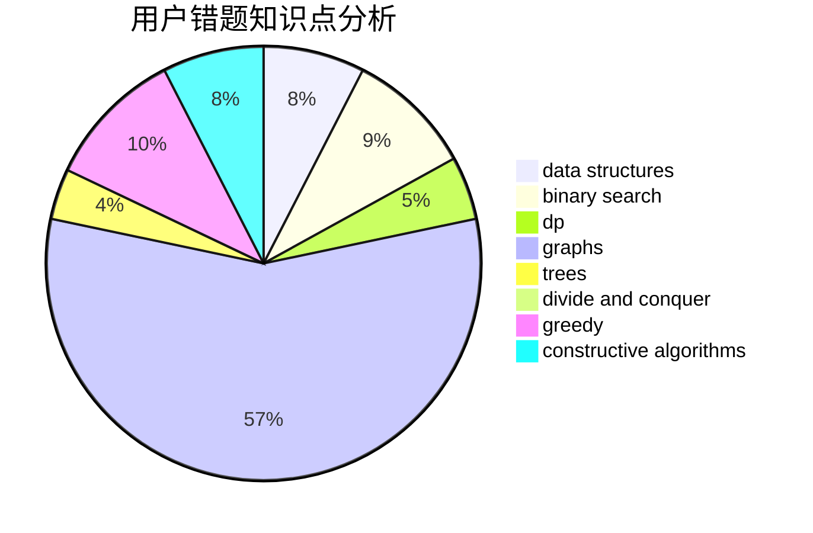

# xuziye0327

<!-- tabs:start -->

#### **用户提交结果分析**

#### **用户做题类型偏好分析**

#### **用户错题知识点分析**

<!-- tabs:end -->
# 推荐题目
[1329A](https://codeforces.com/contest/1329/problem/A)		constructive algorithms,
                        greedy,
                        implementation,
                        math		  
[476B](https://codeforces.com/contest/476/problem/B)		bitmasks,
                        brute force,
                        combinatorics,
                        dp,
                        math,
                        probabilities		  
[572A](https://codeforces.com/contest/572/problem/A)		sortings		  
[1092B](https://codeforces.com/contest/1092/problem/B)		sortings		  
[691E](https://codeforces.com/contest/691/problem/E)		matrices		  
[825G](https://codeforces.com/contest/825/problem/G)		dfs and similar,
                        graphs,
                        trees		  
[300A](https://codeforces.com/contest/300/problem/A)		brute force,
                        constructive algorithms,
                        implementation		  
[441D](https://codeforces.com/contest/441/problem/D)		constructive algorithms,
                        dsu,
                        graphs,
                        implementation,
                        math,
                        string suffix structures		  
[660D](https://codeforces.com/contest/660/problem/D)		geometry		  
[1359D](https://codeforces.com/contest/1359/problem/D)		data structures,
                        dp,
                        implementation,
                        two pointers		  
