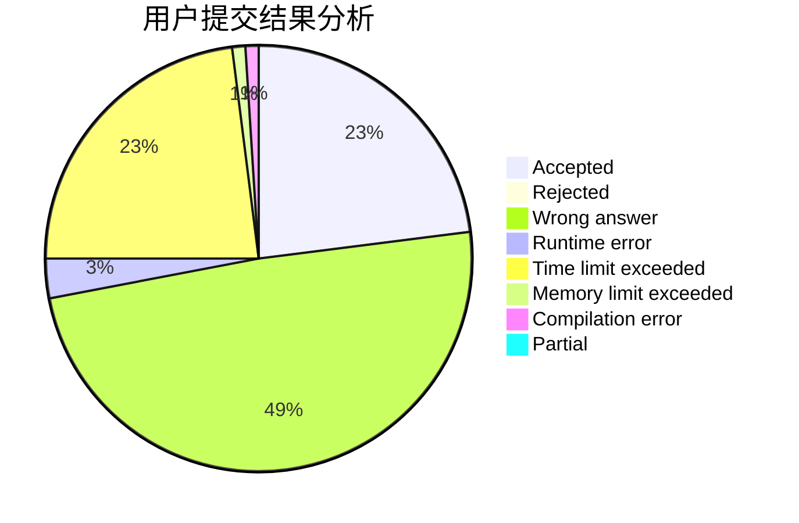
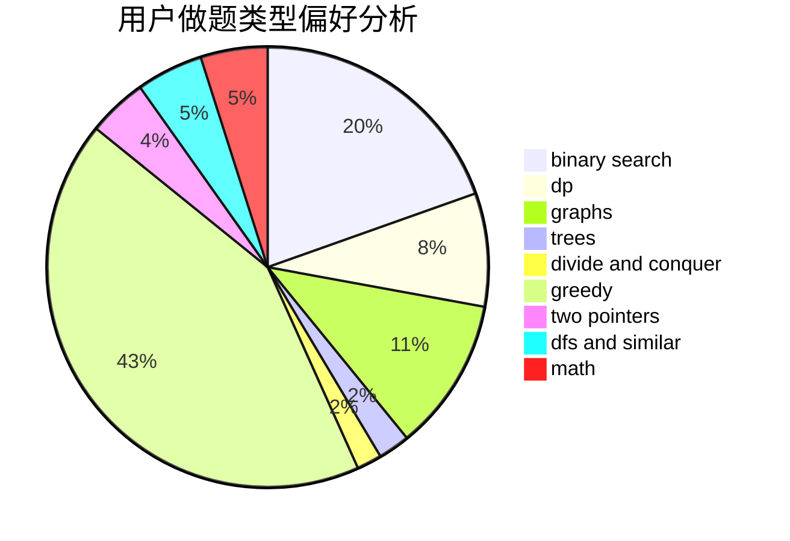

# xuziye0327

<!-- tabs:start -->

#### **用户提交结果分析**

#### **用户做题类型偏好分析**

<!-- tabs:end -->
# 推荐题目
[1335A](https://codeforces.com/contest/1335/problem/A)
[495B](https://codeforces.com/contest/495/problem/B)
[592C](https://codeforces.com/contest/592/problem/C)
[1092E](https://codeforces.com/contest/1092/problem/E)
[711C](https://codeforces.com/contest/711/problem/C)
[845C](https://codeforces.com/contest/845/problem/C)
[318C](https://codeforces.com/contest/318/problem/C)
[462B](https://codeforces.com/contest/462/problem/B)
[681B](https://codeforces.com/contest/681/problem/B)
[1367C](https://codeforces.com/contest/1367/problem/C)
