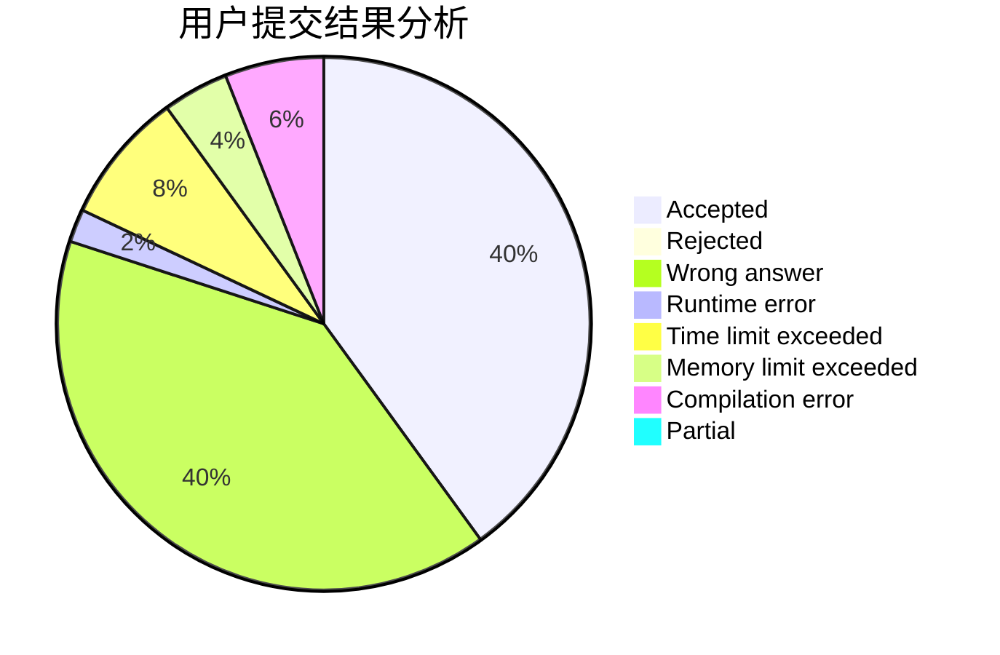
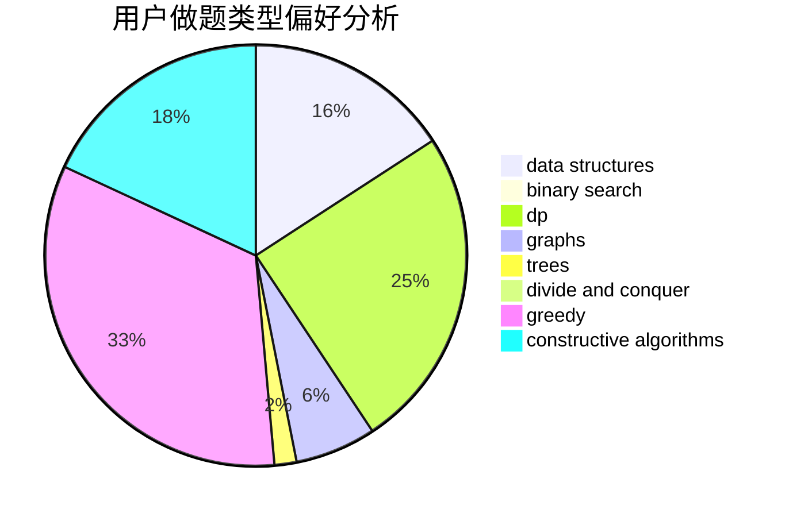
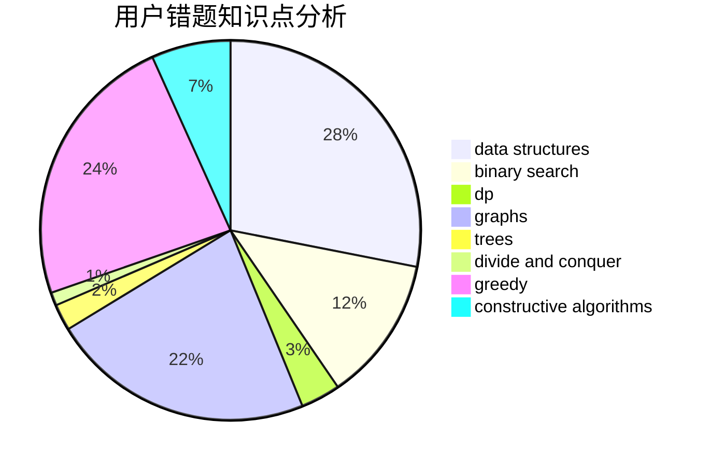

# xwc

<!-- tabs:start -->

#### **用户提交结果分析**

#### **用户做题类型偏好分析**

#### **用户错题知识点分析**

<!-- tabs:end -->
# 推荐题目
[833A](https://codeforces.com/contest/833/problem/A)		math,
                        number theory		  
[591A](https://codeforces.com/contest/591/problem/A)		implementation,
                        math		  
[233C](https://codeforces.com/contest/233/problem/C)		dsu,graphs,sortings,trees		  
[1140A](https://codeforces.com/contest/1140/problem/A)		implementation		  
[1090F](https://codeforces.com/contest/1090/problem/F)		constructive algorithms,
                        interactive		  
[935B](https://codeforces.com/contest/935/problem/B)		implementation		  
[146B](https://codeforces.com/contest/146/problem/B)		brute force,
                        implementation		  
[1098E](https://codeforces.com/contest/1098/problem/E)		binary search,
                        implementation,
                        math,
                        number theory		  
[1268E](https://codeforces.com/contest/1268/problem/E)		dp		  
[1294D](https://codeforces.com/contest/1294/problem/D)		data structures,
                        greedy,
                        implementation,
                        math		  
