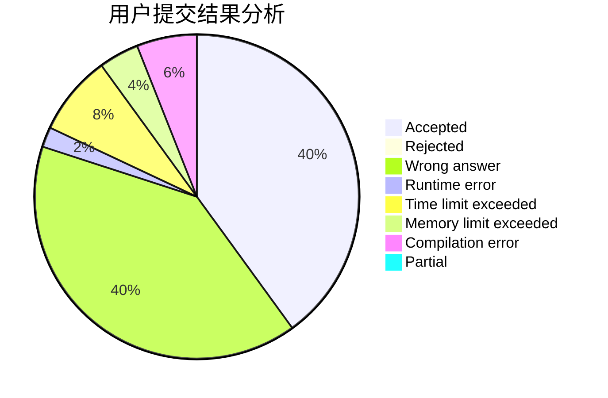
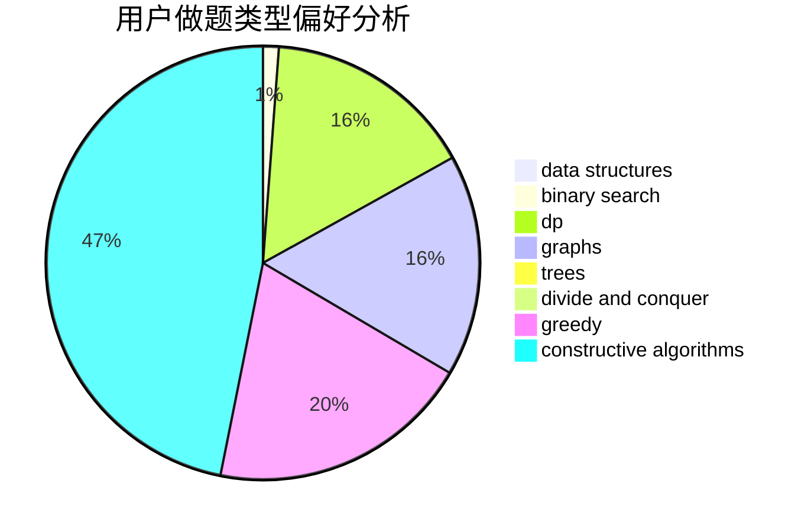
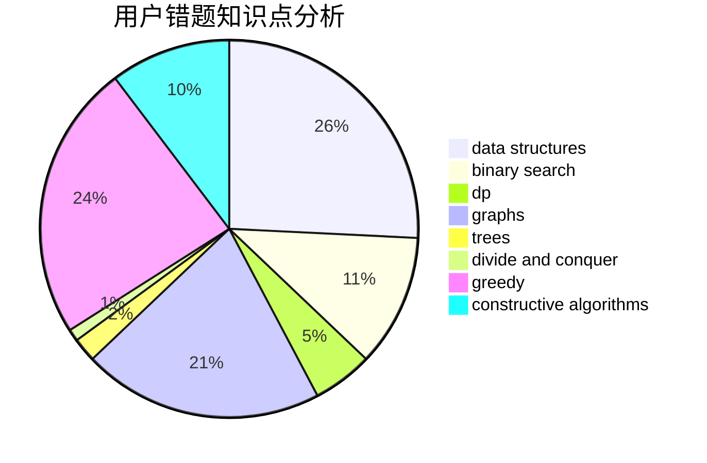

# xwc

<!-- tabs:start -->

#### **用户提交结果分析**

#### **用户做题类型偏好分析**

#### **用户错题知识点分析**

<!-- tabs:end -->
# 推荐题目
[814C](https://codeforces.com/contest/814/problem/C)		brute force,
                        dp,
                        strings,
                        two pointers		  
[570D](https://codeforces.com/contest/570/problem/D)		binary search,
                        bitmasks,
                        constructive algorithms,
                        dfs and similar,
                        graphs,
                        trees		  
[215A](https://codeforces.com/contest/215/problem/A)		brute force,
                        implementation		  
[1138C](https://codeforces.com/contest/1138/problem/C)		dsu,graphs,sortings,trees		  
[1090A](https://codeforces.com/contest/1090/problem/A)		greedy		  
[915C](https://codeforces.com/contest/915/problem/C)		dp,
                        greedy		  
[1462E1](https://codeforces.com/contest/1462E/problem/1)		binary search,
                        combinatorics,
                        math,
                        sortings,
                        two pointers		  
[1098B](https://codeforces.com/contest/1098/problem/B)		brute force,
                        constructive algorithms,
                        greedy,
                        math		  
[1263B](https://codeforces.com/contest/1263/problem/B)		greedy,
                        implementation		  
[1287A](https://codeforces.com/contest/1287/problem/A)		greedy,
                        implementation		  
