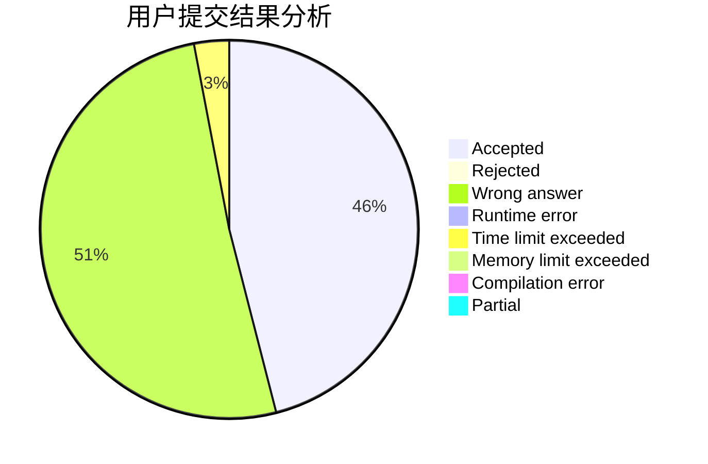
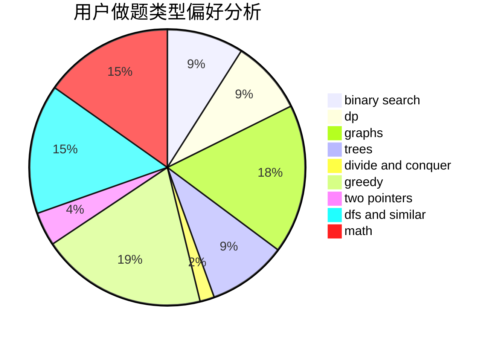

# xwchen

<!-- tabs:start -->

#### **用户提交结果分析**

#### **用户做题类型偏好分析**

<!-- tabs:end -->
# 推荐题目
[312A](https://codeforces.com/contest/312/problem/A)
[1439E](https://codeforces.com/contest/1439/problem/E)
[789D](https://codeforces.com/contest/789/problem/D)
[1148D](https://codeforces.com/contest/1148/problem/D)
[653D](https://codeforces.com/contest/653/problem/D)
[1144B](https://codeforces.com/contest/1144/problem/B)
[1501F](https://codeforces.com/contest/1501/problem/F)
[1423H](https://codeforces.com/contest/1423/problem/H)
[734D](https://codeforces.com/contest/734/problem/D)
[833B](https://codeforces.com/contest/833/problem/B)
