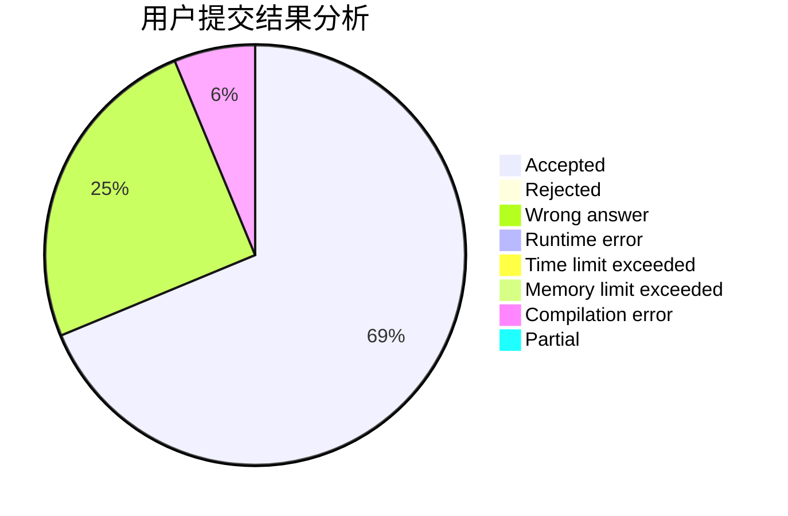
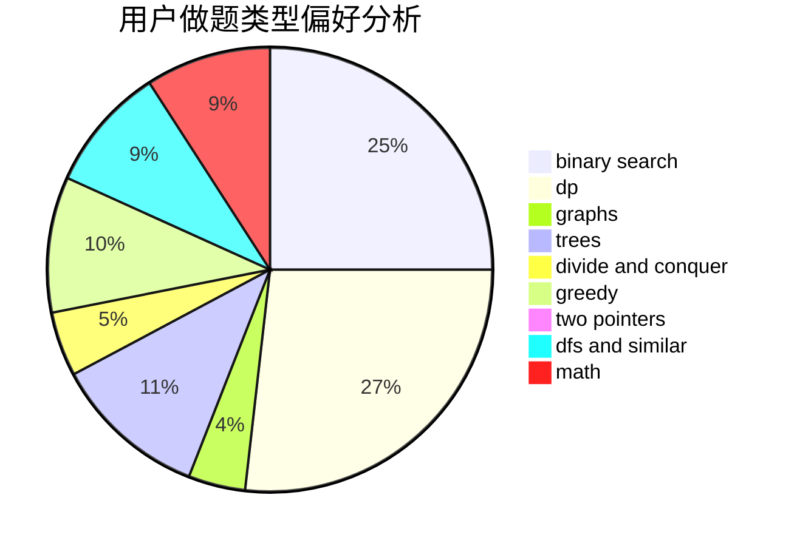

# CartesianTree

<!-- tabs:start -->

#### **用户提交结果分析**

#### **用户做题类型偏好分析**

<!-- tabs:end -->
# 推荐题目
[679E](https://codeforces.com/contest/679/problem/E)
[1093B](https://codeforces.com/contest/1093/problem/B)
[1267I](https://codeforces.com/contest/1267/problem/I)
[67A](https://codeforces.com/contest/67/problem/A)
[290C](https://codeforces.com/contest/290/problem/C)
[120H](https://codeforces.com/contest/120/problem/H)
[346A](https://codeforces.com/contest/346/problem/A)
[572A](https://codeforces.com/contest/572/problem/A)
[389A](https://codeforces.com/contest/389/problem/A)
[459B](https://codeforces.com/contest/459/problem/B)
