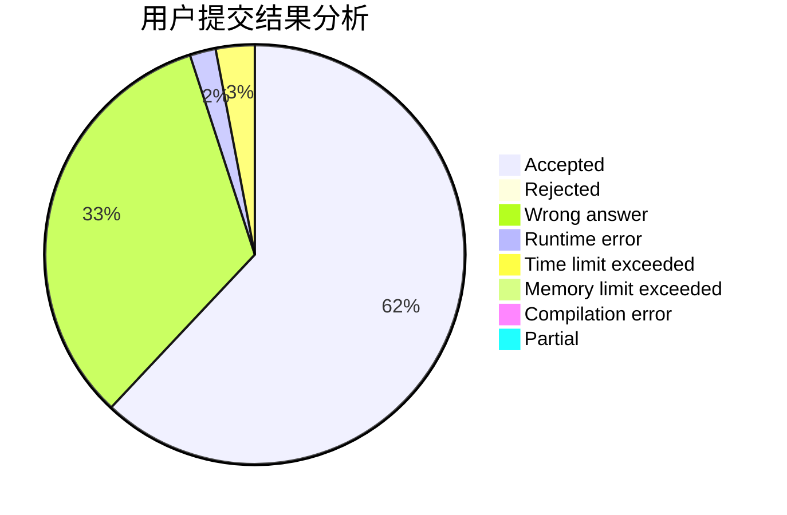
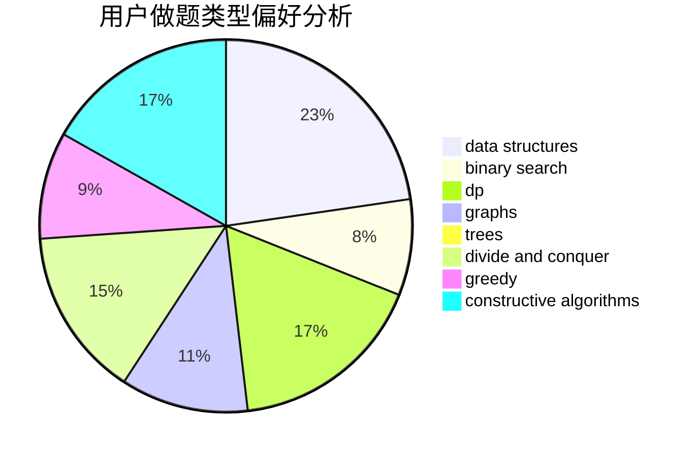
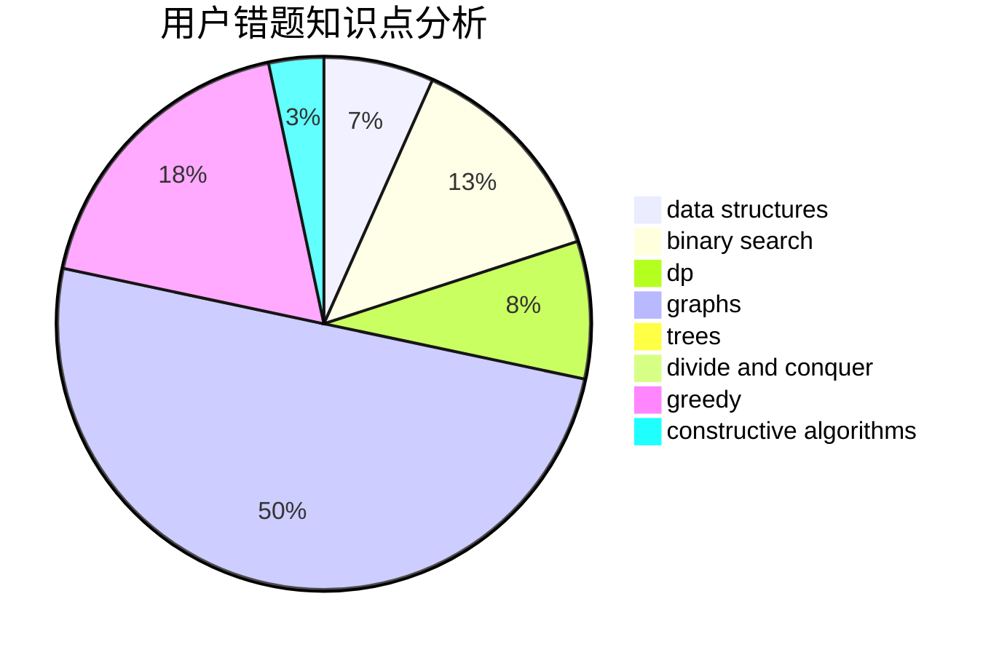

# xxfy

<!-- tabs:start -->

#### **用户提交结果分析**

#### **用户做题类型偏好分析**

#### **用户错题知识点分析**

<!-- tabs:end -->
# 推荐题目
[1310B](https://codeforces.com/contest/1310/problem/B)		dp,
                        implementation		  
[1250L](https://codeforces.com/contest/1250/problem/L)		binary search,
                        greedy,
                        math		  
[763C](https://codeforces.com/contest/763/problem/C)		brute force,
                        implementation,
                        math,
                        number theory		  
[598A](https://codeforces.com/contest/598/problem/A)		math		  
[429E](https://codeforces.com/contest/429/problem/E)		graphs		  
[939B](https://codeforces.com/contest/939/problem/B)		implementation		  
[804E](https://codeforces.com/contest/804/problem/E)		constructive algorithms		  
[215C](https://codeforces.com/contest/215/problem/C)		brute force,
                        implementation		  
[761F](https://codeforces.com/contest/761/problem/F)		brute force,
                        data structures,
                        dp,
                        implementation		  
[372D](https://codeforces.com/contest/372/problem/D)		binary search,
                        data structures,
                        dfs and similar,
                        trees,
                        two pointers		  
